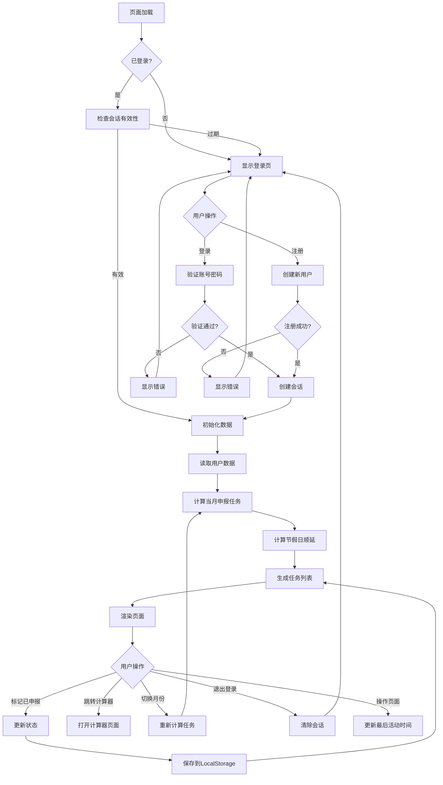
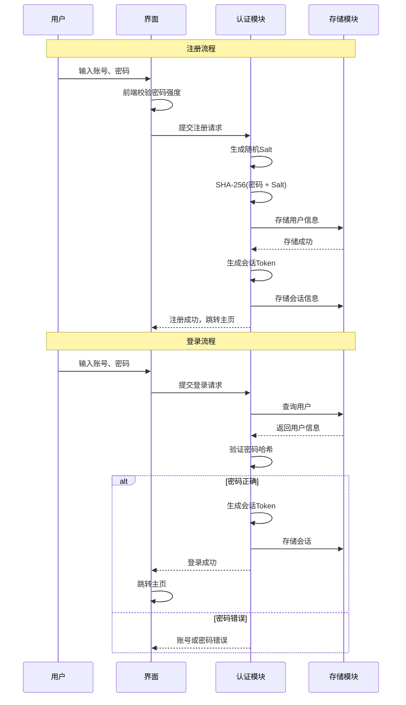
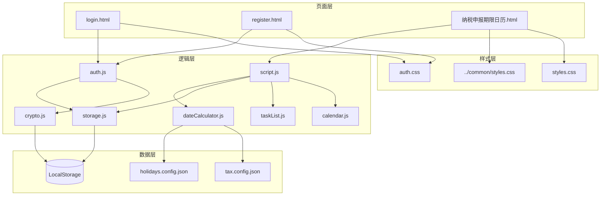

# 纳税申报期限日历 - 产品需求文档 (PRD)

**版本**：v1.1
**创建日期**：2026-03-19
**最后更新**：2026-03-19
**产品负责人**：财税小工具团队

---

## 一、核心目标 (Mission)

> **帮助企业财税人员不再错过任何一个纳税申报截止日期**
>
> 通过安全可靠的多用户系统，让每位财税人员都能独立管理自己的申报任务。

---

## 二、用户画像 (Persona)

| 属性 | 描述 |
|------|------|
| **主要用户** | 企业财务人员、会计、出纳 |
| **次要用户** | 代理记账机构从业者 |
| **核心痛点** | 18个税种申报期限各不相同，节假日顺延规则复杂，容易遗漏导致逾期罚款 |
| **安全需求** | 申报数据涉及企业敏感信息，需要数据隔离和安全保护 |
| **使用场景** | 月初规划当月申报任务、随时查询某税种截止日期 |
| **技术水平** | 基础，需要简洁直观的界面 |

---

## 三、产品路线图 (Product Roadmap)

### V1: 最小可行产品 (MVP)

| 序号 | 功能 | 描述 | 优先级 |
|------|------|------|--------|
| 1 | 日历视图 | 可折叠的迷你月历，标记有申报任务的日期 | P0 |
| 2 | 任务列表 | 按状态分组（待申报/已申报/逾期）展示申报任务 | P0 |
| 3 | 申报状态标记 | 用户可手动标记"已申报/未申报" | P0 |
| 4 | 节假日顺延 | 内置2026年法定节假日，自动计算顺延后截止日期 | P0 |
| 5 | 逾期预警 | 超过截止日期未标记已申报的显示红色警告 | P0 |
| 6 | 计算器跳转 | 快速跳转到对应税种的计算器 | P1 |
| 7 | 移动端适配 | 响应式设计，移动端垂直布局 | P0 |

### MVP 包含税种（6个高频）

| 税种 | 申报周期 | 一般规定截止日 | 适用纳税人 |
|------|----------|---------------|-----------|
| 增值税 | 月度/季度 | 月/季后15日内 | 一般/小规模 |
| 企业所得税（预缴） | 季度 | 季后15日内 | 所有企业 |
| 企业所得税（汇算） | 年度 | 次年5月31日 | 所有企业 |
| 个人所得税 | 月度 | 次月15日内 | 代扣代缴 |
| 附加税费 | 月度/季度 | 随增值税 | 随增值税 |
| 印花税 | 月度/季度 | 月/季后15日内 | 按期汇总缴纳 |

### V2: 用户认证与安全

| 序号 | 功能 | 描述 | 优先级 |
|------|------|------|--------|
| 1 | 用户注册 | 手机号/邮箱注册，密码强度校验 | P0 |
| 2 | 用户登录 | 账号密码登录，记住登录状态 | P0 |
| 3 | 密码安全 | 密码加密存储（SHA-256 + Salt） | P0 |
| 4 | 数据隔离 | 每个用户只能访问自己的申报数据 | P0 |
| 5 | 自动登出 | 长时间未操作自动登出（30分钟） | P1 |
| 6 | 修改密码 | 支持用户修改登录密码 | P1 |
| 7 | 退出登录 | 清除登录状态，保护数据安全 | P0 |

### V3: 企业版增强

| 功能 | 描述 |
|------|------|
| 浏览器推送提醒 | 申报到期前3天/1天推送通知 |
| 历史记录 | 保存申报历史，支持导出Excel |
| 自定义税种 | 用户可添加自定义申报项目 |
| 低频税种 | 房产税、土地使用税、车船税等12个税种 |
| 多年度支持 | 支持2025-2028等多年度节假日数据 |
| 数据备份 | 本地数据导出为JSON备份文件 |
| 数据恢复 | 从备份文件恢复数据 |

### V4: 代理记账版

| 功能 | 描述 |
|------|------|
| 多企业管理 | 支持添加多家客户企业 |
| 客户分组 | 按行业/地区/规模分组管理 |
| 批量状态更新 | 一键标记多个企业申报状态 |
| 进度看板 | 可视化展示所有客户申报进度 |
| 团队协作 | 支持多人分工管理 |
| 权限控制 | 管理员/普通成员权限区分 |

### V5: 云端同步（可选）

| 功能 | 描述 |
|------|------|
| 云端存储 | 数据同步到云端，多设备访问 |
| 账号找回 | 手机/邮箱验证码找回密码 |
| 第三方登录 | 微信/支付宝快捷登录 |
| 数据加密 | 传输加密（HTTPS）+ 存储加密 |

### V6: 智能化

| 功能 | 描述 |
|------|------|
| 节假日API | 自动获取国务院发布的节假日安排 |
| 智能提醒 | 根据企业税种自动匹配申报任务 |
| 数据分析 | 申报及时率统计、逾期风险分析 |

---

## 四、关键业务逻辑 (Business Rules)

### 4.1 截止日期计算规则

```
基础截止日 + 节假日顺延 = 实际截止日

顺延规则：
- 遇到周六 → 顺延至下一个周一
- 遇到周日 → 顺延至下一个周一
- 遇到法定节假日 → 顺延至节后第一个工作日
- 连续节假日 → 按实际放假安排顺延
```

### 4.2 各税种截止日期计算

| 税种 | 周期 | 基础截止日计算规则 |
|------|------|-------------------|
| 增值税（一般纳税人） | 按月 | 次月15日 |
| 增值税（小规模） | 按季 | 季后次月15日（1/4/7/10月） |
| 企业所得税（预缴） | 按季 | 季后次月15日（1/4/7/10月） |
| 企业所得税（汇算） | 按年 | 次年5月31日 |
| 个人所得税 | 按月 | 次月15日 |
| 附加税费 | 随增值税 | 与增值税相同 |
| 印花税 | 按月 | 次月15日 |

### 4.3 申报状态流转

```
未到申报期 → 待申报 → 已申报
                  ↘ 逾期（超过截止日未申报）
```

### 4.4 逾期判定逻辑

```
IF 当前日期 > 实际截止日 AND 状态 != 已申报
THEN 显示逾期警告（红色）
```

### 4.5 状态优先级

1. **逾期**（红色）：当前日期 > 截止日期 且 未申报
2. **紧急**（橙色）：截止日期 - 当前日期 <= 3天 且 未申报
3. **待申报**（黄色）：未到截止日期 且 未申报
4. **已申报**（绿色）：用户已标记完成

### 4.6 用户认证逻辑 (V2)

```
注册流程：
1. 用户输入手机号/邮箱 + 密码
2. 密码强度校验（至少8位，包含字母和数字）
3. 检查账号是否已存在
4. 密码加密（SHA-256 + 随机Salt）
5. 存储用户信息
6. 自动登录

登录流程：
1. 用户输入账号 + 密码
2. 查找用户记录
3. 验证密码（对比加密后的哈希值）
4. 生成会话Token
5. 记录登录时间
6. 跳转到主页

自动登出逻辑：
IF 当前时间 - 最后操作时间 > 30分钟
THEN 清除会话，跳转到登录页
```

### 4.7 数据安全规则 (V2)

```
数据隔离：
- 每个用户的数据使用独立的 LocalStorage 键名前缀
- 格式：{userId}_filingRecords, {userId}_enterprise
- 未登录用户无法访问任何用户数据

密码安全：
- 密码使用 SHA-256 + Salt 加密存储
- Salt 为32位随机字符串
- 原始密码不存储、不传输

会话安全：
- 会话Token存储在 SessionStorage
- 页面关闭后自动清除
- 每次操作更新最后活动时间
```

---

## 五、数据契约 (Data Contract)

### 5.1 用户数据结构 (V2)

```json
{
  "users": [
    {
      "id": "u_20260319_abc123",
      "account": "13800138000",
      "accountType": "phone",
      "passwordHash": "a1b2c3d4e5f6...",
      "salt": "x9y8z7w6v5u4t3s2r1",
      "nickname": "张会计",
      "createdAt": "2026-03-19T10:30:00Z",
      "lastLoginAt": "2026-03-19T14:00:00Z"
    }
  ]
}
```

### 5.2 会话数据结构 (V2)

```json
{
  "currentSession": {
    "userId": "u_20260319_abc123",
    "token": "sess_xyz789...",
    "loginAt": "2026-03-19T14:00:00Z",
    "lastActiveAt": "2026-03-19T15:30:00Z",
    "expiresAt": "2026-03-19T16:00:00Z"
  }
}
```

### 5.3 税种配置数据

```json
{
  "taxTypes": [
    {
      "id": "vat",
      "name": "增值税",
      "shortName": "增值税",
      "cycle": "monthly",
      "cycleLabel": "按月",
      "baseDeadline": 15,
      "calculatorUrl": "../税金计算器/增值税计算器/增值税计算器.html",
      "enabled": true,
      "taxpayerTypes": ["general", "small"]
    },
    {
      "id": "vat_quarterly",
      "name": "增值税",
      "shortName": "增值税(季)",
      "cycle": "quarterly",
      "cycleLabel": "按季",
      "baseDeadline": 15,
      "calculatorUrl": "../税金计算器/增值税计算器/增值税计算器.html",
      "enabled": true,
      "taxpayerTypes": ["small"]
    },
    {
      "id": "cit_prepaid",
      "name": "企业所得税（预缴）",
      "shortName": "企业所得税",
      "cycle": "quarterly",
      "cycleLabel": "按季预缴",
      "baseDeadline": 15,
      "calculatorUrl": "../税金计算器/企业所得税计算器/企业所得税计算器.html",
      "enabled": true
    },
    {
      "id": "cit_annual",
      "name": "企业所得税（汇算）",
      "shortName": "所得税汇算",
      "cycle": "annual",
      "cycleLabel": "年度汇算",
      "baseDeadlineMonth": 5,
      "baseDeadlineDay": 31,
      "calculatorUrl": "../税金计算器/企业所得税计算器/企业所得税计算器.html",
      "enabled": true
    },
    {
      "id": "pit",
      "name": "个人所得税",
      "shortName": "个税",
      "cycle": "monthly",
      "cycleLabel": "按月",
      "baseDeadline": 15,
      "calculatorUrl": "../税金计算器/个人所得税计算器/个人所得税计算器.html",
      "enabled": true
    },
    {
      "id": "surtax",
      "name": "附加税费",
      "shortName": "附加税",
      "cycle": "follow_vat",
      "cycleLabel": "随增值税",
      "calculatorUrl": "../税金计算器/附加税费计算器/附加税费计算器.html",
      "enabled": true
    },
    {
      "id": "stamp_duty",
      "name": "印花税",
      "shortName": "印花税",
      "cycle": "monthly",
      "cycleLabel": "按月",
      "baseDeadline": 15,
      "calculatorUrl": "../税金计算器/印花税计算器/印花税计算器.html",
      "enabled": true
    }
  ]
}
```

### 5.4 节假日数据结构

```json
{
  "year": 2026,
  "holidays": [
    {
      "name": "元旦",
      "dates": ["2026-01-01", "2026-01-02", "2026-01-03"],
      "type": "holiday"
    },
    {
      "name": "春节",
      "dates": ["2026-02-17", "2026-02-18", "2026-02-19", "2026-02-20", "2026-02-21", "2026-02-22", "2026-02-23"],
      "type": "holiday"
    },
    {
      "name": "春节调休",
      "dates": ["2026-02-14", "2026-02-28"],
      "type": "workday"
    }
  ],
  "weekends": {
    "saturday": true,
    "sunday": true
  }
}
```

### 5.5 用户申报数据结构 (V2带用户隔离)

```json
{
  "u_20260319_abc123_enterprise": {
    "name": "示例科技有限公司",
    "taxpayerType": "general"
  },
  "u_20260319_abc123_filingRecords": [
    {
      "taxId": "vat",
      "period": "2026-03",
      "status": "pending",
      "deadline": "2026-03-17",
      "filedDate": null,
      "createdAt": "2026-03-01",
      "updatedAt": "2026-03-01"
    }
  ]
}
```

---

## 六、MVP 原型设计

### 6.1 设计理念

**列表为主 + 可折叠迷你日历**

- 主视图：按状态分组的任务列表
- 日历：可折叠的迷你月历（点击日期筛选任务）
- 状态统计：顶部显示待申报/已申报/逾期数量
- 移动端：垂直布局，卡片式任务项
- 桌面端：左侧日历 + 右侧任务列表

### 6.2 桌面端原型

```
┌─────────────────────────────────────────────────────────────────────────────┐
│  纳税申报期限日历                                          2026年3月  ⚙️      │
├─────────────────────────────────────────────────────────────────────────────┤
│                                                                             │
│  ┌─────────────────────┐  ┌─────────────────────────────────────────────┐  │
│  │   📅 2026年3月      │  │                                             │  │
│  │                     │  │  待申报 (3)                                  │  │
│  │  日 一 二 三 四 五 六│  │  ┌─────────────────────────────────────────┐│  │
│  │                   1 │  │  │ 🔴 增值税 · 截止 3月17日(顺延)          ││  │
│  │   2  3  4  5  6  7 8 │  │  │    一般纳税人 · 按月                    ││  │
│  │   9 10 11 12 13 14 15│  │  │    [标记已申报]  [计算器]               ││  │
│  │  16 17 18 19 20 21   │  │  └─────────────────────────────────────────┘│  │
│  │  22 23 24 25 26 27 28│  │  ┌─────────────────────────────────────────┐│  │
│  │  29 30 31            │  │  │ 🟡 个人所得税 · 截止 3月17日            ││  │
│  │                      │  │  │    工资薪金 · 按月                      ││  │
│  │  ■ 今天 ● 有申报     │  │  │    [标记已申报]  [计算器]               ││  │
│  └─────────────────────┘  │  └─────────────────────────────────────────┘│  │
│                           │                                             │  │
│                           │  已申报 (2)                                  │  │
│                           │  ┌─────────────────────────────────────────┐│  │
│                           │  │ 🟢 印花税 · 3月10日已申报 ✓             ││  │
│                           │  └─────────────────────────────────────────┘│  │
│                           │  ┌─────────────────────────────────────────┐│  │
│                           │  │ 🟢 附加税费 · 3月11日已申报 ✓           ││  │
│                           │  └─────────────────────────────────────────┘│  │
│                           └─────────────────────────────────────────────┘  │
└─────────────────────────────────────────────────────────────────────────────┘
```

### 6.3 移动端原型

```
┌───────────────────────────┐
│  ☰  纳税申报期限日历   ⚙️  │
├───────────────────────────┤
│                           │
│  📅 2026年3月       [▼]  │  ← 可折叠迷你日历
│  ─────────────────────── │
│  待申报 3  已申报 2  逾期 0│  ← 状态统计
│                           │
├───────────────────────────┤
│                           │
│  ⚠️ 待申报                 │
│                           │
│  ┌─────────────────────┐  │
│  │ 🔴 增值税            │  │
│  │ 截止: 3月17日(顺延)  │  │
│  │ ─────────────────── │  │
│  │ [已申报]    [计算器] │  │
│  └─────────────────────┘  │
│                           │
│  ┌─────────────────────┐  │
│  │ 🟡 个人所得税        │  │
│  │ 截止: 3月17日        │  │
│  │ ─────────────────── │  │
│  │ [已申报]    [计算器] │  │
│  └─────────────────────┘  │
│                           │
├───────────────────────────┤
│                           │
│  ✅ 已申报                 │
│                           │
│  ┌─────────────────────┐  │
│  │ 🟢 印花税            │  │
│  │ 已申报: 3月10日      │  │
│  └─────────────────────┘  │
│                           │
└───────────────────────────┘
```

### 6.4 登录页面原型 (V2)

```
┌─────────────────────────────────────────────────────────────┐
│                                                             │
│                    📅 纳税申报期限日历                       │
│                                                             │
│                    帮您不再错过申报期限                      │
│                                                             │
│  ┌─────────────────────────────────────────────────────┐   │
│  │                                                       │   │
│  │   📱 手机号/邮箱                                      │   │
│  │   ┌─────────────────────────────────────────────┐   │   │
│  │   │                                             │   │   │
│  │   └─────────────────────────────────────────────┘   │   │
│  │                                                       │   │
│  │   🔒 密码                                             │   │
│  │   ┌─────────────────────────────────────────────┐   │   │
│  │   │ ••••••••                                    │   │   │
│  │   └─────────────────────────────────────────────┘   │   │
│  │                                                       │   │
│  │   [✓] 记住登录状态                                    │   │
│  │                                                       │   │
│  │   ┌─────────────────────────────────────────────┐   │   │
│  │   │              登  录                          │   │   │
│  │   └─────────────────────────────────────────────┘   │   │
│  │                                                       │   │
│  │   ─────────────── 或 ───────────────                 │   │
│  │                                                       │   │
│  │   ┌─────────────────────────────────────────────┐   │   │
│  │   │            注册新账号                        │   │   │
│  │   └─────────────────────────────────────────────┘   │   │
│  │                                                       │   │
│  └─────────────────────────────────────────────────────┘   │
│                                                             │
│                    🔒 数据安全 · 本地加密存储               │
│                                                             │
└─────────────────────────────────────────────────────────────┘
```

### 6.5 注册页面原型 (V2)

```
┌─────────────────────────────────────────────────────────────┐
│                                                             │
│                    📅 注册新账号                             │
│                                                             │
│  ┌─────────────────────────────────────────────────────┐   │
│  │                                                       │   │
│  │   📱 手机号/邮箱                                      │   │
│  │   ┌─────────────────────────────────────────────┐   │   │
│  │   │                                             │   │   │
│  │   └─────────────────────────────────────────────┘   │   │
│  │                                                       │   │
│  │   👤 昵称（选填）                                     │   │
│  │   ┌─────────────────────────────────────────────┐   │   │
│  │   │                                             │   │   │
│  │   └─────────────────────────────────────────────┘   │   │
│  │                                                       │   │
│  │   🔒 密码                                             │   │
│  │   ┌─────────────────────────────────────────────┐   │   │
│  │   │ ••••••••                                    │   │   │
│  │   └─────────────────────────────────────────────┘   │   │
│  │   💡 至少8位，包含字母和数字                          │   │
│  │                                                       │   │
│  │   🔒 确认密码                                         │   │
│  │   ┌─────────────────────────────────────────────┐   │   │
│  │   │ ••••••••                                    │   │   │
│  │   └─────────────────────────────────────────────┘   │   │
│  │                                                       │   │
│  │   ┌─────────────────────────────────────────────┐   │   │
│  │   │              注  册                          │   │   │
│  │   └─────────────────────────────────────────────┘   │   │
│  │                                                       │   │
│  │            已有账号？点击登录                         │   │
│  │                                                       │   │
│  └─────────────────────────────────────────────────────┘   │
│                                                             │
└─────────────────────────────────────────────────────────────┘
```

### 6.6 交互说明

| 交互 | 说明 |
|------|------|
| 点击日历日期 | 筛选该日期截止的申报任务 |
| 点击任务卡片 | 展开详情，显示申报说明 |
| 点击"标记已申报" | 弹出确认框，确认后状态变更为已申报 |
| 点击"计算器" | 跳转到对应税种计算器页面 |
| 折叠/展开日历 | 移动端点击日历标题栏折叠或展开 |
| 切换月份 | 点击左右箭头切换上/下月 |
| 点击用户头像 | 显示下拉菜单：个人设置、修改密码、退出登录 |
| 长时间未操作 | 30分钟后自动退出登录 |

---

## 七、架构设计蓝图

### 7.1 核心流程图 (V2 含认证)



### 7.2 用户认证流程 (V2)



### 7.3 组件架构图 (V2)



### 7.4 文件结构

```
纳税申报期限日历/
├── index.html                # 入口页面（判断登录状态）
├── login.html                # 登录页面 (V2)
├── register.html             # 注册页面 (V2)
├── main.html                 # 主页面（日历+任务列表）
├── script.js                 # 主逻辑入口
├── styles.css                # 主页面样式
├── auth.css                  # 认证页面样式 (V2)
├── tax.config.json           # 税种配置
├── holidays.config.json      # 节假日配置
├── PRD.md                    # 产品需求文档（本文件）
└── lib/
    ├── auth.js               # 认证模块 (V2)
    ├── crypto.js             # 加密工具 (V2)
    ├── calendar.js           # 日历组件
    ├── taskList.js           # 任务列表组件
    ├── dateCalculator.js     # 日期计算引擎
    └── storage.js            # 本地存储管理
```

### 7.5 组件交互说明

| 组件 | 职责 | 依赖 | 版本 |
|------|------|------|------|
| `auth.js` | 用户注册、登录、会话管理 | crypto, storage | V2 |
| `crypto.js` | 密码加密、Token生成 | - | V2 |
| `script.js` | 应用入口，初始化各组件，协调交互 | calendar, taskList, storage | V1 |
| `calendar.js` | 日历渲染、月份切换、日期点击事件 | dateCalculator | V1 |
| `taskList.js` | 任务列表渲染、状态标记、筛选 | storage, dateCalculator | V1 |
| `dateCalculator.js` | 截止日期计算、节假日判断 | tax.config, holidays.config | V1 |
| `storage.js` | LocalStorage读写、数据持久化、用户数据隔离 | - | V1/V2 |

### 7.6 与现有模块的关系

```
纳税申报期限日历/
    │
    ├── 复用 ../common/styles.css (移动端响应式)
    │
    └── 跳转 ../税金计算器/*/计算器.html (各税种计算器)
```

---

## 八、技术选型与风险

### 8.1 技术选型

| 技术 | 选型 | 理由 |
|------|------|------|
| UI框架 | Bootstrap 5 | 与现有税金计算器保持一致 |
| 图标 | Bootstrap Icons | 与现有项目一致 |
| 数据存储 | LocalStorage | 纯前端，无需后端，数据持久化 |
| 密码加密 | SHA-256 + Salt | Web Crypto API原生支持，安全性足够 |
| 日期处理 | 原生Date + 自定义函数 | 避免引入moment.js等重依赖 |
| 响应式 | CSS Media Query | 复用现有common/styles.css断点 |
| 会话管理 | SessionStorage + 定时检查 | 安全且简单 |

### 8.2 安全措施 (V2)

| 安全需求 | 实现方案 |
|---------|---------|
| 密码安全 | SHA-256 + 32位随机Salt，原始密码不存储 |
| 数据隔离 | 用户数据使用 `{userId}_` 前缀隔离 |
| 会话安全 | SessionStorage存储Token，页面关闭自动清除 |
| 自动登出 | 30分钟无操作自动退出 |
| XSS防护 | 用户输入进行转义处理 |
| 密码强度 | 至少8位，必须包含字母和数字 |

### 8.3 技术风险

| 风险 | 影响 | 缓解措施 |
|------|------|---------|
| LocalStorage容量限制 | 大量数据可能超限 | 定期清理过期数据，限制存储范围 |
| 节假日数据维护 | 每年需手动更新 | V3版本接入节假日API自动更新 |
| 浏览器兼容性 | IE不支持 | 明确支持Chrome/Edge/Firefox/Safari |
| 跨域跳转 | file://协议无法正常工作 | 必须通过HTTP服务器访问 |
| 本地存储安全 | 用户可清除数据 | V3版本提供云端备份功能 |
| 设备更换 | 数据无法迁移 | V3版本提供数据导出/导入功能 |

### 8.4 开发排期建议

| 阶段 | 任务 | 版本 | 预估工作量 |
|------|------|------|-----------|
| 第1阶段 | 搭建页面骨架、样式基础 | V1 | 2h |
| 第2阶段 | 日历组件开发 | V1 | 3h |
| 第3阶段 | 日期计算引擎、节假日逻辑 | V1 | 3h |
| 第4阶段 | 任务列表组件、状态管理 | V1 | 3h |
| 第5阶段 | 移动端适配、联调测试 | V1 | 2h |
| 第6阶段 | 用户认证模块（注册/登录） | V2 | 4h |
| 第7阶段 | 密码加密、数据隔离 | V2 | 2h |
| 第8阶段 | 会话管理、自动登出 | V2 | 2h |
| 第9阶段 | V2测试与修复 | V2 | 2h |

---

## 九、验收标准

### 9.1 V1 功能验收

- [ ] 日历正确显示当月日期
- [ ] 申报任务正确显示在对应截止日期
- [ ] 节假日顺延计算正确
- [ ] 用户可标记已申报状态
- [ ] 状态刷新页面后保持
- [ ] 跳转计算器功能正常
- [ ] 移动端布局正确

### 9.2 V2 功能验收

- [ ] 用户可以注册新账号
- [ ] 密码强度校验正常
- [ ] 用户可以登录/退出
- [ ] 登录状态刷新后保持
- [ ] 不同用户数据完全隔离
- [ ] 30分钟无操作自动登出
- [ ] 密码修改功能正常

### 9.3 安全验收

- [ ] 密码不以明文存储
- [ ] 用户无法访问他人数据
- [ ] XSS攻击测试通过
- [ ] 会话过期后无法访问数据

### 9.4 UI验收

- [ ] 与现有税金计算器风格一致
- [ ] 移动端(375px)显示正常
- [ ] 桌面端(1440px)显示正常
- [ ] 交互反馈及时

### 9.5 性能验收

- [ ] 页面加载时间 < 2s
- [ ] 操作响应时间 < 100ms
- [ ] 加密操作时间 < 50ms

---

## 十、附录

### 10.1 2026年法定节假日（预设）

| 节日 | 放假日期 | 调休日期 |
|------|---------|---------|
| 元旦 | 1月1日-3日 | 无 |
| 春节 | 2月17日-23日 | 2月14日、2月28日上班 |
| 清明节 | 4月4日-6日 | 无 |
| 劳动节 | 5月1日-5日 | 4月26日、5月9日上班 |
| 端午节 | 5月31日-6月2日 | 无 |
| 中秋节 | 10月3日-5日 | 与国庆合并 |
| 国庆节 | 10月1日-7日 | 9月27日、10月10日上班 |

*注：具体以国务院办公厅发布的2026年节假日安排为准*

### 10.2 密码强度规则

| 等级 | 规则 | 示例 |
|------|------|------|
| 弱 | 少于8位 | 123456 |
| 中 | 8位以上纯数字或纯字母 | 12345678 |
| 强 | 8位以上，包含字母和数字 | Tax2026 |
| 很强 | 8位以上，包含字母、数字和特殊字符 | Tax@2026! |

### 10.3 LocalStorage 键名规范

| 键名 | 用途 | 版本 |
|------|------|------|
| `tax_calendar_users` | 所有用户列表 | V2 |
| `tax_calendar_session` | 当前会话信息 | V2 |
| `{userId}_enterprise` | 用户的企业信息 | V2 |
| `{userId}_filingRecords` | 用户的申报记录 | V2 |
| `tax_calendar_settings` | 全局设置 | V1 |

---

**文档版本历史**

| 版本 | 日期 | 修改内容 | 作者 |
|------|------|---------|------|
| v1.0 | 2026-03-19 | 初始版本 | Claude |
| v1.1 | 2026-03-19 | 新增V2用户认证与安全模块，更新数据契约和架构设计 | Claude |

---

*本文档为纳税申报期限日历的完整产品需求文档，任何功能变更需更新本文档。*
