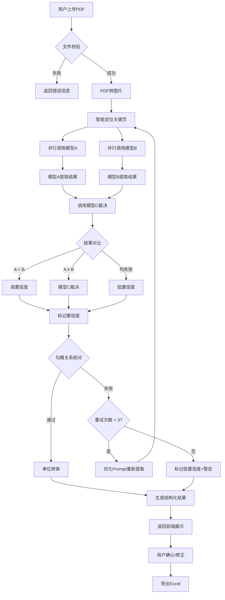
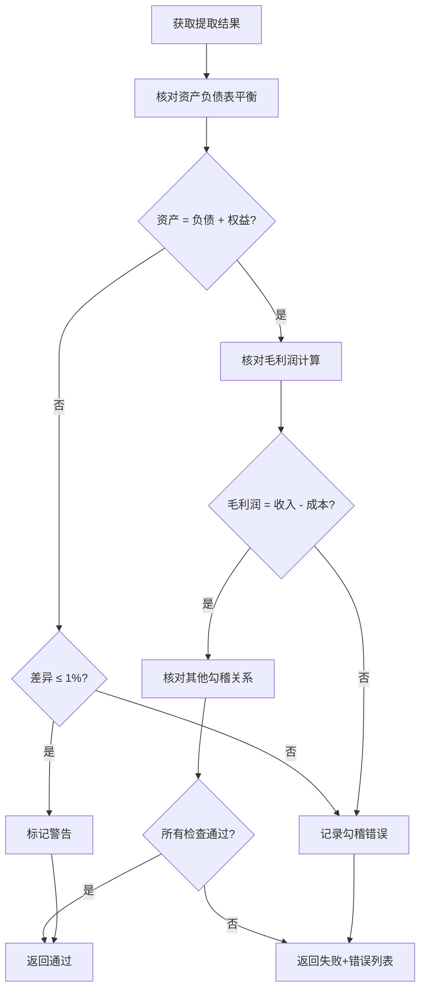
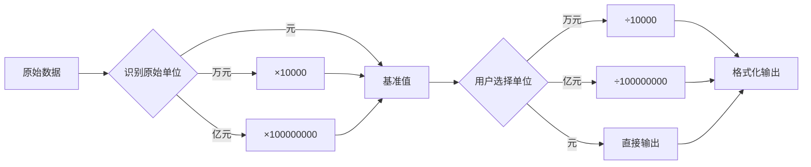
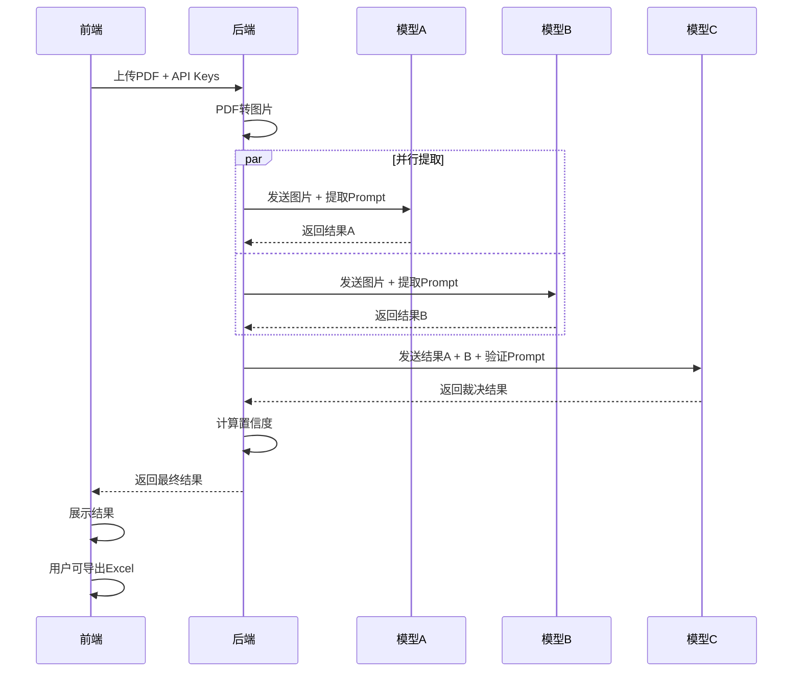
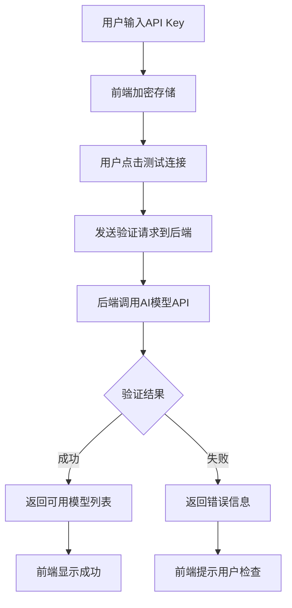

# 智能财务报表数据提取工具 - 架构设计蓝图

> **版本**: V1.14
> **创建日期**: 2026-03-20
> **最后更新**: 2026-03-25

---

## 🆕 V1.14 架构更新 (2026-03-25)

### 核心变更：五档置信度系统 + 响应优化

**问题根因**：
1. 三档置信度区分度不够，用户无法精确了解数据质量
2. 模型C响应JSON过长导致截断，解析失败返回低置信度
3. 模型C的validate()调用未记录日志

**解决方案**：
1. 五档置信度系统（1-5分），模型C直接评分
2. 优化模型C响应格式，只返回裁决决策不返回完整结果
3. validate()调用传递aiLogService

```
┌─────────────────────────────────────────────────────────────────────────────┐
│                         V1.14 五档置信度系统                                  │
├─────────────────────────────────────────────────────────────────────────────┤
│                                                                             │
│  置信度评分流程                                                              │
│  ┌─────────────────────────────────────────────────────────────────────┐   │
│  │                                                                     │   │
│  │  模型A、B提取数据 ──► 模型C裁决评分 ──► 后端结合勾稽微调 ──► 最终分数  │   │
│  │        │                  │                  │               │       │   │
│  │        ▼                  ▼                  ▼               ▼       │   │
│  │   financialMetrics    confidence: 4     勾稽通过: +0       4分       │   │
│  │   (每个带confidence)   decisions[]      勾稽失败: -1                │   │
│  │                                                                     │   │
│  └─────────────────────────────────────────────────────────────────────┘   │
│                                                                             │
│  五档置信度定义                                                              │
│  ┌─────────────────────────────────────────────────────────────────────┐   │
│  │  分数 │ 名称       │ 颜色  │ 条件                                   │   │
│  │  ────┼────────────┼───────┼────────────────────────────────────────│   │
│  │   5  │ 高置信度    │ 🟢    │ 三模型一致 + 勾稽通过                   │   │
│  │   4  │ 中高置信度  │ 🔵    │ 双模型一致 或 三模型小差异              │   │
│  │   3  │ 中置信度    │ 🟡    │ 有差异但可裁决                          │   │
│  │   2  │ 中低置信度  │ 🟠    │ 差异较大需核对                          │   │
│  │   1  │ 低置信度    │ 🔴    │ 模拟数据/解析失败                       │   │
│  └─────────────────────────────────────────────────────────────────────┘   │
│                                                                             │
└─────────────────────────────────────────────────────────────────────────────┘
```

### 模型C响应格式优化

```
┌─────────────────────────────────────────────────────────────────────────────┐
│                         模型C响应格式对比                                     │
├─────────────────────────────────────────────────────────────────────────────┤
│                                                                             │
│  V1.13 (会被截断):                                                          │
│  ┌─────────────────────────────────────────────────────────────────────┐   │
│  │  {                                                                  │   │
│  │    "finalResult": {                    ← 完整复制，太长！            │   │
│  │      "companyInfo": {...},              约500字符                    │   │
│  │      "financialMetrics": [...]          约5000字符                   │   │
│  │      "nonFinancialInfo": {...}          约1000字符                   │   │
│  │    },                                                               │   │
│  │    "comparisons": [...],               约2000字符                    │   │
│  │    "confidence": "high"                                             │   │
│  │  }                     总计约8500字符，容易截断                       │   │
│  └─────────────────────────────────────────────────────────────────────┘   │
│                                                                             │
│  V1.14 (简洁高效):                                                          │
│  ┌─────────────────────────────────────────────────────────────────────┐   │
│  │  {                                                                  │   │
│  │    "confidence": 4,                    ← 直接评分                    │   │
│  │    "decisions": [                        只记录差异                   │   │
│  │      {"metric": "营业收入", "choose": "same", "reason": "一致"}       │   │
│  │    ],                   约500字符                                    │   │
│  │    "companyInfoDecision": {"choose": "A"},                          │   │
│  │    "notes": ""                         约100字符                     │   │
│  │  }                     总计约600字符，不会截断                        │   │
│  └─────────────────────────────────────────────────────────────────────┘   │
│                                                                             │
│  后端根据decisions合并A/B结果生成finalResult                                │
│                                                                             │
└─────────────────────────────────────────────────────────────────────────────┘
```

### 文件变更清单

| 文件 | 变更内容 |
|------|----------|
| `adapters/BaseAdapter.js` | 优化buildValidatePrompt()，简化输出格式 |
| `adapters/DoubaoAdapter.js` | 新增mergeValidationResults()合并结果 |
| `services/ExtractionService.js` | 支持五档置信度，validate()传递aiLogService |
| `components/ExtractionResult/index.jsx` | 五档置信度配置和显示 |

---

## 🆕 V1.7 架构更新 (2026-03-22)

### 核心变更：AI调试日志系统

**问题根因**：V1.6增强了文本提取和Prompt，但提取结果仍与PDF原文不符。用户需要查看AI模型的输入、思考过程和输出详情来诊断问题。

**解决方案**：
1. 新增AILogService记录所有AI交互详情
2. 前端新增AIDebugPanel展示调试日志
3. API响应新增debugLog字段

```
┌─────────────────────────────────────────────────────────────────────────────┐
│                         V1.7 数据流（含调试日志）                             │
├─────────────────────────────────────────────────────────────────────────────┤
│                                                                             │
│  ┌─────────────────────────────────────────────────────────────────────┐   │
│  │  前端                                                                │   │
│  │  ┌───────────┐    ┌───────────┐    ┌───────────────────────────────┐│   │
│  │  │ FileUploader │──►│ apiService │──►│ 收到 { data, debugLog }     ││   │
│  │  └───────────┘    └───────────┘    │  ├─ data → extractionResult  ││   │
│  │                                    │  └─ debugLog → store          ││   │
│  │                                    └───────────────────────────────┘│   │
│  │                                           │                          │   │
│  │                                           ▼                          │   │
│  │                                    ┌───────────────────────────────┐│   │
│  │                                    │ ExtractionResult              ││   │
│  │                                    │  ├─ [查看AI调试日志] 按钮      ││   │
│  │                                    │  └─ AIDebugPanel 弹窗         ││   │
│  │                                    └───────────────────────────────┘│   │
│  └─────────────────────────────────────────────────────────────────────┘   │
│                                                                             │
│  ┌─────────────────────────────────────────────────────────────────────┐   │
│  │  后端                                                                │   │
│  │  ┌───────────┐    ┌───────────────┐    ┌───────────────────────────┐│   │
│  │  │ routes/   │───►│ Extraction    │───►│ AILogService              ││   │
│  │  │ extract.js│    │ Service.js    │    │  ├─ startSession()        ││   │
│  │  └───────────┘    └───────────────┘    │  ├─ logRequest()          ││   │
│  │         │              │               │  ├─ logResponse()         ││   │
│  │         │              ▼               │  ├─ logError()            ││   │
│  │         │      ┌───────────────┐       │  └─ buildDebugLog()       ││   │
│  │         │      │ DoubaoAdapter │───────►                           ││   │
│  │         │      │   (传递日志服务)│       └───────────────────────────┘│   │
│  │         │      └───────────────┘                    │               │   │
│  │         │                                           ▼               │   │
│  │         │                                ┌───────────────────────────┐│   │
│  │         └────────────────────────────────► 返回 { data, debugLog }  ││   │
│  │                                          └───────────────────────────┘│   │
│  └─────────────────────────────────────────────────────────────────────┘   │
│                                                                             │
└─────────────────────────────────────────────────────────────────────────────┘
```

### 文件变更清单

| 文件 | 变更内容 |
|------|----------|
| `services/AILogService.js` | 新增AI交互日志服务 |
| `DoubaoAdapter.js` | 添加日志记录调用 |
| `ExtractionService.js` | 集成AILogService，返回debugLog |
| `routes/extract.js` | 返回debugLog字段 |
| `components/AIDebugPanel/index.jsx` | 新增调试面板组件 |
| `ExtractionResult.jsx` | 添加调试按钮，集成调试面板 |
| `store/useStore.js` | 添加debugLog状态 |
| `services/apiService.js` | 处理debugLog返回值 |

---

## 🆕 V1.6 架构更新 (2026-03-22)

### 核心变更：增强文本提取 + 表格结构保留

**问题根因**：pdf-parse提取的纯文本丢失了财务报表的表格布局，导致AI无法准确定位数据，倾向于使用训练数据中的"已知"信息。

**解决方案**：
1. 使用pdf2json提取带位置信息的文本，保留表格结构
2. 增强Prompt，强调从原文提取而非使用记忆
3. 降低AI温度参数，减少幻觉

```
┌─────────────────────────────────────────────────────────────────────────────┐
│                         V1.6 数据提取流程                                    │
├─────────────────────────────────────────────────────────────────────────────┤
│                                                                             │
│  ┌─────────────────────────────────────────────────────────────────────┐   │
│  │  PDF文件                                                            │   │
│  │     │                                                               │   │
│  │     ├──► pdf2json ──► 提取文本+位置信息 ──► 重建表格结构            │   │
│  │     │                                          │                    │   │
│  │     └──► pdf-parse ──► 提取纯文本 ──────────────┘ (备选)            │   │
│  │                                                  │                    │   │
│  │                                                  ▼                    │   │
│  │                                    格式化文本（保留表格结构）        │   │
│  │                                                  │                    │   │
│  │                                                  ▼                    │   │
│  │                                    构建增强Prompt                    │   │
│  │                                    (强调从原文提取)                  │   │
│  │                                                  │                    │   │
│  │                                                  ▼                    │   │
│  │                                    Vision AI API                    │   │
│  │                                    (temperature=0.1)                 │   │
│  │                                                  │                    │   │
│  │                                                  ▼                    │   │
│  │                                    提取结果                          │   │
│  └─────────────────────────────────────────────────────────────────────┘   │
│                                                                             │
│  关键改进:                                                                   │
│  ┌─────────────────────────────────────────────────────────────────────┐   │
│  │  1. PDFService.js: 使用pdf2json提取带位置信息的文本                 │   │
│  │  2. 表格重建: 按Y坐标分行，按X坐标分列，保留表格结构                │   │
│  │  3. DoubaoAdapter.js: 增强Prompt，降低temperature                   │   │
│  │  4. 模拟数据检测: 检测AI是否使用了训练数据而非原文                  │   │
│  └─────────────────────────────────────────────────────────────────────┘   │
│                                                                             │
└─────────────────────────────────────────────────────────────────────────────┘
```

### 文件变更清单

| 文件 | 变更内容 |
|------|----------|
| `PDFService.js` | 新增pdf2json提取，表格结构重建 |
| `DoubaoAdapter.js` | 增强Prompt，temperature=0.1 |
| `package.json` | 新增pdf2json依赖 |

---

## 一、系统架构概览

### 1.1 整体架构

```
┌─────────────────────────────────────────────────────────────────────────────┐
│                              用户界面层                                      │
│  ┌─────────────────────────────────────────────────────────────────────┐   │
│  │                    React Single Page Application                     │   │
│  │  ┌──────────┐ ┌──────────┐ ┌──────────┐ ┌──────────┐ ┌──────────┐  │   │
│  │  │ Layout   │ │ Model    │ │ File     │ │ Result   │ │ History  │  │   │
│  │  │          │ │ Config   │ │ Uploader │ │ Display  │ │ Panel    │  │   │
│  │  └──────────┘ └──────────┘ └──────────┘ └──────────┘ └──────────┘  │   │
│  └─────────────────────────────────────────────────────────────────────┘   │
└─────────────────────────────────────────────────────────────────────────────┘
                                        │
                                        ▼
┌─────────────────────────────────────────────────────────────────────────────┐
│                              服务层                                          │
│  ┌─────────────────┐  ┌─────────────────┐  ┌─────────────────┐             │
│  │   API Service   │  │ Storage Service │  │ Export Service  │             │
│  │  (HTTP请求封装)  │  │  (本地存储管理)  │  │  (Excel导出)    │             │
│  └─────────────────┘  └─────────────────┘  └─────────────────┘             │
└─────────────────────────────────────────────────────────────────────────────┘
                                        │
                                        ▼
┌─────────────────────────────────────────────────────────────────────────────┐
│                              后端API层                                       │
│  ┌─────────────────────────────────────────────────────────────────────┐   │
│  │                      Node.js / Express Server                        │   │
│  │  ┌──────────────┐ ┌──────────────┐ ┌──────────────┐ ┌────────────┐  │   │
│  │  │ /api/extract │ │/api/validate │ │ /api/models  │ │ Middleware │  │   │
│  │  │   提取数据    │ │   验证Key    │ │  模型列表    │ │  (CORS等)  │  │   │
│  │  └──────────────┘ └──────────────┘ └──────────────┘ └────────────┘  │   │
│  └─────────────────────────────────────────────────────────────────────┘   │
└─────────────────────────────────────────────────────────────────────────────┘
                                        │
                    ┌───────────────────┼───────────────────┐
                    ▼                   ▼                   ▼
┌───────────────────────┐ ┌───────────────────────┐ ┌───────────────────────┐ ┌───────────────────────┐
│     PDF处理服务        │ │    提取协调服务        │ │     验证服务          │ │  勾稽核对服务    ←新增 │
│  ┌─────────────────┐  │ │  ┌─────────────────┐  │ │  ┌─────────────────┐  │ │  ┌─────────────────┐  │
│  │ PDF → Images    │  │ │  │ 并行调用多模型  │  │ │  │ 结果对比        │  │ │  │ 勾稽关系核对    │  │
│  │ 页面解析        │  │ │  │ 结果聚合        │  │ │  │ 置信度计算      │  │ │  │ 自动重试机制    │  │
│  └─────────────────┘  │ │  └─────────────────┘  │ │  └─────────────────┘  │ │  └─────────────────┘  │
└───────────────────────┘ └───────────────────────┘ └───────────────────────┘ └───────────────────────┘
                                        │
                    ┌───────────────────┴───────────────────┐
                    ▼                                       ▼
          ┌───────────────────────┐             ┌───────────────────────┐
          │   单位转换服务   ←新增 │             │    导出服务           │
          │  ┌─────────────────┐  │             │  ┌─────────────────┐  │
          │  │ 元/万元/亿元    │  │             │  │ Excel生成       │  │
          │  │ 自动转换        │  │             │  │ 格式化输出      │  │
          │  └─────────────────┘  │             │  └─────────────────┘  │
          └───────────────────────┘             └───────────────────────┘
                                        │
                                        ▼
┌─────────────────────────────────────────────────────────────────────────────┐
│                              AI模型适配层                                    │
│  ┌─────────┐ ┌─────────┐ ┌─────────┐ ┌─────────┐ ┌─────────┐ ┌─────────┐  │
│  │ Claude  │ │  GPT    │ │ Gemini  │ │DeepSeek │ │  Kimi   │ │  GLM    │  │
│  │ Adapter │ │ Adapter │ │ Adapter │ │ Adapter │ │ Adapter │ │ Adapter │  │
│  └─────────┘ └─────────┘ └─────────┘ └─────────┘ └─────────┘ └─────────┘  │
│  ┌─────────┐ ┌─────────┐                                                  │
│  │MiniMax  │ │  Base   │  ← 统一接口抽象                                   │
│  │ Adapter │ │ Adapter │                                                  │
│  └─────────┘ └─────────┘                                                  │
└─────────────────────────────────────────────────────────────────────────────┘
                                        │
                                        ▼
┌─────────────────────────────────────────────────────────────────────────────┐
│                              外部AI服务                                      │
│  Anthropic API │ OpenAI API │ Google AI API │ DeepSeek API │ ...          │
└─────────────────────────────────────────────────────────────────────────────┘
```

---

## 二、核心流程图

### 2.1 数据提取主流程（含勾稽核对）



### 2.2 勾稽关系核对流程（新增）



### 2.3 单位转换流程（新增）



### 2.4 三模型验证流程



### 2.3 API Key验证流程



---

## 三、组件交互说明

### 3.1 前端组件结构

```
src/
├── components/
│   ├── Layout/
│   │   ├── index.jsx              # 主布局组件
│   │   ├── Header.jsx             # 顶部导航
│   │   └── Sidebar.jsx            # 左侧边栏
│   │
│   ├── ModelConfig/
│   │   ├── index.jsx              # 模型配置面板
│   │   ├── ModelSelector.jsx      # 模型选择器
│   │   ├── ApiKeyInput.jsx        # API Key输入框
│   │   └── TestConnection.jsx     # 测试连接按钮
│   │
│   ├── FileUploader/
│   │   ├── index.jsx              # 文件上传组件
│   │   ├── DropZone.jsx           # 拖拽区域
│   │   └── FileInfo.jsx           # 文件信息显示
│   │
│   ├── UnitSelector/              # ← 新增
│   │   ├── index.jsx              # 单位选择器组件
│   │   └── UnitOption.jsx         # 单位选项
│   │
│   ├── ExtractionResult/
│   │   ├── index.jsx              # 结果展示主组件
│   │   ├── CompanyInfo.jsx        # 公司信息卡片
│   │   ├── MetricsTable.jsx       # 财务指标表格
│   │   ├── NonFinancialInfo.jsx   # 非财务信息
│   │   ├── ValidationDetail.jsx   # 验证详情
│   │   └── AccountingCheckPanel.jsx  # ← 新增：勾稽核对面板
│   │
│   ├── HistoryPanel/
│   │   ├── index.jsx              # 历史记录面板
│   │   └── HistoryItem.jsx        # 历史记录项
│   │
│   ├── HistoryPanel/
│   │   ├── index.jsx              # 历史记录面板
│   │   └── HistoryItem.jsx        # 历史记录项
│   │
│   └── common/
│       ├── Button.jsx             # 通用按钮
│       ├── Input.jsx              # 通用输入框
│       ├── Modal.jsx              # 模态框
│       ├── Tooltip.jsx            # 提示框
│       └── Loading.jsx            # 加载动画
│
├── services/
│   ├── apiService.js              # API调用封装
│   ├── storageService.js          # 本地存储服务
│   └── exportService.js           # Excel导出服务
│
├── hooks/
│   ├── useExtraction.js           # 提取逻辑Hook
│   ├── useModelConfig.js          # 模型配置Hook
│   └── useHistory.js              # 历史记录Hook
│
├── utils/
│   ├── crypto.js                  # 加密工具
│   ├── format.js                  # 格式化工具
│   └── constants.js               # 常量定义
│
├── store/
│   └── useStore.js                # Zustand状态管理
│
├── App.jsx                        # 根组件
└── main.jsx                       # 入口文件
```

### 3.2 后端模块结构

```
backend/
├── src/
│   ├── routes/
│   │   ├── extract.js             # 提取路由
│   │   ├── validate.js            # 验证路由
│   │   └── models.js              # 模型列表路由
│   │
│   ├── services/
│   │   ├── PDFService.js          # PDF处理服务
│   │   ├── ExtractionService.js   # 提取协调服务
│   │   ├── ValidationService.js   # 验证服务
│   │   ├── AccountingCheckService.js  # ← 新增：勾稽核对服务
│   │   ├── UnitConvertService.js      # ← 新增：单位转换服务
│   │   └── ExportService.js       # 导出服务
│   │
│   ├── adapters/
│   │   ├── BaseAdapter.js         # 适配器基类
│   │   ├── ClaudeAdapter.js       # Claude适配器
│   │   ├── OpenAIAdapter.js       # OpenAI适配器
│   │   ├── GeminiAdapter.js       # Gemini适配器
│   │   ├── DeepSeekAdapter.js     # DeepSeek适配器
│   │   ├── KimiAdapter.js         # Kimi适配器
│   │   ├── GLMAdapter.js          # GLM适配器
│   │   └── MiniMaxAdapter.js      # MiniMax适配器
│   │
│   ├── prompts/
│   │   ├── extractPrompt.js       # 提取Prompt模板
│   │   └── validatePrompt.js      # 验证Prompt模板
│   │
│   ├── middleware/
│   │   ├── errorHandler.js        # 错误处理
│   │   ├── fileUpload.js          # 文件上传处理
│   │   └── rateLimiter.js         # 请求限流
│   │
│   ├── utils/
│   │   ├── logger.js              # 日志工具
│   │   └── validator.js           # 数据校验
│   │
│   └── app.js                     # Express应用入口
│
├── uploads/                       # 临时文件目录
├── package.json
└── .env.example
```

### 3.3 组件调用关系

```
┌─────────────────────────────────────────────────────────────────────────────┐
│                              组件调用关系图                                  │
├─────────────────────────────────────────────────────────────────────────────┤
│                                                                             │
│  App.jsx                                                                    │
│    │                                                                        │
│    ├── Layout                                                               │
│    │     ├── Header                                                         │
│    │     └── Sidebar                                                        │
│    │           ├── ModelConfig                                              │
│    │           │     ├── ModelSelector × 3                                  │
│    │           │     ├── ApiKeyInput × 3                                    │
│    │           │     └── TestConnection                                     │
│    │           │           └── apiService.validateKey()                     │
│    │           │                                                            │
│    │           ├── FileUploader                                             │
│    │           │     └── DropZone                                           │
│    │           │                                                            │
│    │           └── HistoryPanel                                             │
│    │                 └── storageService.getHistory()                        │
│    │                                                                        │
│    └── ExtractionResult                                                     │
│          ├── CompanyInfo                                                    │
│          ├── MetricsTable                                                   │
│          │     └── 点击数据 → 显示ValidationDetail                          │
│          ├── NonFinancialInfo                                               │
│          │     └── 展开查看详情                                              │
│          └── 操作按钮                                                       │
│                ├── [导出Excel] → exportService.exportToExcel()              │
│                ├── [复制数据] → navigator.clipboard.writeText()             │
│                └── [重新提取] → apiService.extract()                        │
│                                                                             │
│  ─────────────────────────────────────────────────────────────────────────  │
│                                                                             │
│  Store (Zustand)                                                            │
│    ├── modelConfig                                                          │
│    │     └── storageService.loadConfig() / saveConfig()                     │
│    ├── extractionResult                                                     │
│    ├── history                                                              │
│    │     └── storageService.updateHistory()                                 │
│    └── uiState (loading, error, etc.)                                       │
│                                                                             │
└─────────────────────────────────────────────────────────────────────────────┘
```

---

## 四、API接口设计

### 4.1 接口列表

| 方法 | 路径 | 描述 | 请求体 | 响应体 |
|------|------|------|--------|--------|
| POST | /api/extract | 提取数据 | FormData | ExtractionResult |
| POST | /api/validate-key | 验证API Key | ValidateKeyRequest | ValidateKeyResponse |
| GET | /api/models | 获取支持的模型列表 | - | ModelList |
| POST | /api/convert-unit | 单位转换 | UnitConvertRequest | UnitConvertResponse |

### 4.2 接口详细设计

#### POST /api/extract

**请求**:
```javascript
// FormData
{
  pdf: File,                    // PDF文件
  modelA: 'claude',             // 模型A类型
  modelAKey: 'sk-xxx...',       // 模型A API Key
  modelB: 'gpt',                // 模型B类型
  modelBKey: 'sk-xxx...',       // 模型B API Key
  modelC: 'deepseek',           // 模型C类型
  modelCKey: 'sk-xxx...',       // 模型C API Key
  options: JSON.stringify({     // 可选参数
    metrics: ['营业收入', '净利润'],  // 指定指标
    infoTypes: ['risk', 'plan'],     // 指定非财务信息类型
    displayUnit: 'wan',              // ← 新增：显示单位（yuan/wan/yi）
    maxRetries: 3                    // ← 新增：勾稽失败最大重试次数
  })
}
```

**响应**:
```javascript
{
  success: true,
  data: {
    companyInfo: {
      name: "贵州茅台",
      stockCode: "600519",
      reportPeriod: "2024年年度报告",
      reportDate: "2025-03-15"
    },
    financialMetrics: [...],
    nonFinancialInfo: [...],
    // ← 新增：勾稽核对结果
    accountingCheck: {
      isValid: true,
      retryCount: 0,
      checks: [
        {
          name: "资产负债表平衡",
          formula: "总资产 = 总负债 + 净资产",
          passed: true,
          difference: 0,
          differencePercent: 0
        }
      ]
    },
    // ← 新增：单位信息
    unitInfo: {
      originalUnit: "yi",      // PDF原始单位
      displayUnit: "wan"       // 显示单位
    },
    metadata: {
      extractedAt: "2026-03-20T10:30:00Z",
      processingTimeMs: 32000,
      retryCount: 0,           // ← 新增：重试次数
      modelsUsed: {
        modelA: "claude-3-5-sonnet",
        modelB: "gpt-4o",
        modelC: "deepseek-v3"
      },
      pdfPageCount: 240,
      pagesProcessed: [6, 7, 8, 9, 10, 45, 46]
    }
  }
}
```

**错误响应**:
```javascript
{
  success: false,
  error: {
    code: "PDF_PARSE_ERROR",
    message: "PDF解析失败",
    details: "无法读取PDF文件，请检查文件是否损坏"
  }
}
```

#### POST /api/validate-key

**请求**:
```javascript
{
  provider: "claude",
  apiKey: "sk-ant-xxx...",
  model: "claude-3-5-sonnet-20241022"  // 可选
}
```

**响应**:
```javascript
{
  success: true,
  message: "API Key 验证成功",
  models: [
    "claude-3-5-sonnet-20241022",
    "claude-3-5-haiku-20241022",
    "claude-3-opus-20240229"
  ]
}
```

#### GET /api/models

**响应**:
```javascript
{
  models: [
    {
      provider: "claude",
      name: "Claude",
      models: [
        { id: "claude-3-5-sonnet-20241022", name: "Claude 3.5 Sonnet" },
        { id: "claude-3-5-haiku-20241022", name: "Claude 3.5 Haiku" }
      ],
      keyFormat: "sk-ant-...",
      docs: "https://docs.anthropic.com/"
    },
    {
      provider: "gpt",
      name: "OpenAI GPT",
      models: [
        { id: "gpt-4o", name: "GPT-4o" },
        { id: "gpt-4-turbo", name: "GPT-4 Turbo" }
      ],
      keyFormat: "sk-...",
      docs: "https://platform.openai.com/"
    },
    // ... 其他模型
  ]
}
```

---

## 五、AI模型适配器设计

### 5.1 适配器基类

```javascript
// BaseAdapter.js
class BaseAdapter {
  constructor(config) {
    this.provider = config.provider;
    this.apiKey = config.apiKey;
    this.model = config.model;
    this.baseUrl = config.baseUrl;
  }

  // 子类必须实现
  async extract(pdfImages, prompt) {
    throw new Error('Method not implemented');
  }

  async validateKey() {
    throw new Error('Method not implemented');
  }

  // 统一的错误处理
  handleError(error) {
    return {
      success: false,
      code: this.getErrorCode(error),
      message: error.message
    };
  }

  getErrorCode(error) {
    // 根据不同错误类型返回错误码
    if (error.status === 401) return 'INVALID_API_KEY';
    if (error.status === 429) return 'RATE_LIMIT_EXCEEDED';
    if (error.status === 500) return 'MODEL_ERROR';
    return 'UNKNOWN_ERROR';
  }
}

module.exports = BaseAdapter;
```

### 5.2 Claude适配器示例

```javascript
// ClaudeAdapter.js
const BaseAdapter = require('./BaseAdapter');
const Anthropic = require('@anthropic-ai/sdk');

class ClaudeAdapter extends BaseAdapter {
  constructor(config) {
    super(config);
    this.client = new Anthropic({ apiKey: config.apiKey });
  }

  async extract(pdfImages, prompt) {
    try {
      const content = [
        ...pdfImages.map(img => ({
          type: 'image',
          source: {
            type: 'base64',
            media_type: 'image/png',
            data: img.base64
          }
        })),
        { type: 'text', text: prompt }
      ];

      const response = await this.client.messages.create({
        model: this.model,
        max_tokens: 4096,
        messages: [{ role: 'user', content }]
      });

      return {
        success: true,
        data: this.parseResponse(response.content[0].text)
      };
    } catch (error) {
      return this.handleError(error);
    }
  }

  async validateKey() {
    try {
      await this.client.messages.create({
        model: this.model,
        max_tokens: 10,
        messages: [{ role: 'user', content: 'Hi' }]
      });
      return { success: true };
    } catch (error) {
      return this.handleError(error);
    }
  }

  parseResponse(text) {
    // 解析AI返回的JSON
    try {
      return JSON.parse(text);
    } catch {
      // 尝试从markdown代码块中提取JSON
      const jsonMatch = text.match(/```json\n([\s\S]*?)\n```/);
      if (jsonMatch) {
        return JSON.parse(jsonMatch[1]);
      }
      throw new Error('Failed to parse AI response');
    }
  }
}

module.exports = ClaudeAdapter;
```

### 5.3 模型适配器工厂

```javascript
// AdapterFactory.js
const ClaudeAdapter = require('./ClaudeAdapter');
const OpenAIAdapter = require('./OpenAIAdapter');
const GeminiAdapter = require('./GeminiAdapter');
const DeepSeekAdapter = require('./DeepSeekAdapter');
const KimiAdapter = require('./KimiAdapter');
const GLMAdapter = require('./GLMAdapter');
const MiniMaxAdapter = require('./MiniMaxAdapter');

const adapterMap = {
  claude: ClaudeAdapter,
  gpt: OpenAIAdapter,
  gemini: GeminiAdapter,
  deepseek: DeepSeekAdapter,
  kimi: KimiAdapter,
  glm: GLMAdapter,
  minimax: MiniMaxAdapter
};

class AdapterFactory {
  static create(provider, config) {
    const AdapterClass = adapterMap[provider];
    if (!AdapterClass) {
      throw new Error(`Unknown provider: ${provider}`);
    }
    return new AdapterClass({ ...config, provider });
  }

  static getSupportedProviders() {
    return Object.keys(adapterMap);
  }
}

module.exports = AdapterFactory;
```

---

## 六、勾稽核对服务设计（新增）

### 6.1 服务职责

```
┌─────────────────────────────────────────────────────────────────┐
│                    AccountingCheckService                        │
├─────────────────────────────────────────────────────────────────┤
│                                                                 │
│  职责:                                                          │
│  1. 对AI提取的财务数据进行勾稽关系核对                           │
│  2. 发现勾稽关系错误时，触发重新提取                             │
│  3. 记录核对结果，生成用户可理解的警告信息                       │
│                                                                 │
└─────────────────────────────────────────────────────────────────┘
```

### 6.2 核心代码实现

```javascript
// AccountingCheckService.js
class AccountingCheckService {
  constructor() {
    // 定义勾稽关系规则
    this.rules = [
      {
        name: '资产负债表平衡',
        formula: '总资产 = 总负债 + 净资产',
        check: (data) => {
          const left = data.totalAssets;
          const right = data.totalLiabilities + data.netAssets;
          const diff = Math.abs(left - right);
          const diffPercent = left > 0 ? (diff / left) * 100 : 0;
          return {
            passed: diffPercent <= 1, // 1%容差
            leftSide: left,
            rightSide: right,
            difference: diff,
            differencePercent: diffPercent
          };
        }
      },
      {
        name: '毛利润计算',
        formula: '毛利润 = 营业收入 - 营业成本',
        check: (data) => {
          const expected = data.revenue - data.cost;
          const actual = data.grossProfit;
          const diff = Math.abs(expected - actual);
          const diffPercent = expected > 0 ? (diff / expected) * 100 : 0;
          return {
            passed: diffPercent <= 1,
            expected: expected,
            actual: actual,
            difference: diff,
            differencePercent: diffPercent
          };
        }
      },
      {
        name: '流动资产校验',
        formula: '流动资产 ≤ 总资产',
        check: (data) => ({
          passed: data.currentAssets <= data.totalAssets,
          currentAssets: data.currentAssets,
          totalAssets: data.totalAssets
        })
      },
      {
        name: '流动负债校验',
        formula: '流动负债 ≤ 总负债',
        check: (data) => ({
          passed: data.currentLiabilities <= data.totalLiabilities,
          currentLiabilities: data.currentLiabilities,
          totalLiabilities: data.totalLiabilities
        })
      }
    ];
  }

  /**
   * 执行勾稽关系核对
   * @param {Object} extractedData - AI提取的数据
   * @returns {Object} 核对结果
   */
  check(extractedData) {
    const results = this.rules.map(rule => {
      const checkResult = rule.check(extractedData);
      return {
        name: rule.name,
        formula: rule.formula,
        passed: checkResult.passed,
        ...checkResult
      };
    });

    const allPassed = results.every(r => r.passed);
    const failedChecks = results.filter(r => !r.passed);

    return {
      isValid: allPassed,
      checks: results,
      failedChecks: failedChecks,
      summary: this.generateSummary(allPassed, failedChecks)
    };
  }

  /**
   * 生成核对摘要
   */
  generateSummary(allPassed, failedChecks) {
    if (allPassed) {
      return '所有勾稽关系核对通过';
    }
    return `发现 ${failedChecks.length} 项勾稽关系异常：${failedChecks.map(c => c.name).join('、')}`;
  }
}

module.exports = AccountingCheckService;
```

### 6.3 重试机制

```javascript
// ExtractionService.js 中的重试逻辑
class ExtractionService {
  constructor() {
    this.accountingCheckService = new AccountingCheckService();
    this.maxRetries = 3;
  }

  async extractWithRetry(pdfImages, config, retryCount = 0) {
    // 1. 执行AI提取
    const extractedData = await this.extract(pdfImages, config);

    // 2. 执行勾稽核对
    const checkResult = this.accountingCheckService.check(extractedData);

    // 3. 如果勾稽失败且未超过重试次数
    if (!checkResult.isValid && retryCount < this.maxRetries) {
      console.log(`勾稽核对失败（第${retryCount + 1}次），准备重试...`);

      // 优化Prompt，强调勾稽关系
      const enhancedPrompt = this.enhancePromptWithAccountingHints(
        config.prompt,
        checkResult.failedChecks,
        retryCount
      );

      // 重新提取
      return this.extractWithRetry(
        pdfImages,
        { ...config, prompt: enhancedPrompt },
        retryCount + 1
      );
    }

    // 4. 返回最终结果（包含勾稽核对信息）
    return {
      ...extractedData,
      accountingCheck: {
        ...checkResult,
        retryCount: retryCount
      }
    };
  }

  /**
   * 根据重试次数优化Prompt
   */
  enhancePromptWithAccountingHints(originalPrompt, failedChecks, retryCount) {
    const hints = failedChecks.map(c => `【${c.formula}】`).join('、');

    if (retryCount === 0) {
      return `${originalPrompt}\n\n⚠️ 特别注意：请确保以下勾稽关系成立：${hints}`;
    } else if (retryCount === 1) {
      return `${originalPrompt}\n\n🔴 重要警告：上次提取的数据勾稽关系不正确，请仔细核对以下关系：\n${failedChecks.map(c => `  - ${c.name}：${c.formula}`).join('\n')}`;
    } else {
      return `${originalPrompt}\n\n🚨 最终警告：这是最后一次尝试，请务必确保勾稽关系正确：\n${failedChecks.map(c => `  - ${c.name}：${c.formula}（上次差异：${c.differencePercent?.toFixed(2)}%）`).join('\n')}`;
    }
  }
}
```

---

## 七、单位转换服务设计（新增）

### 7.1 服务职责

```
┌─────────────────────────────────────────────────────────────────┐
│                     UnitConvertService                           │
├─────────────────────────────────────────────────────────────────┤
│                                                                 │
│  职责:                                                          │
│  1. 识别PDF中财务数据的原始单位                                  │
│  2. 将所有数据转换为统一单位（元为基准）                         │
│  3. 根据用户选择显示单位进行转换                                 │
│  4. 格式化输出（千分位、小数位）                                 │
│                                                                 │
└─────────────────────────────────────────────────────────────────┘
```

### 7.2 核心代码实现

```javascript
// UnitConvertService.js
class UnitConvertService {
  constructor() {
    // 单位转换系数（以"元"为基准）
    this.factors = {
      yuan: 1,
      wan: 10000,        // 万
      yi: 100000000      // 亿
    };

    // 单位显示名称
    this.unitNames = {
      yuan: '元',
      wan: '万元',
      yi: '亿元'
    };
  }

  /**
   * 将值从源单位转换为目标单位
   */
  convert(value, fromUnit, toUnit, decimalPlaces = 2) {
    // 先转换为元（基准单位）
    const valueInYuan = value * this.factors[fromUnit];
    // 再转换为目标单位
    const convertedValue = valueInYuan / this.factors[toUnit];
    // 格式化
    return this.format(convertedValue, decimalPlaces);
  }

  /**
   * 格式化数字（千分位 + 小数位）
   */
  format(value, decimalPlaces = 2) {
    return value.toLocaleString('zh-CN', {
      minimumFractionDigits: decimalPlaces,
      maximumFractionDigits: decimalPlaces
    });
  }

  /**
   * 批量转换财务指标
   */
  convertMetrics(metrics, originalUnit, displayUnit) {
    return metrics.map(metric => {
      // 比率类指标不转换
      if (metric.category === 'calculated' && metric.name.includes('率')) {
        return metric;
      }

      return {
        ...metric,
        value: this.convert(metric.value, originalUnit, displayUnit),
        unit: displayUnit,
        originalValue: metric.value,
        originalUnit: originalUnit
      };
    });
  }

  /**
   * 获取单位显示名称
   */
  getUnitName(unit) {
    return this.unitNames[unit] || unit;
  }
}

module.exports = UnitConvertService;
```

### 7.3 前端单位选择组件

```jsx
// UnitSelector/index.jsx
import React from 'react';
import { Radio, Typography } from 'antd';

const { Text } = Typography;

const UnitSelector = ({ value, onChange }) => {
  return (
    <div className="unit-selector">
      <Text strong>📐 显示单位</Text>
      <Radio.Group
        value={value}
        onChange={(e) => onChange(e.target.value)}
        style={{ marginTop: 8 }}
      >
        <Radio.Button value="yuan">元</Radio.Button>
        <Radio.Button value="wan">万元</Radio.Button>
        <Radio.Button value="yi">亿元</Radio.Button>
      </Radio.Group>
      <Text type="secondary" style={{ display: 'block', marginTop: 4, fontSize: 12 }}>
        所有数据将以选定单位统一显示
      </Text>
    </div>
  );
};

export default UnitSelector;
```

---

## 八、Prompt设计

### 6.1 数据提取Prompt

```javascript
// extractPrompt.js
const EXTRACT_PROMPT = `你是一位专业的财务分析师，请从提供的财务报表图片中提取以下信息。

## 提取要求

1. **财务指标**（请从图片中查找以下指标，如果找不到则标记为 null）：
   - 营业收入
   - 营业成本
   - 毛利润
   - 净利润
   - 归母净利润
   - 扣非净利润
   - 总资产
   - 总负债
   - 净资产（所有者权益合计）
   - 流动资产
   - 流动负债
   - 应收账款
   - 存货
   - 经营活动现金流净额
   - 投资活动现金流净额
   - 筹资活动现金流净额

2. **非财务信息**：
   - 公司概况：主营业务描述、所属行业
   - 风险提示：列出前3-5条重大风险
   - 重大事项：诉讼、担保、关联交易等
   - 未来规划：重大投资计划、战略方向
   - 分红方案：分红金额、比例

3. **公司基本信息**：
   - 公司名称
   - 股票代码（如有）
   - 报告期

## 输出格式

请严格按照以下JSON格式输出，不要添加任何其他文字：

\`\`\`json
{
  "companyInfo": {
    "name": "公司名称",
    "stockCode": "股票代码",
    "reportPeriod": "报告期"
  },
  "financialMetrics": [
    {
      "name": "指标名称",
      "value": 数值,
      "unit": "单位（元/万元/亿元）",
      "source": {
        "page": 页码,
        "location": "位置描述",
        "originalText": "原文"
      }
    }
  ],
  "nonFinancialInfo": [
    {
      "type": "类型（overview/risk/event/plan/dividend）",
      "title": "标题",
      "content": "内容",
      "source": {
        "page": 页码,
        "location": "位置描述"
      }
    }
  ]
}
\`\`\`

## 注意事项

1. 数值必须是纯数字，不要包含逗号或单位符号
2. 如果某个指标在图片中找不到，value 设为 null
3. source 必须准确记录数据来源的页码和位置
4. 位置描述格式示例："资产负债表第3行"、"利润表第5行"、"第2段"
`;

module.exports = EXTRACT_PROMPT;
```

### 6.2 验证裁决Prompt

```javascript
// validatePrompt.js
const VALIDATE_PROMPT = `你是一位资深的财务审计专家，请对以下两个AI模型提取的财务数据进行核对和裁决。

## 模型A提取结果
{{modelAResult}}

## 模型B提取结果
{{modelBResult}}

## 你的任务

1. 对比两个模型的提取结果
2. 对于一致的数据，确认其准确性
3. 对于不一致的数据，根据财务报表的常理判断哪个更准确，并说明理由
4. 对于都缺失的数据，标记为需要人工确认

## 输出格式

请严格按照以下JSON格式输出：

\`\`\`json
{
  "financialMetrics": [
    {
      "name": "指标名称",
      "finalValue": 最终采纳的数值,
      "confidence": "high/medium/low",
      "modelAValue": 模型A的值,
      "modelBValue": 模型B的值,
      "decision": "裁决理由（当A≠B时必填）"
    }
  ],
  "nonFinancialInfo": [
    {
      "type": "类型",
      "finalContent": "最终采纳的内容",
      "confidence": "high/medium/low",
      "decision": "裁决理由（如有分歧）"
    }
  ]
}
\`\`\`

## 置信度判断标准

- **high**: 两个模型结果一致，且数值合理
- **medium**: 两个模型结果不一致，但你能够做出合理裁决
- **low**: 两个模型结果差异大，无法确定哪个正确，需要人工确认

## 注意事项

1. 财务数据应该符合勾稽关系（如：资产=负债+所有者权益）
2. 注意单位的统一（元/万元/亿元）
3. 对于明显异常的数值，应标记为低置信度
`;

module.exports = VALIDATE_PROMPT;
```

---

## 七、技术选型详情

### 7.1 前端技术栈

| 技术 | 版本 | 用途 | 选型理由 |
|------|------|------|---------|
| React | 18.x | UI框架 | 生态成熟，组件化开发 |
| Vite | 5.x | 构建工具 | 快速开发体验，HMR |
| Ant Design | 5.x | UI组件库 | 企业级组件，开箱即用 |
| Zustand | 4.x | 状态管理 | 轻量级，API简单 |
| Axios | 1.x | HTTP客户端 | 拦截器，请求取消 |
| xlsx | 0.18.x | Excel处理 | 功能完善，社区活跃 |
| crypto-js | 4.x | 加密 | API Key本地加密 |
| react-dropzone | 14.x | 文件上传 | 拖拽上传支持 |

### 7.2 后端技术栈

| 技术 | 版本 | 用途 | 选型理由 |
|------|------|------|---------|
| Node.js | 20.x LTS | 运行时 | 与前端技术栈统一 |
| Express | 4.x | Web框架 | 成熟稳定，中间件丰富 |
| Multer | 1.x | 文件上传 | Express标准方案 |
| pdf2pic | 3.x | PDF转图片 | 基于GraphicsMagick |
| Sharp | 0.33.x | 图片处理 | 高性能，压缩优化 |
| @anthropic-ai/sdk | 0.30.x | Claude API | 官方SDK |
| openai | 4.x | OpenAI API | 官方SDK |
| @google/generative-ai | 0.x | Gemini API | 官方SDK |

### 7.3 部署方案

| 环境 | 方案 | 说明 |
|------|------|------|
| 开发环境 | 本地运行 | Node.js + Vite dev server |
| 测试环境 | Vercel (前端) + Railway (后端) | 免费额度，快速部署 |
| 生产环境 | 阿里云/腾讯云 | 国内访问更快 |

---

## 八、安全设计

### 8.1 API Key安全

```
┌─────────────────────────────────────────────────────────────────┐
│  API Key 安全流程                                                │
├─────────────────────────────────────────────────────────────────┤
│                                                                 │
│  1. 用户输入 API Key                                            │
│       ↓                                                         │
│  2. 前端使用 AES 加密 (密钥由用户密码派生)                        │
│       ↓                                                         │
│  3. 加密后存储在 localStorage                                   │
│       ↓                                                         │
│  4. 发送请求时，从 localStorage 读取并解密                       │
│       ↓                                                         │
│  5. 仅在请求体中传输，不在 URL 或 Header 中                      │
│       ↓                                                         │
│  6. 后端收到后立即使用，不持久化存储                             │
│       ↓                                                         │
│  7. 请求完成后，内存中的 Key 立即释放                            │
│                                                                 │
└─────────────────────────────────────────────────────────────────┘
```

### 8.2 文件上传安全

- 文件类型校验：仅允许 `.pdf` 扩展名
- 文件大小限制：最大 50MB
- 文件内容校验：检查 PDF 文件头
- 临时文件清理：处理完成后立即删除

### 8.3 请求安全

- CORS 配置：仅允许指定域名
- 请求限流：单IP每分钟最多10次请求
- 输入校验：所有输入参数进行类型和格式校验

---

## 九、性能优化

### 9.1 前端优化

| 优化项 | 方案 |
|--------|------|
| 代码分割 | 路由级别懒加载 |
| 图片优化 | 压缩 + WebP格式 |
| 缓存策略 | 静态资源长期缓存 |
| 状态优化 | 使用 useMemo/useCallback |

### 9.2 后端优化

| 优化项 | 方案 |
|--------|------|
| 并行处理 | 模型A/B并行调用 |
| 连接池 | 复用HTTP连接 |
| 超时控制 | 单个模型30秒超时 |
| 内存管理 | 及时释放大对象 |

### 9.3 AI调用优化

| 优化项 | 方案 |
|--------|------|
| 页面筛选 | 仅处理财务报表相关页面 |
| 批量处理 | 一次请求发送多张图片 |
| 重试机制 | 失败后最多重试2次 |
| 结果缓存 | 相同PDF不重复处理 |

---

## 十、监控与日志

### 10.1 日志规范

```javascript
// 日志格式
{
  timestamp: "2026-03-20T10:30:00.000Z",
  level: "info",  // debug, info, warn, error
  service: "extraction-service",
  requestId: "req-xxx",
  message: "Extraction completed",
  metadata: {
    pdfPages: 240,
    processingTimeMs: 32000,
    modelsUsed: ["claude", "gpt", "deepseek"]
  }
}
```

### 10.2 监控指标

| 指标 | 描述 | 告警阈值 |
|------|------|---------|
| 请求成功率 | 提取请求的成功率 | < 90% |
| 平均响应时间 | 提取请求的平均耗时 | > 60s |
| AI调用成功率 | 单个AI模型的调用成功率 | < 95% |
| 错误率 | 各类错误的发生频率 | > 5% |

---

## 十一、部署架构

### 11.1 开发环境

```
┌─────────────────────────────────────────┐
│            开发者本地机器               │
├─────────────────────────────────────────┤
│  ┌─────────────┐    ┌─────────────┐    │
│  │   Vite Dev  │    │  Node.js    │    │
│  │   :5173     │───►│   :3000     │    │
│  └─────────────┘    └─────────────┘    │
│                            │            │
│                            ▼            │
│                    外部 AI API          │
└─────────────────────────────────────────┘
```

### 11.2 生产环境

```
┌─────────────────────────────────────────────────────────────────┐
│                           CDN                                    │
│                    (静态资源加速)                                │
└─────────────────────────────────────────────────────────────────┘
                              │
                              ▼
┌─────────────────────────────────────────────────────────────────┐
│                        Nginx 负载均衡                            │
└─────────────────────────────────────────────────────────────────┘
                              │
              ┌───────────────┼───────────────┐
              ▼               ▼               ▼
┌─────────────────┐ ┌─────────────────┐ ┌─────────────────┐
│   Node.js #1    │ │   Node.js #2    │ │   Node.js #3    │
└─────────────────┘ └─────────────────┘ └─────────────────┘
              │               │               │
              └───────────────┼───────────────┘
                              ▼
                    外部 AI API 服务
```

---

## 十二、风险与应对

### 12.1 技术风险

| 风险 | 概率 | 影响 | 应对措施 |
|------|------|------|---------|
| PDF解析失败 | 中 | 高 | 多种解析方案备选；提示用户上传清晰版本 |
| AI API不稳定 | 中 | 高 | 设置合理超时；支持重试；显示处理进度 |
| 内存溢出 | 低 | 高 | 限制文件大小；分页处理；及时释放内存 |
| 跨域问题 | 低 | 中 | 后端代理AI API；正确配置CORS |

### 12.2 业务风险

| 风险 | 概率 | 影响 | 应对措施 |
|------|------|------|---------|
| 准确率不达标 | 中 | 高 | 优化Prompt；多轮验证；标记低置信度 |
| 用户API Key泄露 | 低 | 高 | 仅本地存储；加密存储；安全提示 |
| 响应时间过长 | 中 | 中 | 并行处理；进度显示；优化Prompt长度 |

---

*本文档将随项目迭代持续更新*
