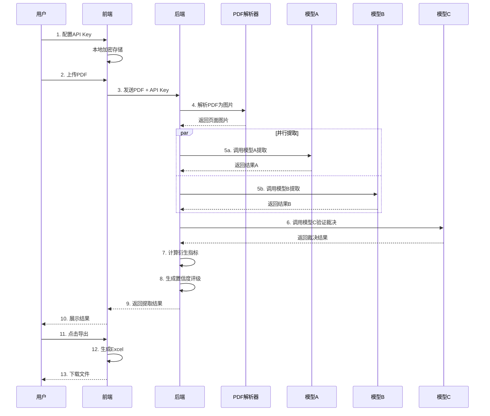
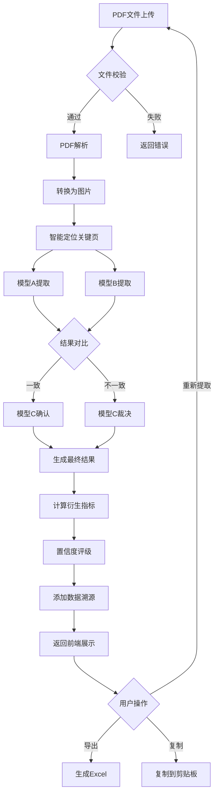

# 智能财务报表数据提取工具 - 产品需求文档 (PRD)

> **版本**: V1.2 (MVP)
> **文档创建日期**: 2026-03-20
> **最后更新**: 2026-03-21
> **产品负责人**: [待定]

---

## 一、产品概述

### 1.1 核心目标

> **让财务报表数据提取从"手工十多分钟"变成"AI五分钟"，准确率95%+，每项数据可追溯源头。**

#### 准确率测量方法

| 维度 | 定义 | 计算公式 |
|------|------|----------|
| **高置信度数据准确率** | 三模型验证后标记为"高置信度"的数据中，与人工核对一致的比例 | `正确数 / 高置信度总数 × 100%` |
| **整体数据准确率** | 所有提取数据（含高/中/低置信度）与人工核对一致的比例 | `正确数 / 总提取数 × 100%` |
| **非财务信息相关性** | 提取的非财务信息与原文相关且完整的比例 | `相关且完整数 / 非财务信息总数 × 100%` |

**验收标准**：
- 样本量：≥30份不同行业、不同格式的PDF年报
- 标注标准：由具备财务专业背景的人员进行人工核对
- 统计方法：95%置信区间，允许±3%的误差范围

### 1.2 产品定位

一款面向会计师、审计师、财务分析师、投资研究员等专业人士的智能财务报表数据提取工具。通过三模型AI验证机制，从PDF年报中快速、准确地提取核心财务数据和关键非财务信息。

### 1.3 核心价值

| 价值点 | 描述 |
|--------|------|
| **效率提升** | 从手工10+分钟缩短到AI处理5分钟 |
| **准确可靠** | 三模型验证机制，准确率95%+ |
| **可追溯** | 每项数据标注来源页码和位置 |
| **灵活配置** | 用户自带API Key，支持多种AI模型 |

---

## 二、用户画像

### 2.1 目标用户

| 用户类型 | 特征 | 核心需求 | 使用频率 |
|----------|------|----------|----------|
| **会计师** | 编制审计底稿、财务分析 | 准确提取财务数据 | 高频（每周） |
| **审计师** | 年报审计、数据核对 | 高准确率、可追溯 | 高频（审计季每天） |
| **财务分析师** | 投资研究、行业分析 | 批量处理、对比分析 | 高频（每天） |
| **投资研究员** | 公司研究、估值建模 | 快速提取、非财务信息 | 中高频 |
| **信贷审核员** | 企业贷款审核 | 风险识别、财务健康度 | 中频 |
| **个人投资者** | 投资决策参考 | 简单易用、低成本 | 低频 |

### 2.2 用户痛点

1. **效率低**: 手工从PDF复制数据，一家公司需要10-15分钟
2. **易出错**: 数字抄写错误，需要反复核对
3. **格式乱**: 不同公司报表格式不统一，难以标准化提取
4. **非结构化**: 风险提示、经营分析等文字信息难以整理
5. **工具缺**: 缺乏专业的财报数据提取工具

---

## 三、产品路线图

### 3.1 版本演进

```
V1 (MVP)          V2              V3              V4           V5
┌─────┐        ┌─────┐        ┌─────┐        ┌─────┐       ┌─────┐
│核心 │ ──►    │效率 │ ──►    │深度 │ ──►    │协作 │ ──►   │商业化│
│提取 │        │提升 │        │分析 │        │企业 │       │变现  │
└─────┘        └─────┘        └─────┘        └─────┘       └─────┘

Q1 2026        Q2 2026        Q3 2026        Q4 2026       2027+
```

### 3.2 V1: MVP版本 (当前)

**定位**: 验证核心价值，"能用、好用、准确"

| 模块 | 功能 | 优先级 |
|------|------|--------|
| **PDF处理** | 手动上传PDF（≤50MB） | P0 |
| | PDF基本信息显示 | P0 |
| **模型配置** | 多模型API Key管理 | P0 |
| | 支持7+主流AI模型 | P0 |
| | API Key本地加密存储 | P0 |
| | 测试连接功能 | P1 |
| **数据提取** | 21项核心财务指标 | P0 |
| | 5类非财务信息 | P0 |
| | 三模型验证机制 | P0 |
| | 数据源位置标注 | P0 |
| | **勾稽关系自动核对** | P0 |
| | **勾稽关系错误自动重新提取** | P0 |
| **单位转换** | **金额单位选择（元/万元/亿元）** | P0 |
| | **自动单位转换** | P0 |
| **结果展示** | 仪表盘式布局 | P0 |
| | 置信度标识（高/中/低） | P0 |
| | 冲突数据高亮 + 裁决说明 | P0 |
| | 历史记录（本地存储） | P1 |
| **导出功能** | Excel导出（格式化） | P0 |
| | 数据来源批注 | P0 |
| | 复制到剪贴板 | P1 |

### 3.3 V2: 效率提升版 (Q2 2026)

| 模块 | 功能 | 价值 |
|------|------|------|
| **数据源扩展** | 自动抓取PDF（股票代码/公司名） | 效率再提升50% |
| | 多数据源支持（东财/巨潮/交易所） | 数据源更全面 |
| **批量处理** | 批量上传/批量抓取 | 机构用户刚需 |
| | 处理队列 + 进度显示 | 提升体验 |
| **PDF联动** | PDF预览（方案C升级） | 核对更方便 |
| | 点击数据跳转PDF位置 | 快速验证 |
| | 高亮显示提取区域 | 一目了然 |
| **模板系统** | 预设/自定义模板 | 个性化需求 |

### 3.4 V3: 深度分析版 (Q3 2026)

| 模块 | 功能 | 价值 |
|------|------|------|
| **多年度对比** | 近3-5年数据对比 | 趋势分析 |
| | 趋势图表 | 可视化 |
| | 同比/环比计算 | 自动化 |
| **自定义提取** | 自定义指标/字段 | 灵活性 |
| | 正则表达式提取 | 高级功能 |
| **智能分析** | 异常检测 | 风险预警 |
| | AI财务点评 | 辅助决策 |
| **行业对标** | 行业数据对比 | 横向分析 |

### 3.5 V4: 协作企业版 (Q4 2026)

| 模块 | 功能 | 价值 |
|------|------|------|
| **账户系统** | 注册/登录/云同步 | 多设备 |
| **团队协作** | 团队空间/成员管理 | 企业级 |
| | 共享模板/历史记录 | 协作效率 |
| **高级功能** | 定时任务/变动提醒 | 自动化 |
| | 批量导出/操作日志 | 企业需求 |

### 3.6 V5: 商业化版本 (2027+)

| 模块 | 功能 | 价值 |
|------|------|------|
| **订阅体系** | 免费/专业/企业/旗舰版 | 商业化 |
| **API开放** | RESTful API/SDK | 生态建设 |
| **增值服务** | AI深度报告/专家审核 | 增值收入 |
| **生态建设** | 插件市场/模板市场 | 社区生态 |

---

## 四、MVP功能详细设计

### 4.1 三模型验证机制

```
┌─────────────────────────────────────────────────────────────────┐
│                     三模型智能验证架构                           │
├─────────────────────────────────────────────────────────────────┤
│                                                                 │
│    ┌─────────────┐         ┌─────────────┐                     │
│    │   模型 A    │         │   模型 B    │                     │
│    │  独立提取   │         │  独立提取   │                     │
│    └──────┬──────┘         └──────┬──────┘                     │
│           │                       │                            │
│           └───────────┬───────────┘                            │
│                       ▼                                        │
│              ┌─────────────────┐                               │
│              │     模型 C      │                               │
│              │   核对与裁决    │                               │
│              └────────┬────────┘                               │
│                       │                                        │
│           ┌───────────┼───────────┐                            │
│           ▼           ▼           ▼                            │
│      [数据一致]   [数据冲突]   [缺失数据]                       │
│        直接采用    模型C裁决    标记需人工补充                   │
│                                                                 │
└─────────────────────────────────────────────────────────────────┘
```

**验证规则**:

| 置信度 | 条件 | 标识颜色 | 处理方式 |
|--------|------|----------|----------|
| **高** | A = B 且 C 确认 | 🟢 绿色 | 直接采用 |
| **中** | A ≠ B，C 做出裁决 | 🟡 黄色 | 采用C的裁决，展示理由 |
| **低** | A、B、C 均无法确定 | 🔴 红色 | 标记需人工确认 |

### 4.2 支持的AI模型

| 模型提供商 | 模型名称 | 特点 | 推荐角色 |
|-----------|---------|------|---------|
| **Anthropic** | Claude 3.5/4 | 理解能力最强，长文本优秀 | 模型A/B |
| **OpenAI** | GPT-4o/GPT-4-turbo | 综合能力强，生态完善 | 模型A/B |
| **Google** | Gemini Pro/Ultra | 多模态能力突出 | 模型A/B |
| **DeepSeek** | DeepSeek-V3 | 性价比极高，中文友好 | 模型C |
| **Moonshot** | Kimi | 长文本处理优秀 | 模型A/B/C |
| **智谱AI** | GLM-4 | 国产模型，中文能力强 | 模型A/B/C |
| **MiniMax** | abab6.5 | 国产模型，性价比高 | 模型C |

### 4.3 提取数据范围

#### 4.3.1 核心财务指标（21项）

| 序号 | 类别 | 指标名称 | 数据来源 | 获取方式 |
|------|------|---------|---------|---------|
| 1 | 收入利润 | 营业收入 | 利润表 | 直接提取 |
| 2 | | 营业成本 | 利润表 | 直接提取 |
| 3 | | 毛利润 | 利润表 | 提取/计算 |
| 4 | | 净利润 | 利润表 | 直接提取 |
| 5 | | 归母净利润 | 利润表 | 直接提取 |
| 6 | | 扣非净利润 | 利润表 | 直接提取 |
| 7 | 资产负债 | 总资产 | 资产负债表 | 直接提取 |
| 8 | | 总负债 | 资产负债表 | 直接提取 |
| 9 | | 净资产 | 资产负债表 | 直接提取 |
| 10 | | 流动资产 | 资产负债表 | 直接提取 |
| 11 | | 流动负债 | 资产负债表 | 直接提取 |
| 12 | | 应收账款 | 资产负债表 | 直接提取 |
| 13 | | 存货 | 资产负债表 | 直接提取 |
| 14 | 现金流 | 经营活动现金流净额 | 现金流量表 | 直接提取 |
| 15 | | 投资活动现金流净额 | 现金流量表 | 直接提取 |
| 16 | | 筹资活动现金流净额 | 现金流量表 | 直接提取 |
| 17 | 计算指标 | 毛利率 | - | 毛利润/营业收入 |
| 18 | | 净利率 | - | 净利润/营业收入 |
| 19 | | 资产负债率 | - | 总负债/总资产 |
| 20 | | 流动比率 | - | 流动资产/流动负债 |
| 21 | | ROE | - | 净利润/净资产 |

#### 4.3.2 非财务信息（5类）

| 序号 | 类型 | 提取内容 | 关注者 | 提取方式 |
|------|------|---------|--------|---------|
| 1 | 公司概况 | 主营业务、所属行业、成立时间 | 所有人 | 摘要提取 |
| 2 | 风险提示 | 前3-5条重大风险因素 | 投资者、债权人 | 列表提取 |
| 3 | 重大事项 | 诉讼、担保、关联交易等 | 审计师、债权人 | 关键词+AI |
| 4 | 未来规划 | 投资计划、战略方向 | 投资者 | 摘要提取 |
| 5 | 分红方案 | 分红金额、比例、日期 | 投资者 | 结构化提取 |

### 4.4 财务数据勾稽关系核对功能

#### 4.4.1 功能说明

在AI提取数据后，系统自动进行财务勾稽关系核对。如果勾稽关系不成立，说明AI提取的数据可能存在错误，系统将自动触发重新提取流程。

#### 4.4.2 核心勾稽关系

| 序号 | 勾稽关系 | 公式 | 容差范围 | 说明 |
|------|---------|------|----------|------|
| 1 | **资产负债表平衡** | 总资产 = 总负债 + 净资产 | ±1% | 会计恒等式，最核心的勾稽关系 |
| 2 | **流动资产构成** | 流动资产 ≤ 总资产 | - | 逻辑校验 |
| 3 | **流动负债构成** | 流动负债 ≤ 总负债 | - | 逻辑校验 |
| 4 | **毛利润计算** | 毛利润 = 营业收入 - 营业成本 | ±1% | 利润表勾稽 |
| 5 | **净利润关系** | 归母净利润 ≤ 净利润 | - | 逻辑校验 |
| 6 | **资产负债率** | 资产负债率 = 总负债 / 总资产 | ±0.5% | 计算校验 |

#### 4.4.3 勾稽核对流程

```
┌─────────────────────────────────────────────────────────────────┐
│                     勾稽关系核对流程                             │
├─────────────────────────────────────────────────────────────────┤
│                                                                 │
│   AI提取数据完成                                                │
│         │                                                       │
│         ▼                                                       │
│   ┌─────────────────┐                                           │
│   │  勾稽关系核对   │                                           │
│   └────────┬────────┘                                           │
│            │                                                    │
│            ▼                                                    │
│   ┌─────────────────────────────────────┐                       │
│   │  检查: 总资产 = 总负债 + 净资产 ?   │                       │
│   │  检查: 毛利润 = 收入 - 成本 ?       │                       │
│   │  检查: 其他勾稽关系...              │                       │
│   └────────┬────────────────────────────┘                       │
│            │                                                    │
│      ┌─────┴─────┐                                              │
│      ▼           ▼                                              │
│   [全部通过]  [存在错误]                                         │
│      │           │                                              │
│      ▼           ▼                                              │
│   继续流程    ┌──────────────────┐                              │
│              │ 重试次数 < 3 ?   │                               │
│              └────────┬─────────┘                               │
│                 ┌─────┴─────┐                                   │
│                 ▼           ▼                                   │
│               [是]         [否]                                 │
│                 │           │                                   │
│                 ▼           ▼                                   │
│          自动重新提取    标记为低置信度                           │
│          (提示AI注意    提示用户人工核对                          │
│          勾稽关系)                                              │
│                                                                 │
└─────────────────────────────────────────────────────────────────┘
```

#### 4.4.4 重试策略

| 重试次数 | 处理方式 | Prompt优化 |
|---------|---------|-----------|
| 第1次失败 | 自动重新提取 | 在Prompt中强调："请注意勾稽关系：资产=负债+所有者权益" |
| 第2次失败 | 自动重新提取 | 在Prompt中列出所有勾稽关系要求 |
| 第3次失败 | 停止重试 | 标记为低置信度，提示用户人工核对 |

#### 4.4.5 勾稽错误提示

当勾稽关系不成立时，系统将在结果页面显示：

```
┌─────────────────────────────────────────────────────────────────┐
│  ⚠️ 勾稽关系警告                                                │
├─────────────────────────────────────────────────────────────────┤
│                                                                 │
│  检测到以下勾稽关系异常（已尝试3次重新提取）：                    │
│                                                                 │
│  1. 资产负债表不平衡                                             │
│     总资产: 2845.63亿                                            │
│     总负债 + 净资产: 2848.21亿                                   │
│     差异: 2.58亿 (0.09%)                                         │
│     [查看详情]                                                   │
│                                                                 │
│  建议: 请人工核对这些数据的准确性                                │
│                                                                 │
└─────────────────────────────────────────────────────────────────┘
```

### 4.5 金额单位转换功能

#### 4.5.1 功能说明

财务报告中可能使用不同的金额单位（元、万元、亿元），用户可以统一选择显示单位，系统自动完成单位转换。

#### 4.5.2 支持的单位

| 单位 | 显示格式 | 示例 |
|------|---------|------|
| **元** | 1,234,567,890.00 | 精确到分 |
| **万元** | 123,456.79 | 保留2位小数 |
| **亿元** | 12.35 | 保留2位小数 |

#### 4.5.3 单位转换规则

```javascript
// 单位转换系数
const UNIT_FACTORS = {
  yuan: 1,        // 元
  wan: 10000,     // 万元
  yi: 100000000   // 亿元
};

// 转换函数
function convertUnit(value, fromUnit, toUnit) {
  // 先转换为元（基准单位）
  const valueInYuan = value * UNIT_FACTORS[fromUnit];
  // 再转换为目标单位
  return valueInYuan / UNIT_FACTORS[toUnit];
}

// 示例：1505.60亿元 转换为 万元
// 1505.60 * 100000000 / 10000 = 15,056,000 万元
```

#### 4.5.4 UI设计

在左侧面板增加单位选择器：

```
┌─────────────────────┐
│  📐 显示单位        │
│  ━━━━━━━━━━━━━━     │
│                     │
│  ○ 元              │
│  ● 万元            │
│  ○ 亿元            │
│                     │
│  所有数据将以选定   │
│  单位统一显示       │
│                     │
└─────────────────────┘
```

#### 4.5.5 导出时的单位处理

- Excel导出时，使用用户选择的单位
- 在Excel表头标注单位，如："营业收入（万元）"
- 批注中保留原始单位和原始数值

### 4.6 UI设计 - 仪表盘式布局

```
┌─────────────────────────────────────────────────────────────────────────────┐
│  🏦 智能财务报表提取工具                                                     │
├─────────────────────┬───────────────────────────────────────────────────────┤
│                     │                                                       │
│  ⚙️ 模型配置        │   📊 提取结果                                         │
│  ━━━━━━━━━━━━━━     │   ━━━━━━━━━━━━━━━━━━━━━━━━━━━━━━━━━━━━━━━━━━━━━━━━━   │
│                     │                                                       │
│  模型A: [下拉选择]  │   公司: [公司名称]    报告期: [报告期间]              │
│  API Key: ****      │   处理时间: [XX秒]    页数: [XX页]                    │
│                     │                                                       │
│  模型B: [下拉选择]  │   ┌─────────────────────────────────────────────┐     │
│  API Key: ****      │   │ [核心指标] [完整报表] [非财务信息] [验证详情] │     │
│                     │   └─────────────────────────────────────────────┘     │
│  模型C: [下拉选择]  │                                                       │
│  API Key: ****      │   ┌────────────────┬────────────┬────┬────────────┐  │
│                     │   │ 指标名称       │ 数值(万元) │置信度│ 来源      │  │
│  [测试连接]         │   ├────────────────┼────────────┼────┼────────────┤  │
│                     │   │ 营业收入       │ 150,560,000│ 🟢 │ 第8页      │  │
│  ───────────────    │   ├────────────────┼────────────┼────┼────────────┤  │
│                     │   │ 营业成本       │ 10,532,000 │ 🟢 │ 第8页      │  │
│  📐 显示单位        │   ├────────────────┼────────────┼────┼────────────┤  │
│  ━━━━━━━━━━━━━━     │   │ 毛利率         │ 93.00%     │ 🟢 │ 📊计算     │  │
│                     │   ├────────────────┼────────────┼────┼────────────┤  │
│  ○ 元              │   │ 净利润         │ 74,719,000 │ 🟢 │ 第8页      │  │
│  ● 万元            │   ├────────────────┼────────────┼────┼────────────┤  │
│  ○ 亿元            │   │ 总资产         │ 284,563,000│ 🟢 │ 第6页      │  │
│                     │   ├────────────────┼────────────┼────┼────────────┤  │
│  ───────────────    │   │ 资产负债率     │ 18.00%     │ 🟡 │ 第6页 ⚠️  │  │
│                     │   └────────────────┴────────────┴────┴────────────┘  │
│  📤 上传PDF         │                                                       │
│  ━━━━━━━━━━━━━━     │   ━━━━━━━━━━━━━━━━━━━━━━━━━━━━━━━━━━━━━━━━━━━━━━━━━   │
│                     │                                                       │
│  ┌───────────────┐  │   ✅ 勾稽关系核对                                    │
│  │   拖拽上传     │  │   ━━━━━━━━━━━━━━━━━━━━━━━━━━━━━━━━━━━━━━━━━━━━━━━━━   │
│  │   或点击选择   │  │   ✓ 资产负债表平衡 (差异 0.00%)                     │
│  │   PDF文件      │  │   ✓ 毛利润计算正确                                  │
│  │               │  │   ✓ 其他勾稽关系正常                                 │
│  │   📄 点击选择  │  │                                                       │
│  └───────────────┘  │                                                       │
│                     │   ━━━━━━━━━━━━━━━━━━━━━━━━━━━━━━━━━━━━━━━━━━━━━━━━━   │
│  当前文件: [文件名] │   📋 非财务信息                                       │
│  大小: [XX MB]      │   ━━━━━━━━━━━━━━━━━━━━━━━━━━━━━━━━━━━━━━━━━━━━━━━━━   │
│  页数: [XX页]       │                                                       │
│                     │   🏢 公司概况: [摘要内容]                            │
│  [开始提取]         │   ⚠️ 风险提示: [风险列表]                            │
│                     │   📈 未来规划: [摘要内容]                            │
│  ───────────────    │                                                       │
│                     │          [📥 导出Excel] [📋 复制] [🔄 重新提取]       │
│  📜 最近记录        │                                                       │
│  ━━━━━━━━━━━━━━     │                                                       │
│  • 记录1            │                                                       │
│  • 记录2            │                                                       │
│                     │                                                       │
└─────────────────────┴───────────────────────────────────────────────────────┘
```

#### 4.6.1 勾稽关系错误时的UI显示

当勾稽关系核对失败时，显示警告信息：

```
┌─────────────────────────────────────────────────────────────────────────────┐
│  📊 提取结果                                                                 │
├─────────────────────────────────────────────────────────────────────────────┤
│                                                                             │
│  ⚠️ 勾稽关系警告 (已尝试3次自动修正)                                        │
│  ━━━━━━━━━━━━━━━━━━━━━━━━━━━━━━━━━━━━━━━━━━━━━━━━━━━━━━━━━━━━━━━━━━━━━━━━  │
│                                                                             │
│  ❌ 资产负债表不平衡                                                        │
│     总资产: 284,563,000 万元                                                │
│     总负债 + 净资产: 284,821,000 万元                                       │
│     差异: 258,000 万元 (0.09%)                                              │
│     [查看详情] [人工修正]                                                   │
│                                                                             │
│  ✅ 毛利润计算正确                                                          │
│  ✅ 其他勾稽关系正常                                                        │
│                                                                             │
│  💡 建议: 差异较小(0.09%)，可能是四舍五入导致，建议人工核对                 │
│                                                                             │
└─────────────────────────────────────────────────────────────────────────────┘
```

---

## 五、架构设计蓝图

### 5.1 系统架构

```
┌─────────────────────────────────────────────────────────────────────────────┐
│                              系统架构图                                      │
├─────────────────────────────────────────────────────────────────────────────┤
│                                                                             │
│  ┌─────────────────────────────────────────────────────────────────────┐   │
│  │                         前端层 (React)                               │   │
│  ├─────────────────────────────────────────────────────────────────────┤   │
│  │  组件:                                                               │   │
│  │  ├── Layout (整体布局)                                               │   │
│  │  ├── ModelConfig (模型配置面板)                                      │   │
│  │  ├── FileUploader (文件上传)                                         │   │
│  │  ├── ExtractionResult (结果展示)                                     │   │
│  │  ├── MetricsTable (指标表格)                                         │   │
│  │  ├── NonFinancialInfo (非财务信息)                                   │   │
│  │  └── HistoryPanel (历史记录)                                         │   │
│  │                                                                       │   │
│  │  服务:                                                               │   │
│  │  ├── apiService (API调用封装)                                        │   │
│  │  ├── storageService (本地存储)                                       │   │
│  │  └── exportService (导出功能)                                        │   │
│  └─────────────────────────────────────────────────────────────────────┘   │
│                                    │                                        │
│                                    ▼                                        │
│  ┌─────────────────────────────────────────────────────────────────────┐   │
│  │                         后端层 (Node.js/Python)                      │   │
│  ├─────────────────────────────────────────────────────────────────────┤   │
│  │  API路由:                                                            │   │
│  │  ├── POST /api/extract (提取数据)                                    │   │
│  │  ├── POST /api/validate-key (验证API Key)                           │   │
│  │  └── GET /api/models (获取支持的模型列表)                            │   │
│  │                                                                       │   │
│  │  核心服务:                                                           │   │
│  │  ├── PDFService (PDF解析)                                            │   │
│  │  ├── ExtractionService (数据提取协调)                                │   │
│  │  ├── ModelAdapter (AI模型适配器)                                     │   │
│  │  ├── ValidationService (验证引擎)                                    │   │
│  │  └── ExportService (Excel导出)                                       │   │
│  └─────────────────────────────────────────────────────────────────────┘   │
│                                    │                                        │
│                                    ▼                                        │
│  ┌─────────────────────────────────────────────────────────────────────┐   │
│  │                         AI模型层                                     │   │
│  ├─────────────────────────────────────────────────────────────────────┤   │
│  │  模型适配器:                                                         │   │
│  │  ├── ClaudeAdapter (Anthropic API)                                   │   │
│  │  ├── OpenAIAdapter (OpenAI API)                                      │   │
│  │  ├── GeminiAdapter (Google AI API)                                   │   │
│  │  ├── DeepSeekAdapter (DeepSeek API)                                  │   │
│  │  ├── KimiAdapter (Moonshot API)                                      │   │
│  │  ├── GLMAdapter (智谱AI API)                                         │   │
│  │  └── MiniMaxAdapter (MiniMax API)                                    │   │
│  └─────────────────────────────────────────────────────────────────────┘   │
│                                                                             │
└─────────────────────────────────────────────────────────────────────────────┘
```

### 5.2 核心流程图



### 5.3 数据流程图



### 5.4 组件交互说明

#### 5.4.1 文件结构

```
财务报表数据分析/
├── README.md                 # 项目说明
├── PRD.md                    # 产品需求文档（本文件）
├── package.json              # 项目依赖
│
├── frontend/                 # 前端代码
│   ├── public/
│   │   └── index.html
│   ├── src/
│   │   ├── components/       # React组件
│   │   │   ├── Layout/
│   │   │   ├── ModelConfig/
│   │   │   ├── FileUploader/
│   │   │   ├── ExtractionResult/
│   │   │   ├── MetricsTable/
│   │   │   ├── NonFinancialInfo/
│   │   │   └── HistoryPanel/
│   │   ├── services/         # 服务层
│   │   │   ├── apiService.js
│   │   │   ├── storageService.js
│   │   │   └── exportService.js
│   │   ├── hooks/            # 自定义Hooks
│   │   ├── utils/            # 工具函数
│   │   ├── App.jsx
│   │   └── index.js
│   └── package.json
│
├── backend/                  # 后端代码
│   ├── src/
│   │   ├── routes/           # API路由
│   │   │   ├── extract.js
│   │   │   ├── validate.js
│   │   │   └── models.js
│   │   ├── services/         # 核心服务
│   │   │   ├── PDFService.js
│   │   │   ├── ExtractionService.js
│   │   │   ├── ValidationService.js
│   │   │   └── ExportService.js
│   │   ├── adapters/         # AI模型适配器
│   │   │   ├── BaseAdapter.js
│   │   │   ├── ClaudeAdapter.js
│   │   │   ├── OpenAIAdapter.js
│   │   │   ├── GeminiAdapter.js
│   │   │   ├── DeepSeekAdapter.js
│   │   │   ├── KimiAdapter.js
│   │   │   ├── GLMAdapter.js
│   │   │   └── MiniMaxAdapter.js
│   │   ├── prompts/          # AI提示词模板
│   │   │   ├── extractPrompt.js
│   │   │   └── validatePrompt.js
│   │   └── app.js
│   └── package.json
│
└── docs/                     # 文档
    ├── API.md
    └── DEPLOYMENT.md
```

#### 5.4.2 模块调用关系

```
┌─────────────────────────────────────────────────────────────────┐
│                         调用关系图                               │
├─────────────────────────────────────────────────────────────────┤
│                                                                 │
│  前端                                                           │
│  ────                                                           │
│  App.jsx                                                        │
│    ├── Layout                                                   │
│    │     ├── ModelConfig ──► storageService (读取/保存API Key)  │
│    │     └── FileUploader                                       │
│    │                                                             │
│    └── ExtractionResult                                         │
│          ├── MetricsTable                                       │
│          ├── NonFinancialInfo                                   │
│          └── [导出] ──► exportService                           │
│                                                                 │
│  apiService ──────────────────► 后端API                         │
│                                                                 │
│  后端                                                           │
│  ────                                                           │
│  /api/extract 路由                                              │
│    │                                                             │
│    ├── PDFService.pdfToImages() ──► 图片数组                    │
│    │                                                             │
│    ├── ExtractionService.extract()                              │
│    │     ├── ModelAdapter.call(模型A)                           │
│    │     ├── ModelAdapter.call(模型B)                           │
│    │     └── ModelAdapter.call(模型C, 结果A+B)                  │
│    │                                                             │
│    ├── ValidationService.validate() ──► 置信度评级              │
│    │                                                             │
│    └── 返回结果                                                 │
│                                                                 │
└─────────────────────────────────────────────────────────────────┘
```

### 5.5 技术选型

| 层级 | 技术 | 选型理由 |
|------|------|---------|
| **前端框架** | React 18 + Vite | 生态成熟，开发效率高 |
| **UI组件库** | Ant Design 5 | 企业级组件，开箱即用 |
| **状态管理** | Zustand | 轻量级，适合中小项目 |
| **HTTP客户端** | Axios | 功能完善，拦截器支持好 |
| **Excel导出** | xlsx (SheetJS) | 功能强大，社区活跃 |
| **后端框架** | Node.js + Express | 与前端技术栈统一 |
| **PDF处理** | pdf2pic + Sharp | 高质量图片转换 |
| **文件上传** | Multer | Express标准中间件 |
| **API Key加密** | crypto-js | 前端加密存储 |

### 5.6 技术风险与应对

| 风险 | 影响 | 应对措施 |
|------|------|---------|
| **PDF解析失败** | 无法提取数据 | 1. 多种解析方案备选<br>2. 提示用户上传清晰版本 |
| **AI模型API超时** | 提取时间长 | 1. 设置合理超时时间<br>2. 支持重试机制<br>3. 显示处理进度 |
| **API Key泄露** | 用户损失 | 1. 仅本地存储<br>2. 加密存储<br>3. 不传输到服务器持久化 |
| **跨域问题** | 前端无法调用AI API | 1. 后端代理AI API调用<br>2. 配置CORS |
| **大文件处理** | 内存溢出 | 1. 限制文件大小50MB<br>2. 分页处理PDF |
| **模型响应不一致** | 准确率下降 | 1. 优化提示词<br>2. 多轮验证<br>3. 标记低置信度数据 |

---

## 六、关键业务规则

### 6.1 API Key管理规则

```
┌─────────────────────────────────────────────────────────────────┐
│  API Key 安全规则                                               │
├─────────────────────────────────────────────────────────────────┤
│                                                                 │
│  1. 存储位置: 浏览器 localStorage (加密)                        │
│  2. 加密方式: AES-256 加密，密钥由用户密码派生                   │
│  3. 传输方式: 仅在提取请求时传输，不持久化存储在服务器           │
│  4. 验证机制: 提供"测试连接"功能，验证Key有效性                  │
│  5. 格式校验: 根据不同模型提供商的Key格式进行基础校验            │
│                                                                 │
└─────────────────────────────────────────────────────────────────┘
```

#### MVP最小安全实现

```
┌─────────────────────────────────────────────────────────────────┐
│  MVP 密码系统设计                                               │
├─────────────────────────────────────────────────────────────────┤
│                                                                 │
│  1. 密码输入                                                    │
│     - 首次配置API Key时，要求用户设置加密密码（≥8位）           │
│     - 密码强度提示：至少包含字母和数字                          │
│     - 密码确认：需要二次输入确认                                │
│                                                                 │
│  2. 密钥派生                                                    │
│     - 使用 PBKDF2 算法，迭代次数 ≥ 100,000                      │
│     - 盐值：每个用户生成随机16字节盐值                          │
│     - 输出：256位 AES密钥                                       │
│                                                                 │
│  3. 会话缓存                                                    │
│     - 密码仅在当前会话有效（关闭浏览器后清除）                  │
│     - 使用 sessionStorage 存储派生密钥                          │
│     - 每次打开应用需要重新输入密码                              │
│                                                                 │
│  4. 密码重置                                                    │
│     - MVP阶段：无法重置，需要重新配置所有API Key                │
│     - 提供明确的提示："忘记密码需重新配置"                      │
│                                                                 │
│  5. 安全存储结构                                                │
│     localStorage: {                                             │
│       "api_keys_encrypted": "AES加密后的密文",                  │
│       "api_keys_salt": "PBKDF2盐值",                            │
│       "api_keys_version": 1                                     │
│     }                                                           │
│                                                                 │
└─────────────────────────────────────────────────────────────────┘
```

### 6.2 数据提取规则

```
┌─────────────────────────────────────────────────────────────────┐
│  提取流程规则                                                   │
├─────────────────────────────────────────────────────────────────┤
│                                                                 │
│  1. 模型A和B必须独立提取，结果互不可见                          │
│  2. 提取结果必须包含:                                           │
│     - 数值 (标准化为元/万元/亿元)                               │
│     - 原始单位 (PDF中使用的单位)                                │
│     - 页码                                                      │
│     - 位置描述                                                  │
│     - 原文                                                      │
│  3. 模型C输出内容:                                              │
│     - 最终采纳值                                                │
│     - 裁决理由 (当A≠B时必填)                                    │
│     - 置信度评估                                                │
│  4. 提取完成后自动进行勾稽关系核对                              │
│                                                                 │
└─────────────────────────────────────────────────────────────────┘
```

### 6.3 勾稽关系核对规则

```
┌─────────────────────────────────────────────────────────────────┐
│  勾稽关系核对规则                                               │
├─────────────────────────────────────────────────────────────────┤
│                                                                 │
│  1. 核对时机                                                    │
│     - 模型C裁决完成后，生成最终结果前                           │
│     - 每次重试提取后都需要重新核对                              │
│                                                                 │
│  2. 核对项目（按优先级排序）                                    │
│     P0: 资产负债表平衡 (资产 = 负债 + 所有者权益)               │
│     P0: 毛利润计算 (毛利润 = 营业收入 - 营业成本)               │
│     P1: 流动资产 ≤ 总资产                                       │
│     P1: 流动负债 ≤ 总负债                                       │
│     P2: 资产负债率计算校验                                      │
│                                                                 │
│  3. 容差范围                                                    │
│     - 资产负债表平衡: ±1%                                       │
│     - 毛利润计算: ±1%                                           │
│     - 逻辑关系: 0% (必须完全满足)                               │
│                                                                 │
│  4. 重试策略                                                    │
│     - 第1次失败: 在Prompt中强调勾稽关系，重新提取               │
│     - 第2次失败: 列出所有勾稽要求，重新提取                     │
│     - 第3次失败: 标记为低置信度，提示人工核对                   │
│     - 最大重试次数: 3次                                         │
│                                                                 │
│  5. 重试时的Prompt优化                                          │
│     第1次: "请注意：资产必须等于负债加所有者权益"               │
│     第2次: "已检测到勾稽关系异常，请仔细核对以下数据..."        │
│     第3次: "这是最后一次尝试，请特别关注勾稽关系..."            │
│                                                                 │
└─────────────────────────────────────────────────────────────────┘
```

### 6.4 单位转换规则

```
┌─────────────────────────────────────────────────────────────────┐
│  单位转换规则                                                   │
├─────────────────────────────────────────────────────────────────┤
│                                                                 │
│  1. 转换基准                                                    │
│     - 所有数据先转换为"元"作为基准单位                          │
│     - 再根据用户选择的显示单位进行转换                          │
│                                                                 │
│  2. 转换系数                                                    │
│     - 元 → 万元: ÷ 10,000                                      │
│     - 元 → 亿元: ÷ 100,000,000                                 │
│     - 万元 → 亿元: ÷ 10,000                                    │
│                                                                 │
│  3. 精度处理                                                    │
│     - 元: 保留2位小数，显示千分位                               │
│     - 万元: 保留2位小数，显示千分位                             │
│     - 亿元: 保留2位小数，显示千分位                             │
│                                                                 │
│  4. 显示格式                                                    │
│     - 表格表头显示单位: "营业收入（万元）"                      │
│     - Excel导出时使用用户选择的单位                             │
│     - 批注中保留原始单位和数值                                  │
│                                                                 │
│  5. 特殊处理                                                    │
│     - 比率类指标（毛利率、净利率等）不进行单位转换              │
│     - 每股收益等"元/股"类指标保持原单位                        │
│                                                                 │
└─────────────────────────────────────────────────────────────────┘
```

### 6.5 置信度评级规则

| 置信度 | 条件 | 颜色标识 | 用户提示 |
|--------|------|----------|----------|
| **高** | A=B且C确认 | 🟢 绿色 | "数据经过三模型验证，可信度高" |
| **中** | A≠B，C做出裁决 | 🟡 黄色 | "模型存在分歧，已自动裁决，建议核对" |
| **低** | 无法确定 | 🔴 红色 | "数据无法自动确认，请人工核对" |

### 6.6 Excel导出规则

```
┌─────────────────────────────────────────────────────────────────┐
│  Excel 导出格式                                                 │
├─────────────────────────────────────────────────────────────────┤
│                                                                 │
│  Sheet1: 核心财务指标                                           │
│  ├── 收入利润类 (6项)                                           │
│  ├── 资产负债类 (7项)                                           │
│  ├── 现金流类 (3项)                                             │
│  └── 计算指标类 (5项)                                           │
│                                                                 │
│  Sheet2: 非财务信息                                             │
│  ├── 公司概况                                                   │
│  ├── 风险提示                                                   │
│  ├── 重大事项                                                   │
│  ├── 未来规划                                                   │
│  └── 分红方案                                                   │
│                                                                 │
│  Sheet3: 验证详情                                               │
│  ├── 各指标三模型结果对比                                       │
│  └── 裁决说明                                                   │
│                                                                 │
│  格式要求:                                                      │
│  • 低置信度数据标红                                             │
│  • 每个数据单元格添加批注(来源)                                  │
│  • 表头固定，方便滚动查看                                       │
│                                                                 │
└─────────────────────────────────────────────────────────────────┘
```

---

## 七、数据契约

### 7.1 用户配置

```typescript
interface UserConfig {
  models: {
    modelA: ModelConfig;
    modelB: ModelConfig;
    modelC: ModelConfig;
  };
  preferences: {
    displayUnit: 'yuan' | 'wan' | 'yi';  // 显示单位
    language: 'zh' | 'en';
  };
}

interface ModelConfig {
  provider: 'claude' | 'gpt' | 'gemini' | 'deepseek' | 'kimi' | 'glm' | 'minimax';
  apiKey: string;  // 加密存储
  model: string;   // 具体模型名称
}
```

### 7.2 勾稽关系核对结果

```typescript
interface AccountingCheckResult {
  isValid: boolean;                    // 整体是否通过
  retryCount: number;                  // 重试次数
  maxRetries: number;                  // 最大重试次数（默认3次）
  checks: AccountingCheck[];           // 各项检查结果
  summary: string;                     // 检查摘要
}

interface AccountingCheck {
  name: string;                        // 检查项名称
  formula: string;                     // 勾稽公式
  leftSide: number;                    // 等式左边值
  rightSide: number;                   // 等式右边值
  difference: number;                  // 差异值
  differencePercent: number;           // 差异百分比
  tolerance: number;                   // 容差范围
  passed: boolean;                     // 是否通过核对（差异在容差内）
  status: 'pass' | 'warning' | 'fail'; // 状态标识
  suggestion?: string;                 // 建议
}

// 状态状态机定义
// ┌─────────┬───────────────────────────────────────────────────┐
// │ status  │ 含义                                               │
// ├─────────┼───────────────────────────────────────────────────┤
// │ pass    │ 差异为0或极小（<0.01%），passed=true              │
// │ warning │ 差异在容差范围内但非0，passed=true，建议人工确认   │
// │ fail    │ 差异超出容差范围，passed=false，必须人工干预       │
// └─────────┴───────────────────────────────────────────────────┘
// 注意：passed 字段仅表示"是否在容差范围内"，与 status 语义独立

// 示例数据
const exampleCheck: AccountingCheck = {
  name: "资产负债表平衡",
  formula: "总资产 = 总负债 + 净资产",
  leftSide: 2845630000000,             // 总资产（元）
  rightSide: 2848210000000,            // 总负债 + 净资产（元）
  difference: 2580000000,              // 差异（元）
  differencePercent: 0.09,             // 差异百分比
  tolerance: 1,                        // 容差1%
  passed: true,                        // 在容差范围内
  status: "warning",                   // 有差异但在容差内，标记为warning提示用户关注
  suggestion: "差异较小，可能是四舍五入导致"
};
```

### 7.3 提取结果

```typescript
interface ExtractionResult {
  companyInfo: {
    name: string;
    stockCode?: string;
    reportPeriod: string;
    reportDate?: string;
  };

  financialMetrics: FinancialMetric[];
  nonFinancialInfo: NonFinancialInfo[];

  // 勾稽关系核对结果
  accountingCheck: AccountingCheckResult;

  // 单位信息
  unitInfo: {
    originalUnit: 'yuan' | 'wan' | 'yi';   // PDF原始单位
    displayUnit: 'yuan' | 'wan' | 'yi';    // 显示单位
  };

  metadata: {
    extractedAt: string;
    processingTimeMs: number;
    retryCount: number;                     // 因勾稽关系重试的次数
    modelsUsed: {
      modelA: string;
      modelB: string;
      modelC: string;
    };
    pdfPageCount: number;
    pagesProcessed: number[];
  };
}

interface FinancialMetric {
  id: string;
  name: string;
  value: number;                           // 当前显示单位的数值
  originalValue: number;                   // 原始数值
  originalUnit: 'yuan' | 'wan' | 'yi';     // 原始单位
  displayUnit: 'yuan' | 'wan' | 'yi';      // 显示单位
  category: 'income' | 'asset' | 'cashflow' | 'calculated';
  isCalculated: boolean;

  source: {
    page: number;
    location: string;
    originalText: string;
  };

  validation: {
    confidence: 'high' | 'medium' | 'low';
    modelAValue?: number;
    modelBValue?: number;
    modelCDecision?: string;
    conflictReason?: string;
  };
}

interface NonFinancialInfo {
  id: string;
  type: 'overview' | 'risk' | 'event' | 'plan' | 'dividend';
  typeName: string;
  title: string;
  content: string;
  importance: 'high' | 'medium' | 'low';

  source: {
    page: number;
    location: string;
    originalText: string;
  };

  validation: {
    confidence: 'high' | 'medium' | 'low';
    modelCDecision?: string;
  };
}
```

### 7.4 API接口

```typescript
// 提取请求
interface ExtractionRequest {
  pdfFile: File;
  userConfig: UserConfig;
  options?: {
    metrics?: string[];           // 指定提取的指标
    infoTypes?: string[];        // 指定提取的非财务信息类型
    displayUnit: 'yuan' | 'wan' | 'yi';  // 显示单位
    maxRetries?: number;          // 勾稽失败最大重试次数，默认3
  };
}

// 提取响应
interface ExtractionResponse {
  success: boolean;
  data?: ExtractionResult;
  error?: {
    code: string;
    message: string;
    details?: string;
  };
}

// API Key验证请求
interface ValidateKeyRequest {
  provider: string;
  apiKey: string;
  model?: string;
}

// API Key验证响应
interface ValidateKeyResponse {
  success: boolean;
  message?: string;
  models?: string[];  // 该Key可用的模型列表
}

// 单位转换请求
interface UnitConvertRequest {
  value: number;
  fromUnit: 'yuan' | 'wan' | 'yi';
  toUnit: 'yuan' | 'wan' | 'yi';
  decimalPlaces?: number;  // 小数位数，默认2
}

// 单位转换响应
interface UnitConvertResponse {
  originalValue: number;
  originalUnit: string;
  convertedValue: number;
  convertedUnit: string;
  formattedValue: string;  // 格式化后的字符串，如 "12,345.67"
}
```

---

## 八、MVP原型图（仪表盘式）

```
┌─────────────────────────────────────────────────────────────────────────────┐
│  🏦 智能财务报表提取工具                                                     │
├─────────────────────┬───────────────────────────────────────────────────────┤
│                     │                                                       │
│  ⚙️ 模型配置        │   📊 提取结果                                         │
│  ━━━━━━━━━━━━━━     │   ━━━━━━━━━━━━━━━━━━━━━━━━━━━━━━━━━━━━━━━━━━━━━━━━━   │
│                     │                                                       │
│  模型A: Claude ▼    │   公司: 贵州茅台    报告期: 2024年年度报告            │
│  ████████████       │   处理时间: 32秒    页数: 240页(处理12页)             │
│                     │                                                       │
│  模型B: GPT-4o ▼    │   ┌─────────────────────────────────────────────┐     │
│  ████████████       │   │ [核心指标] [完整报表] [非财务信息] [验证详情] │     │
│                     │   └─────────────────────────────────────────────┘     │
│  模型C: DeepSeek ▼  │                                                       │
│  ████████████       │   ┌────────────────┬────────────┬────┬────────────┐  │
│                     │   │ 营业收入       │ 1505.60亿  │ 🟢 │ 📍第8页    │  │
│  [测试连接]         │   ├────────────────┼────────────┼────┼────────────┤  │
│                     │   │ 营业成本       │ 105.32亿   │ 🟢 │ 📍第8页    │  │
│  ───────────────    │   ├────────────────┼────────────┼────┼────────────┤  │
│                     │   │ 毛利率         │ 93.00%     │ 🟢 │ 📊计算     │  │
│  📤 上传PDF         │   ├────────────────┼────────────┼────┼────────────┤  │
│  ━━━━━━━━━━━━━━     │   │ 净利润         │ 747.19亿   │ 🟢 │ 📍第8页    │  │
│                     │   ├────────────────┼────────────┼────┼────────────┤  │
│  ┌───────────────┐  │   │ 总资产         │ 2845.63亿  │ 🟢 │ 📍第6页    │  │
│  │               │  │   ├────────────────┼────────────┼────┼────────────┤  │
│  │   拖拽或点击   │  │   │ 资产负债率     │ 18.00%     │ 🟡 │ 📍第6页 ⚠️│  │
│  │   上传PDF文件  │  │   │                │            │    │ [裁决:A≠B] │  │
│  │               │  │   ├────────────────┼────────────┼────┼────────────┤  │
│  │   📄 点击选择  │  │   │ ROE           │ 26.25%     │ 🟢 │ 📊计算     │  │
│  │               │  │   └────────────────┴────────────┴────┴────────────┘  │
│  └───────────────┘  │                                                       │
│                     │   ━━━━━━━━━━━━━━━━━━━━━━━━━━━━━━━━━━━━━━━━━━━━━━━━━   │
│  当前: 茅台2024.pdf │   📋 非财务信息                                       │
│  大小: 8.2MB        │   ━━━━━━━━━━━━━━━━━━━━━━━━━━━━━━━━━━━━━━━━━━━━━━━━━   │
│  页数: 240页        │                                                       │
│                     │   🏢 公司概况                                         │
│  [开始提取]         │   公司主要从事茅台酒及系列酒的生产与销售...            │
│                     │                                                       │
│  ───────────────    │   ⚠️ 风险提示 (共3条)                                 │
│                     │   1. 宏观经济波动风险 📍第45页                         │
│  📜 最近记录        │   2. 原材料价格波动风险 📍第45页                       │
│  ━━━━━━━━━━━━━━     │   3. 市场竞争加剧风险 📍第46页                        │
│                     │                                                       │
│  • 贵州茅台 2024    │   📈 未来规划                                         │
│    2024-03-15       │   计划新增产能5000吨，投资金额约50亿元...              │
│                     │                                                       │
│  • 五粮液 2024      │                                                       │
│    2024-03-14       │                                                       │
│                     │          [📥 导出Excel] [📋 复制数据] [🔄 重新提取]    │
│  [查看全部]         │                                                       │
│                     │                                                       │
└─────────────────────┴───────────────────────────────────────────────────────┘
```

---

## 九、验收标准

### 9.1 功能验收

| 功能 | 验收标准 |
|------|---------|
| PDF上传 | 支持≤50MB的PDF，拖拽和点击均可 |
| 模型配置 | 支持7+模型，API Key本地加密存储 |
| 数据提取 | 21项财务指标+5类非财务信息 |
| 三模型验证 | 并行调用+裁决机制正常工作 |
| **勾稽关系核对** | **自动核对资产负债表平衡等核心勾稽关系** |
| **自动重试** | **勾稽关系错误时自动重新提取（最多3次）** |
| **单位转换** | **支持元/万元/亿元切换，转换准确** |
| 置信度评级 | 高/中/低三级正确标识 |
| 数据溯源 | 每项数据有页码+位置+原文 |
| Excel导出 | 格式正确，批注完整，单位正确 |

### 9.2 性能验收

| 指标 | 标准 | 说明 |
|------|------|------|
| 单次提取时间 | ≤60秒 (20页以内PDF) | 含AI调用、三模型验证、勾稽核对的完整流程 |
| 页面加载时间 | ≤3秒 | 首屏渲染完成 |
| 同步API响应时间 | ≤500ms | 不含AI调用的接口（如配置保存、历史记录查询） |
| 异步任务轮询间隔 | 2-5秒 | 提取任务状态查询频率 |

### 9.3 准确率验收

| 指标 | 标准 |
|------|------|
| 高置信度数据准确率 | ≥95% |
| 整体数据准确率 | ≥90% |
| 非财务信息提取相关性 | ≥85% |

---

## 十、里程碑计划

| 阶段 | 内容 | 预计周期 |
|------|------|---------|
| **Phase 1** | 项目搭建 + 基础框架 | 3天 |
| **Phase 2** | 前端UI开发 | 5天 |
| **Phase 3** | 后端API + PDF解析 | 4天 |
| **Phase 4** | AI模型集成 + 三模型验证 | 5天 |
| **Phase 5** | Excel导出 + 历史记录 | 2天 |
| **Phase 6** | 测试 + 优化 | 3天 |
| **总计** | MVP上线 | **约22天** |

---

## 附录

### A. 参考资料

- [Anthropic API 文档](https://docs.anthropic.com/)
- [OpenAI API 文档](https://platform.openai.com/docs)
- [Google AI API 文档](https://ai.google.dev/docs)
- [DeepSeek API 文档](https://platform.deepseek.com/docs)
- [SheetJS 文档](https://sheetjs.com/)

### B. 术语表

| 术语 | 定义 |
|------|------|
| MVP | Minimum Viable Product，最小可行产品 |
| 置信度 | 数据准确性的可信程度评级 |
| 数据溯源 | 记录数据的来源位置，便于验证 |
| 三模型验证 | 使用三个AI模型交叉验证数据的机制 |

---

**文档版本历史**

| 版本 | 日期 | 修改内容 | 作者 |
|------|------|---------|------|
| 1.0 | 2026-03-20 | 初始版本 | Claude |
| 1.1 | 2026-03-20 | 新增勾稽关系核对功能、单位转换功能 | Claude |
| 1.2 | 2026-03-21 | 补充准确率测量方法、MVP密码系统设计、修复章节编号、明确状态状态机、细化性能指标 | Claude |

---

*本文档将随产品迭代持续更新*
