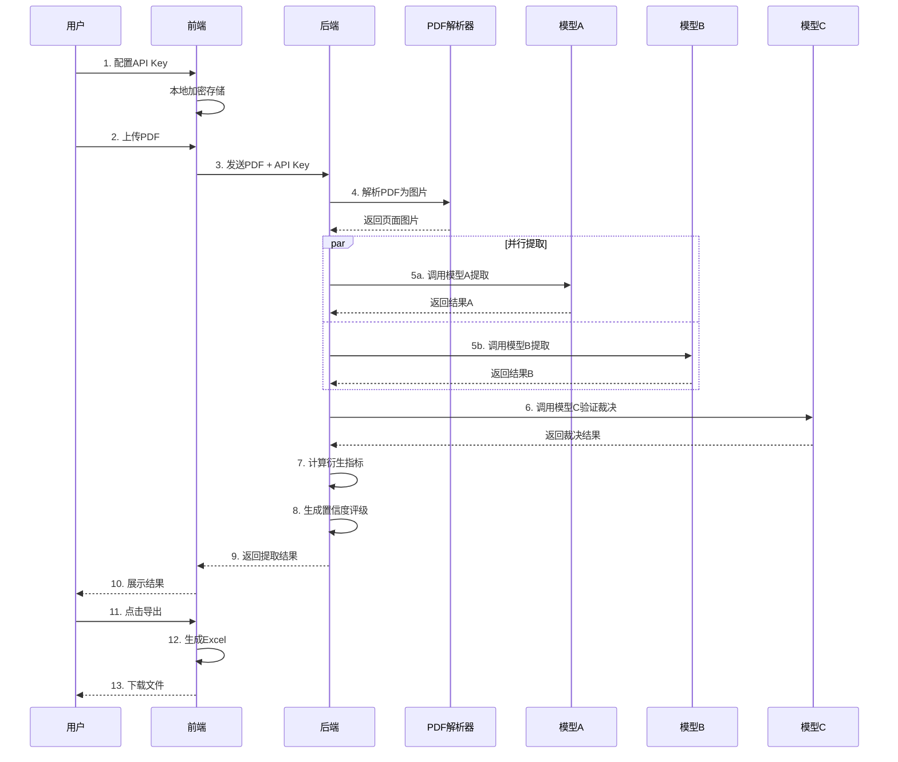
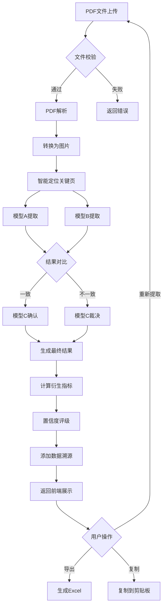

# 智能财务报表数据提取工具 - 产品需求文档 (PRD)

> **版本**: V2.8
> **文档创建日期**: 2026-03-20
> **最后更新**: 2026-03-29
> **产品负责人**: [待定]

---

## 🆕 V2.8 版本更新 (2026-03-29)

### 更新背景

**问题**: L7人工测试发现，非财务信息（风险因素、重大事项、未来规划、分红方案）提取结果为空。

**根因分析**:
1. 第三季度报告通常比年度报告简短，不包含完整的风险因素、重大事项等章节
2. 关键词（如"风险"）只出现在会计科目中（如"一般风险准备"），而非专门的风险因素描述
3. AI模型严格遵循"找不到则返回空"的规则，导致返回空数组

### 一、解决方案设计

#### 1.1 优化非财务信息提取Prompt

```
┌─────────────────────────────────────────────────────────────────────────────┐
│                     V2.8 非财务信息提取优化                                    │
├─────────────────────────────────────────────────────────────────────────────┤
│                                                                             │
│  优化前问题:                                                                  │
│  ┌─────────────────────────────────────────────────────────────────────┐   │
│  │  • Prompt只搜索专门章节标题                                          │   │
│  │  • 季度报告通常不包含这些章节                                         │   │
│  │  • AI返回空结果，用户看到"未提取到相关信息"                           │   │
│  └─────────────────────────────────────────────────────────────────────┘   │
│                                                                             │
│  优化后策略:                                                                  │
│  ┌─────────────────────────────────────────────────────────────────────┐   │
│  │  1. 扩大搜索范围：不仅搜索专门章节，也搜索相关描述                     │   │
│  │  2. 智能识别报告类型：判断是年度报告还是季度报告                       │   │
│  │  3. 灵活提取：即使没有专门章节，也从其他位置提取相关信息               │   │
│  │  4. 明确状态：区分"未找到"和"报告不包含"                              │   │
│  └─────────────────────────────────────────────────────────────────────┘   │
│                                                                             │
└─────────────────────────────────────────────────────────────────────────────┘
```

#### 1.2 前端显示优化

```
┌─────────────────────────────────────────────────────────────────────────────┐
│                        非财务信息显示优化                                      │
├─────────────────────────────────────────────────────────────────────────────┤
│                                                                             │
│  优化前:                                                                     │
│  ┌─────────────────────────────────────────────────────────────────────┐   │
│  │  ┌─ 风险因素 ─────────────────────────────────────────────────────┐ │   │
│  │  │  未提取到相关信息                                               │ │   │
│  │  └─────────────────────────────────────────────────────────────────┘ │   │
│  └─────────────────────────────────────────────────────────────────────┘   │
│                                                                             │
│  优化后:                                                                     │
│  ┌─────────────────────────────────────────────────────────────────────┐   │
│  │  ┌─ 风险因素 ─────────────────────────────────────────────────────┐ │   │
│  │  │  ℹ️ 本报告（季度报告）通常不包含完整的风险因素章节              │ │   │
│  │  │  建议查看年度报告获取完整信息                                   │ │   │
│  │  │                                                                 │ │   │
│  │  │  以下是从报告中提取的相关内容：                                 │ │   │
│  │  │  • 公司第三季度财务会计报告未经审计（第1页）                    │ │   │
│  │  │  • [其他找到的相关内容...]                                      │ │   │
│  │  └─────────────────────────────────────────────────────────────────┘ │   │
│  └─────────────────────────────────────────────────────────────────────┘   │
│                                                                             │
│  状态类型:                                                                   │
│  • found: 找到专门章节，正常显示内容                                         │
│  • partial: 没有专门章节，但找到相关描述                                     │
│  • not_in_report: 报告类型不包含此信息（季度报告）                           │
│  • not_found: 确实找不到任何相关信息                                         │
│                                                                             │
└─────────────────────────────────────────────────────────────────────────────┘
```

#### 1.3 技术架构更新

```
┌─────────────────────────────────────────────────────────────────────────────┐
│                         V2.8 技术架构                                         │
├─────────────────────────────────────────────────────────────────────────────┤
│                                                                             │
│  后端修改:                                                                   │
│  ┌─────────────────────────────────────────────────────────────────────┐   │
│  │  ExtractionService.js                                               │   │
│  │  ├── buildNonFinancialPrompt()  ← 优化prompt，增加报告类型识别      │   │
│  │  └── enhanceNonFinancialInfo()  ← 添加状态标记逻辑                  │   │
│  │                                                                      │   │
│  │  GLMAdapter.js / DoubaoAdapter.js                                   │   │
│  │  └── extractNonFinancial()      ← 确保使用优化后的prompt            │   │
│  └─────────────────────────────────────────────────────────────────────┘   │
│                                                                             │
│  前端修改:                                                                   │
│  ┌─────────────────────────────────────────────────────────────────────┐   │
│  │  ExtractionResult/index.jsx                                         │   │
│  │  └── 非财务信息Tab  ← 根据状态显示不同提示                          │   │
│  └─────────────────────────────────────────────────────────────────────┘   │
│                                                                             │
│  数据结构更新:                                                               │
│  ┌─────────────────────────────────────────────────────────────────────┐   │
│  │  nonFinancialInfo: {                                                │   │
│  │    reportType: "quarterly" | "annual",  // 新增：报告类型           │   │
│  │    riskFactors: {                                                   │   │
│  │      status: "found" | "partial" | "not_in_report" | "not_found",   │   │
│  │      items: [...],                                                  │   │
│  │      hint: "季度报告通常不包含..."  // 提示信息                      │   │
│  │    },                                                               │   │
│  │    majorEvents: { ... },                                            │   │
│  │    futurePlans: { ... },                                            │   │
│  │    dividendPlan: { ... }                                            │   │
│  │  }                                                                  │   │
│  └─────────────────────────────────────────────────────────────────────┘   │
│                                                                             │
└─────────────────────────────────────────────────────────────────────────────┘
```

### 二、ASCII 原型图

#### 2.1 非财务信息显示原型

```
┌──────────────────────────────────────────────────────────────────────────────┐
│                           非财务信息                                          │
├──────────────────────────────────────────────────────────────────────────────┤
│                                                                              │
│  ┌─ ℹ️ 报告类型 ───────────────────────────────────────────────────────────┐ │
│  │  检测到：第三季度报告                                                    │ │
│  │  提示：季度报告通常比年度报告简短，可能不包含完整的风险因素等章节          │ │
│  └──────────────────────────────────────────────────────────────────────────┘ │
│                                                                              │
│  ┌─ ⚠️ 风险因素 ───────────────────────────────────────────────────────────┐ │
│  │  状态：[部分提取] 本报告未包含专门的风险因素章节                          │ │
│  │  ──────────────────────────────────────────────────────────────────────  │ │
│  │  从报告中找到的相关内容：                                                 │ │
│  │  • 公司第三季度财务会计报告未经审计（第1页，重要内容提示）                │ │
│  │  • 企业自身信用风险公允价值变动（第8页，综合收益表）                      │ │
│  │                                                                          │ │
│  │  💡 建议查看年度报告获取完整的风险因素分析                                │ │
│  └──────────────────────────────────────────────────────────────────────────┘ │
│                                                                              │
│  ┌─ 📋 重大事项 ───────────────────────────────────────────────────────────┐ │
│  │  状态：[未包含] 本季度报告未包含重大事项章节                              │ │
│  │  ──────────────────────────────────────────────────────────────────────  │ │
│  │  💡 季度报告的重大事项通常在"重要事项"或"临时公告"中披露                   │ │
│  └──────────────────────────────────────────────────────────────────────────┘ │
│                                                                              │
│  ┌─ 🔮 未来规划 ───────────────────────────────────────────────────────────┐ │
│  │  状态：[未包含] 本季度报告未包含未来规划章节                              │ │
│  │  ──────────────────────────────────────────────────────────────────────  │ │
│  │  💡 年度报告的"管理层讨论与分析"章节通常包含未来发展规划                  │ │
│  └──────────────────────────────────────────────────────────────────────────┘ │
│                                                                              │
│  ┌─ 💰 分红方案 ───────────────────────────────────────────────────────────┐ │
│  │  状态：[已找到]                                                          │ │
│  │  ──────────────────────────────────────────────────────────────────────  │ │
│  │  • 公司利润分配情况详见年度报告（第2页）                                  │ │
│  │  • 未分配利润：XXX元（第6页，资产负债表）                                 │ │
│  └──────────────────────────────────────────────────────────────────────────┘ │
│                                                                              │
└──────────────────────────────────────────────────────────────────────────────┘
```

### 三、涉及文件

| 文件 | 修改内容 |
|------|----------|
| `backend/src/services/ExtractionService.js` | 优化`buildNonFinancialPrompt()`，添加报告类型识别 |
| `backend/src/adapters/GLMAdapter.js` | 确保`extractNonFinancial()`正确使用新prompt |
| `backend/src/adapters/DoubaoAdapter.js` | 同步更新 |
| `frontend/src/components/ExtractionResult/index.jsx` | 优化非财务信息显示逻辑 |

### 四、验收标准

- [ ] 年度报告能正确提取完整非财务信息
- [ ] 季度报告显示"本报告不包含"的友好提示
- [ ] 即使没有专门章节，也能从其他位置提取相关信息
- [ ] 前端显示清晰的状态标识和提示信息

---

## 🆕 V2.0 版本更新 (2026-03-25)

### 更新背景

**本次更新目标**:
1. 整合 PRD.md 中分散的 V2 版本规划，形成统一的版本路线图
2. 新增四项需求：使用统计、免责声明、用户反馈、管理员功能

### 一、V2版本统一规划

```
┌─────────────────────────────────────────────────────────────────────────────┐
│                         V2 版本统一规划                                       │
├─────────────────────────────────────────────────────────────────────────────┤
│                                                                             │
│  V2.0 性能优化与统计增强                                                      │
│  ┌─────────────────────────────────────────────────────────────────────┐   │
│  │  • SSE流式响应：实时显示提取进度，提升用户体验                        │   │
│  │  • 缓存机制：相同PDF不重复提取，节省Token消耗                         │   │
│  │  • 并行提取优化：模型A/B并行调用，缩短响应时间                        │   │
│  │  • 🆕 使用统计：记录每次提取的总时间和总Token用量                     │   │
│  │  • 响应时间目标：<60秒（当前约2-3分钟）                               │   │
│  └─────────────────────────────────────────────────────────────────────┘   │
│                                                                             │
│  V2.1 模型扩展                                                               │
│  ┌─────────────────────────────────────────────────────────────────────┐   │
│  │  当前: 仅支持火山引擎豆包模型                                         │   │
│  │  扩展:                                                               │   │
│  │  • 智谱AI (GLM-4/GLM-5)                                              │   │
│  │  • 阿里通义千问 (Qwen-VL)                                            │   │
│  │  • 百度文心一言 (ERNIE-4V)                                           │   │
│  │  • OpenAI (GPT-4V/GPT-4o)                                            │   │
│  │  • DeepSeek (Vision)                                                 │   │
│  └─────────────────────────────────────────────────────────────────────┘   │
│                                                                             │
│  V2.2 功能增强                                                               │
│  ┌─────────────────────────────────────────────────────────────────────┐   │
│  │  • 批量处理：一次上传多个PDF，队列处理                                │   │
│  │  • 历史记录：保存提取历史，支持重新查看                               │   │
│  │  • 数据对比：多期财务数据对比分析                                     │   │
│  │  • 自定义指标：用户自定义提取指标                                     │   │
│  │  • PDF联动预览：点击数据跳转PDF位置，高亮显示                         │   │
│  │  • 模板系统：预设/自定义提取模板                                      │   │
│  └─────────────────────────────────────────────────────────────────────┘   │
│                                                                             │
│  V2.3 数据源扩展                                                             │
│  ┌─────────────────────────────────────────────────────────────────────┐   │
│  │  • PDF自动抓取：输入股票代码/公司名自动获取年报                       │   │
│  │  • 多数据源支持：东方财富/巨潮资讯/交易所官网                         │   │
│  │  • 数据源优先级配置                                                   │   │
│  └─────────────────────────────────────────────────────────────────────┘   │
│                                                                             │
│  V2.4 用户系统与反馈 (🆕 新增)                                               │
│  ┌─────────────────────────────────────────────────────────────────────┐   │
│  │  • 用户反馈功能：提交问题报告、功能建议、使用咨询                     │   │
│  │  • 管理员登录：简单密码保护的管理后台                                 │   │
│  │  • 反馈管理后台：查看、回复、处理用户反馈                             │   │
│  │  • 使用统计看板：查看用户使用情况统计                                 │   │
│  └─────────────────────────────────────────────────────────────────────┘   │
│                                                                             │
│  V2.5 部署与合规 (🆕 新增)                                                   │
│  ┌─────────────────────────────────────────────────────────────────────┐   │
│  │  • 🆕 免责声明页面：服务性质、隐私保护、使用限制等                    │   │
│  │  • 🆕 隐私政策：详细说明数据处理方式                                  │   │
│  │  • 用户认证：注册/登录系统（可选）                                    │   │
│  │  • 数据隔离：每个用户独立数据空间                                     │   │
│  │  • 云端部署：支持SaaS模式                                             │   │
│  │  • 审计日志：操作记录追踪                                             │   │
│  └─────────────────────────────────────────────────────────────────────┘   │
│                                                                             │
│  版本时间规划:                                                               │
│  V2.0-V2.1: Q2 2026  |  V2.2-V2.3: Q3 2026  |  V2.4-V2.5: Q4 2026          │
│                                                                             │
└─────────────────────────────────────────────────────────────────────────────┘
```

### 二、新增功能详细设计

#### 2.1 使用统计功能 (V2.0)

**功能描述**: 统计每次生成提取数据花费的总时间和总Token用量

```
┌─────────────────────────────────────────────────────────────┐
│                     使用统计数据流                            │
├─────────────────────────────────────────────────────────────┤
│                                                             │
│  用户发起提取请求                                            │
│        │                                                    │
│        ▼                                                    │
│  ┌──────────────┐                                          │
│  │ 开始计时     │  startTime = Date.now()                  │
│  └──────────────┘                                          │
│        │                                                    │
│        ▼                                                    │
│  ┌──────────────┐    ┌──────────────┐                      │
│  │ 模型A调用    │───►│ 记录tokens   │                      │
│  └──────────────┘    │ prompt+completion                    │
│        │             └──────────────┘                      │
│        ▼                                                    │
│  ┌──────────────┐    ┌──────────────┐                      │
│  │ 模型B调用    │───►│ 记录tokens   │                      │
│  └──────────────┘    └──────────────┘                      │
│        │                                                    │
│        ▼                                                    │
│  ┌──────────────┐    ┌──────────────┐                      │
│  │ 模型C调用    │───►│ 记录tokens   │                      │
│  └──────────────┘    └──────────────┘                      │
│        │                                                    │
│        ▼                                                    │
│  ┌──────────────┐                                          │
│  │ 结束计时     │  totalDuration = endTime - startTime     │
│  │ 计算总耗时   │  totalTokens = A + B + C                 │
│  └──────────────┘                                          │
│        │                                                    │
│        ▼                                                    │
│  返回给前端:                                                 │
│  {                                                          │
│    usage: {                                                 │
│      totalDuration: 125000,        // 毫秒                  │
│      formattedDuration: "2分5秒",  // 友好格式              │
│      totalTokens: 15420,                                   │
│      breakdown: {                                          │
│        modelA: { tokens: 5120, duration: 42000 },          │
│        modelB: { tokens: 5100, duration: 41000 },          │
│        modelC: { tokens: 5200, duration: 42000 }           │
│      }                                                     │
│    }                                                       │
│  }                                                         │
│                                                             │
└─────────────────────────────────────────────────────────────┘
```

**UI显示位置**:

```
┌─────────────────────────────────────────────────────────────┐
│  提取结果                                                    │
├─────────────────────────────────────────────────────────────┤
│  ✅ 高置信度 (5分)                                           │
│  ⏱️ 耗时: 2分15秒  |  📊 Token用量: 15,420                   │
│                                                             │
│  [财务指标] [非财务信息] [勾稽核对] [AI调用日志]             │
└─────────────────────────────────────────────────────────────┘
```

#### 2.2 免责声明页面 (V2.5)

**功能描述**: 在页面底部增加免责声明链接，点击可查看完整声明

```
┌─────────────────────────────────────────────────────────────┐
│                        免责声明                              │
├─────────────────────────────────────────────────────────────┤
│                                                             │
│  一、服务性质声明                                            │
│  ─────────────────                                          │
│  本工具为AI辅助的数据提取工具，提取结果由人工智能模型生成，   │
│  仅供参考。用户应当对提取结果进行独立核实，不应完全依赖       │
│  AI生成的内容做出任何决策。                                  │
│                                                             │
│  二、隐私保护声明                                            │
│  ─────────────────                                          │
│  • 本工具不收集、不存储、不上传任何用户的个人信息            │
│  • 用户上传的PDF文件仅在本地处理，不会上传到服务器           │
│  • 用户的API Key仅存储在用户本地浏览器中                     │
│  • 所有AI模型调用均为用户自行发起，直接发送至对应AI服务商     │
│                                                             │
│  三、API Key安全提醒                                        │
│  ─────────────────                                          │
│  • 请妥善保管您的API Key，不要分享给他人                     │
│  • 建议定期更换API Key以确保安全                             │
│  • 如发现API Key泄露，请立即到对应平台撤销并重新生成          │
│  • 因API Key保管不当造成的损失，本工具不承担责任              │
│                                                             │
│  四、数据准确性声明                                          │
│  ─────────────────                                          │
│  • AI模型可能产生幻觉或错误，提取的数据可能不准确             │
│  • 本工具提供的勾稽核对功能仅作为辅助验证手段                 │
│  • 用户应当对照原始PDF文件核实所有提取结果                    │
│  • 因使用本工具产生的数据错误导致的损失，本工具不承担责任      │
│                                                             │
│  五、使用限制                                                │
│  ─────────────────                                          │
│  • 本工具仅供个人学习、研究使用                              │
│  • 未经授权，不得将本工具用于任何商业用途                    │
│  • 不得使用本工具处理涉及国家秘密、商业秘密等敏感信息         │
│  • 不得利用本工具从事任何违法违规活动                        │
│                                                             │
│  六、知识产权声明                                            │
│  ─────────────────                                          │
│  • 用户上传的PDF文件版权归原作者/出版方所有                   │
│  • 本工具不主张对提取结果的所有权                            │
│  • 本工具的软件代码遵循MIT开源协议                           │
│                                                             │
│  七、服务变更与终止                                          │
│  ─────────────────                                          │
│  • 本工具保留随时修改、暂停或终止服务的权利                  │
│  • 重大变更将提前在页面公告                                  │
│                                                             │
│  八、联系方式                                                │
│  ─────────────────                                          │
│  如有问题或建议，请通过【用户反馈】功能联系我们               │
│                                                             │
│  最后更新日期：2026-03-25                                    │
│                                                             │
└─────────────────────────────────────────────────────────────┘
```

#### 2.3 用户反馈功能 (V2.4)

**功能描述**: 用户可以提交使用问题和意见建议

```
┌─────────────────────────────────────────────────────────────┐
│                      用户反馈页面                            │
├─────────────────────────────────────────────────────────────┤
│                                                             │
│  ┌─────────────────────────────────────────────────────┐   │
│  │  📝 提交反馈                                         │   │
│  ├─────────────────────────────────────────────────────┤   │
│  │                                                     │   │
│  │  反馈类型:  [下拉选择 ▼]                             │   │
│  │            ├── 🐛 问题报告 - 功能异常、错误          │   │
│  │            ├── 💡 功能建议 - 新功能想法              │   │
│  │            ├── 📖 使用咨询 - 如何使用                │   │
│  │            └── 🎨 其他反馈 - 其他意见建议            │   │
│  │                                                     │   │
│  │  标题:     [________________________]               │   │
│  │                                                     │   │
│  │  详细描述:                                          │   │
│  │  ┌─────────────────────────────────────────────┐   │   │
│  │  │                                             │   │   │
│  │  │  (多行文本输入框)                            │   │   │
│  │  │                                             │   │   │
│  │  └─────────────────────────────────────────────┘   │   │
│  │                                                     │   │
│  │  联系方式 (选填): [________________]               │   │
│  │  用于回复您的反馈                                   │   │
│  │                                                     │   │
│  │  [ ] 我已阅读并同意隐私政策                         │   │
│  │                                                     │   │
│  │              [  提交反馈  ]                         │   │
│  │                                                     │   │
│  └─────────────────────────────────────────────────────┘   │
│                                                             │
│  提交成功后:                                                 │
│  ┌─────────────────────────────────────────────────────┐   │
│  │  ✅ 感谢您的反馈！                                   │   │
│  │                                                     │   │
│  │  您的反馈编号: FB-2026032501                        │   │
│  │  我们会尽快处理，如有需要会通过您留下的方式联系您。  │   │
│  │                                                     │   │
│  │                              [ 返回首页 ]           │   │
│  └─────────────────────────────────────────────────────┘   │
│                                                             │
└─────────────────────────────────────────────────────────────┘
```

#### 2.4 管理员功能 (V2.4)

**功能描述**: 管理员登录后可查看用户反馈、使用统计

```
┌─────────────────────────────────────────────────────────────┐
│                      管理员后台                              │
├─────────────────────────────────────────────────────────────┤
│                                                             │
│  ┌────────────┐  ┌────────────────────────────────────┐    │
│  │ 导航菜单    │  │                                    │    │
│  ├────────────┤  │     欢迎回来，管理员                │    │
│  │ 📊 概览    │  │                                    │    │
│  │ 📝 反馈    │  │     今日概览                        │    │
│  │ 📈 统计    │  │     ┌─────┐ ┌─────┐ ┌─────┐       │    │
│  │ ⚙️ 设置    │  │     │反馈 │ │使用 │ │Token│       │    │
│  │ 🚪 退出    │  │     │ 12  │ │ 45  │ │125K │       │    │
│  └────────────┘  │     └─────┘ └─────┘ └─────┘       │    │
│                  │                                    │    │
│                  └────────────────────────────────────┘    │
│                                                             │
│  ═══════════════════════════════════════════════════════   │
│                                                             │
│  📝 用户反馈列表                                             │
│  ┌─────────────────────────────────────────────────────┐   │
│  │ 筛选: [全部类型▼] [全部状态▼]    搜索: [______]     │   │
│  ├─────────────────────────────────────────────────────┤   │
│  │ 编号     │类型│标题          │时间  │状态  │操作    │   │
│  ├─────────────────────────────────────────────────────┤   │
│  │ FB-001   │🐛  │导出Excel失败  │03-25 │待处理│[查看]  │   │
│  │ FB-002   │💡  │建议增加对比   │03-24 │已回复│[查看]  │   │
│  │ FB-003   │📖  │如何配置模型   │03-24 │已处理│[查看]  │   │
│  └─────────────────────────────────────────────────────┘   │
│                                                             │
│  ═══════════════════════════════════════════════════════   │
│                                                             │
│  📈 使用统计                                                 │
│  ┌─────────────────────────────────────────────────────┐   │
│  │ 时间范围: [最近7天▼]                                 │   │
│  │                                                     │   │
│  │     提取次数趋势图                                   │   │
│  │  50 ┤                    ╭─╮                       │   │
│  │  40 ┤              ╭────╯  ╰──╮                    │   │
│  │  30 ┤        ╭────╯            ╰──╮               │   │
│  │  20 ┤  ╭────╯                      ╰──            │   │
│  │  10 ┤──╯                                          │   │
│  │     └────────────────────────────────────────      │   │
│  │       03/19 03/20 03/21 03/22 03/23 03/24 03/25   │   │
│  │                                                     │   │
│  │  统计摘要:                                          │   │
│  │  • 总提取次数: 245                                  │   │
│  │  • 平均耗时: 2分15秒                                │   │
│  │  • 总Token消耗: 1.2M                               │   │
│  │  • 平均Token/次: 5,102                              │   │
│  └─────────────────────────────────────────────────────┘   │
│                                                             │
└─────────────────────────────────────────────────────────────┘
```

### 三、技术架构更新

#### 3.1 前端变更

| 文件/组件 | 变更类型 | 说明 |
|----------|---------|------|
| `App.jsx` | 修改 | 新增路由: /feedback, /disclaimer, /admin |
| `components/Navigation.jsx` | 修改 | 新增导航项: 反馈、免责声明 |
| `components/ExtractionResult/index.jsx` | 修改 | 显示耗时和Token统计 |
| `pages/FeedbackPage.jsx` | 新增 | 用户反馈页面 |
| `pages/DisclaimerPage.jsx` | 新增 | 免责声明页面 |
| `pages/admin/LoginPage.jsx` | 新增 | 管理员登录页 |
| `pages/admin/DashboardPage.jsx` | 新增 | 管理员仪表盘 |

#### 3.2 后端变更

| API | 方法 | 说明 |
|-----|------|------|
| `/api/extract` | 修改 | 返回值增加 usage 字段 |
| `/api/feedback` | POST | 提交用户反馈 |
| `/api/admin/login` | POST | 管理员登录 |
| `/api/admin/feedbacks` | GET | 获取反馈列表 |
| `/api/admin/feedbacks/:id` | PUT | 更新反馈状态 |
| `/api/admin/stats/overview` | GET | 获取统计概览 |
| `/api/admin/stats/daily` | GET | 获取每日统计 |

#### 3.3 数据库设计

```sql
-- 用户反馈表
CREATE TABLE feedbacks (
  id INTEGER PRIMARY KEY AUTOINCREMENT,
  feedback_no VARCHAR(20) UNIQUE,      -- FB-2026032501
  type VARCHAR(20) NOT NULL,           -- bug/suggestion/consultation/other
  title VARCHAR(200) NOT NULL,
  content TEXT NOT NULL,
  contact VARCHAR(100),                -- 选填联系方式
  status VARCHAR(20) DEFAULT 'pending', -- pending/replied/resolved/closed
  admin_reply TEXT,
  created_at DATETIME DEFAULT CURRENT_TIMESTAMP,
  updated_at DATETIME DEFAULT CURRENT_TIMESTAMP
);

-- 使用统计表
CREATE TABLE usage_stats (
  id INTEGER PRIMARY KEY AUTOINCREMENT,
  session_id VARCHAR(50),              -- 匿名会话ID（可用IP hash）
  extraction_mode VARCHAR(20),         -- single/dual/tri
  total_duration INTEGER,              -- 总耗时（毫秒）
  total_tokens INTEGER,                -- 总Token数
  model_a_tokens INTEGER,
  model_b_tokens INTEGER,
  model_c_tokens INTEGER,
  confidence_score INTEGER,            -- 置信度分数 1-5
  success BOOLEAN DEFAULT TRUE,        -- 是否成功
  error_message TEXT,                  -- 错误信息（如有）
  created_at DATETIME DEFAULT CURRENT_TIMESTAMP
);

-- 管理员表
CREATE TABLE admins (
  id INTEGER PRIMARY KEY AUTOINCREMENT,
  username VARCHAR(50) UNIQUE NOT NULL,
  password_hash VARCHAR(200) NOT NULL,
  last_login DATETIME,
  created_at DATETIME DEFAULT CURRENT_TIMESTAMP
);
```

### 四、导航栏UI变更

```
┌─────────────────────────────────────────────────────────────┐
│                      变更前                                  │
├─────────────────────────────────────────────────────────────┤
│  [Logo] 财务报表数据提取工具                                 │
│  [模型配置] [历史记录]                        [导出Excel]   │
└─────────────────────────────────────────────────────────────┘

                            ↓ 变更

┌─────────────────────────────────────────────────────────────┐
│                      变更后                                  │
├─────────────────────────────────────────────────────────────┤
│  [Logo] 财务报表数据提取工具                                 │
│  [模型配置] [历史记录] [反馈] [免责声明]      [导出Excel]   │
└─────────────────────────────────────────────────────────────┘
```

### 五、影响范围分析

#### 受影响的文件

| 文件路径 | 变更类型 | 变更内容 |
|---------|---------|---------|
| `PRD.md` | 修改 | 整合V2规划，新增V2.0-V2.5章节 |
| `frontend/src/App.jsx` | 修改 | 新增路由 |
| `frontend/src/components/Navigation.jsx` | 修改 | 新增导航项 |
| `frontend/src/components/ExtractionResult/index.jsx` | 修改 | 显示使用统计 |
| `frontend/src/pages/FeedbackPage.jsx` | 新增 | 用户反馈页面 |
| `frontend/src/pages/DisclaimerPage.jsx` | 新增 | 免责声明页面 |
| `frontend/src/pages/admin/` | 新增 | 管理员相关页面 |
| `backend/src/routes/feedback.js` | 新增 | 反馈路由 |
| `backend/src/routes/admin.js` | 新增 | 管理员路由 |
| `backend/src/services/FeedbackService.js` | 新增 | 反馈服务 |
| `backend/src/services/StatsService.js` | 新增 | 统计服务 |
| `backend/src/services/ExtractionService.js` | 修改 | 记录使用统计 |
| `backend/database/` | 新增 | SQLite数据库文件 |

#### 不受影响的模块

| 模块 | 说明 |
|------|------|
| PDF解析服务 | 不涉及 |
| 勾稽核对服务 | 不涉及 |
| 单位转换服务 | 不涉及 |
| Excel导出服务 | 不涉及 |
| 现有模型适配器 | 仅增加统计记录，不影响核心逻辑 |

---

## 🆕 V1.14 版本更新 (2026-03-25)

### 更新背景

**问题描述**:
V1.11 版本L8人工验收测试中发现三个关键问题：

1. **置信度显示错误**：勾稽核对通过、所有指标高置信度，但整体显示"中置信度"
2. **模型C日志缺失**：三模型模式下，AI调试日志只显示2条记录，缺少模型C的日志
3. **响应截断导致低置信度**：模型C返回的JSON太长被截断，解析失败导致整体置信度为"低"

### 根因分析

```
┌─────────────────────────────────────────────────────────────────────────────┐
│                         V1.14 根因分析                                        │
├─────────────────────────────────────────────────────────────────────────────┤
│                                                                             │
│  问题1: 置信度显示错误                                                        │
│  ┌─────────────────────────────────────────────────────────────────────┐   │
│  │  现象:                                                               │   │
│  │  • 勾稽关系通过 + 所有指标高置信度 → 显示"中置信度" ❌                │   │
│  │                                                                     │   │
│  │  根因:                                                               │   │
│  │  • 前端代码: confidence?.overall || 'medium'                        │   │
│  │  • 后端返回: confidence = 'high' (字符串)                            │   │
│  │  • 结果: 'high'.overall = undefined → 回退到 'medium'               │   │
│  │                                                                     │   │
│  │  修复: confidence?.overall → confidence                             │   │
│  └─────────────────────────────────────────────────────────────────────┘   │
│                                                                             │
│  问题2: 模型C日志缺失                                                        │
│  ┌─────────────────────────────────────────────────────────────────────┐   │
│  │  现象:                                                               │   │
│  │  • 配置3个模型，AI调试日志只显示2条                                  │   │
│  │                                                                     │   │
│  │  根因:                                                               │   │
│  │  • ExtractionService.triModelExtract()                             │   │
│  │  • adapterC.validate() 调用时未传递 aiLogService                    │   │
│  │                                                                     │   │
│  │  修复: 添加 aiLogService 参数到 validate() 调用                      │   │
│  └─────────────────────────────────────────────────────────────────────┘   │
│                                                                             │
│  问题3: 响应截断导致低置信度                                                  │
│  ┌─────────────────────────────────────────────────────────────────────┐   │
│  │  现象:                                                               │   │
│  │  • 数据质量好但显示"低置信度"                                        │   │
│  │  • AI日志显示: "error": "AI响应解析失败"                             │   │
│  │                                                                     │   │
│  │  根因:                                                               │   │
│  │  • 模型C返回完整 finalResult (24个指标 + 非财务信息)                 │   │
│  │  • JSON响应太长，被截断                                              │   │
│  │  • 截断的JSON无法解析 → 返回默认空结果 → confidence = 'low'          │   │
│  │                                                                     │   │
│  │  修复: 优化Prompt，模型C只返回裁决决策，不返回完整finalResult         │   │
│  └─────────────────────────────────────────────────────────────────────┘   │
│                                                                             │
│  问题4: 用户需求 - 五档置信度                                                 │
│  ┌─────────────────────────────────────────────────────────────────────┐   │
│  │  需求:                                                               │   │
│  │  • 三档置信度(高/中/低)区分度不够                                     │   │
│  │  • 希望有更精细的置信度评估                                           │   │
│  │                                                                     │   │
│  │  方案:                                                               │   │
│  │  • 五档置信度: 高(5) / 中高(4) / 中(3) / 中低(2) / 低(1)             │   │
│  │  • 模型C直接给出1-5分评分                                             │   │
│  │  • 后端结合勾稽核对结果微调                                           │   │
│  └─────────────────────────────────────────────────────────────────────┘   │
│                                                                             │
└─────────────────────────────────────────────────────────────────────────────┘
```

### 解决方案

#### 1. 五档置信度系统

| 分数 | 名称 | 图标 | 颜色 | 触发条件 |
|------|------|------|------|---------|
| 5 | 高置信度 | ✅ | 绿色 | 三模型一致 + 勾稽通过 + 无警告 |
| 4 | 中高置信度 | ✅ | 蓝色 | 双模型一致 + 勾稽通过 或 三模型有小差异 |
| 3 | 中置信度 | ⚠️ | 黄色 | 模型有差异但可裁决 或 勾稽有警告 |
| 2 | 中低置信度 | ⚠️ | 橙色 | 模型差异较大 或 勾稽未通过 |
| 1 | 低置信度 | ❌ | 红色 | 检测到模拟数据 或 解析失败 |

#### 2. 模型C响应格式优化

```
修改前（会被截断）：
{
  "finalResult": { 公司信息 + 24个财务指标 + 非财务信息 },  ← 太长！
  "comparisons": [...],
  "confidence": "high"
}

修改后（简洁）：
{
  "confidence": 4,
  "decisions": [
    {"metric": "营业收入", "choose": "same", "reason": "两模型一致"}
  ],
  "companyInfoDecision": {"choose": "A", "reason": "模型A更准确"},
  "notes": "数据质量良好，建议关注投资收益变动"
}
```

### UI 原型图 (ASCII)

#### 五档置信度显示

```
┌─────────────────────────────────────────────────────────────────────────────┐
│  提取结果                                    [查看AI调试日志] [导出Excel]     │
├─────────────────────────────────────────────────────────────────────────────┤
│                                                                             │
│  ┌─────────────────────────────────────────────────────────────────────┐   │
│  │  五档置信度显示                                                      │   │
│  │                                                                     │   │
│  │  分数 5: ✅ 高置信度    (绿色)  → "三模型裁决验证，勾稽关系核对通过"   │   │
│  │  分数 4: ✅ 中高置信度  (蓝色)  → "双模型交叉验证，数据质量良好"       │   │
│  │  分数 3: ⚠️ 中置信度    (黄色)  → "部分指标存在差异，已自动裁决"       │   │
│  │  分数 2: ⚠️ 中低置信度  (橙色)  → "建议人工核对部分数据"               │   │
│  │  分数 1: ❌ 低置信度    (红色)  → "数据质量存疑，建议人工核对"         │   │
│  │                                                                     │   │
│  └─────────────────────────────────────────────────────────────────────┘   │
│                                                                             │
│  示例:                                                                      │
│  ┌─────────────────────────────────────────────────────────────────────┐   │
│  │  提取结果                                                           │   │
│  │  ✅ 中高置信度  三模型裁决验证，勾稽关系核对通过                      │   │
│  │       ↑                                                             │   │
│  │  [蓝色标签]                                                         │   │
│  └─────────────────────────────────────────────────────────────────────┘   │
│                                                                             │
└─────────────────────────────────────────────────────────────────────────────┘
```

#### AI调试日志面板（三模型完整记录）

```
┌─────────────────────────────────────────────────────────────────────────────┐
│  🔧 AI调试日志                                                         [×]  │
├─────────────────────────────────────────────────────────────────────────────┤
│                                                                             │
│  会话ID: session-1774411846252                                              │
│  开始时间: 2026-03-25 12:13:00                                              │
│                                                                             │
│  ┌─────────────────────────────────────────────────────────────────────┐   │
│  │ 📤 调用 1: 模型A - 提取器                                           │   │
│  │ 模型: doubao-seed-2-0-pro-260215                                    │   │
│  │ 耗时: 45.2秒 | Token: 18089 (输入11720 + 输出6369)                  │   │
│  │ 状态: ✅ 成功                                                       │   │
│  │ [展开请求] [展开响应]                                               │   │
│  └─────────────────────────────────────────────────────────────────────┘   │
│                                                                             │
│  ┌─────────────────────────────────────────────────────────────────────┐   │
│  │ 📤 调用 2: 模型B - 提取器                                           │   │
│  │ 模型: doubao-seed-1-5-pro-250415                                    │   │
│  │ 耗时: 42.8秒 | Token: 16542                                         │   │
│  │ 状态: ✅ 成功                                                       │   │
│  │ [展开请求] [展开响应]                                               │   │
│  └─────────────────────────────────────────────────────────────────────┘   │
│                                                                             │
│  ┌─────────────────────────────────────────────────────────────────────┐   │
│  │ 📤 调用 3: 模型C - 验证/裁决  ← V1.14新增                           │   │
│  │ 模型: doubao-seed-2-0-pro-260215                                    │   │
│  │ 耗时: 38.5秒 | Token: 4521 (输入3210 + 输出1311)                    │   │
│  │ 状态: ✅ 成功                                                       │   │
│  │ 评分: 4分 (中高置信度)                                              │   │
│  │ [展开请求] [展开响应]                                               │   │
│  └─────────────────────────────────────────────────────────────────────┘   │
│                                                                             │
│                                              [复制全部日志] [关闭]          │
└─────────────────────────────────────────────────────────────────────────────┘
```

### 技术架构更新

#### 修改文件清单

| 文件 | 修改类型 | 说明 |
|------|---------|------|
| `backend/src/adapters/BaseAdapter.js` | 修改 | 优化验证Prompt，返回简洁格式 |
| `backend/src/adapters/DoubaoAdapter.js` | 修改 | 新增`mergeValidationResults()`方法合并结果 |
| `backend/src/services/ExtractionService.js` | 修改 | 支持五档置信度，传递aiLogService到validate() |
| `frontend/src/components/ExtractionResult/index.jsx` | 修改 | 五档置信度配置和显示 |

#### 核心代码变更

**1. BaseAdapter.buildValidatePrompt() - 简化输出格式**
```javascript
// V1.14: 优化输出格式，避免响应截断
buildValidatePrompt(resultA, resultB) {
  // 只提取摘要信息，减少Prompt长度
  const extractSummary = (result, label) => {
    return `【${label}】
公司: ${result.companyInfo?.name}
财务指标: ${result.financialMetrics?.map(m => `${m.name}: ${m.value}`).join(', ')}`
  }
  // 返回简洁的评分格式，不再要求返回完整finalResult
}
```

**2. DoubaoAdapter.mergeValidationResults() - 合并裁决结果**
```javascript
// V1.14: 根据模型C的裁决合并A/B结果
mergeValidationResults(resultA, resultB, validation) {
  const decisions = validation.decisions || []
  // 根据decisions数组选择每个指标的最终值
  // 返回合并后的finalResult
}
```

**3. ExtractionService - 五档置信度支持**
```javascript
// V1.14: 五档置信度调整
adjustConfidenceBasedOnResults(result, modelCount) {
  // 支持 1-5 数字格式
  // 结合勾稽核对结果微调
  // 最终输出 1-5 分
}
```

**4. Frontend - 五档置信度配置**
```javascript
const CONFIDENCE_CONFIG = {
  5: { color: 'success', text: '高置信度' },
  4: { color: 'processing', text: '中高置信度' },
  3: { color: 'warning', text: '中置信度' },
  2: { color: 'orange', text: '中低置信度' },
  1: { color: 'error', text: '低置信度' }
}
```

---

## 📊 V1 版本开发总结 (2026-03-20 ~ 2026-03-25)

### 版本历程

| 版本 | 日期 | 主要更新 | 测试状态 |
|------|------|---------|---------|
| V1.0 | 2026-03-20 | 初始版本，基础PDF提取功能 | - |
| V1.1 | 2026-03-21 | 多模型支持，双模型验证 | - |
| V1.2 | 2026-03-21 | 三模型裁决模式 | - |
| V1.3 | 2026-03-22 | 勾稽关系核对 | - |
| V1.4 | 2026-03-22 | 单位转换功能 | - |
| V1.5 | 2026-03-22 | Excel导出功能 | - |
| V1.6 | 2026-03-23 | Vision支持增强 | - |
| V1.7 | 2026-03-23 | AI调试日志系统 | - |
| V1.8 | 2026-03-23 | JSON解析容错机制 | HT-01~HT-04 PASS |
| V1.9 | 2026-03-23 | 置信度原因说明 | HT-05~HT-07 PASS |
| V1.10 | 2026-03-24 | 勾稽核对计算详情 | HT-08~HT-10 PASS |
| V1.11 | 2026-03-24 | 非财务信息增强 | AC-01~AC-02 PASS |
| V1.12 | 2026-03-24 | 置信度计算优化 | - |
| V1.13 | 2026-03-25 | 模型C日志记录 | - |
| V1.14 | 2026-03-25 | 五档置信度系统 | AC-01~AC-10 PASS |

### 技术架构总结

```
┌─────────────────────────────────────────────────────────────────────────────┐
│                         V1 技术架构总览                                       │
├─────────────────────────────────────────────────────────────────────────────┤
│                                                                             │
│  前端 (React + Vite + Ant Design 5.x)                                       │
│  ┌─────────────────────────────────────────────────────────────────────┐   │
│  │  组件架构:                                                          │   │
│  │  ├── ModelConfig/        模型配置（支持1-3个模型）                   │   │
│  │  ├── FileUpload/         文件上传（PDF转图片预览）                   │   │
│  │  ├── ExtractionResult/   结果展示（五档置信度、勾稽核对）            │   │
│  │  ├── AIDebugPanel/       AI调试日志（完整调用记录）                  │   │
│  │  └── Settings/           设置面板（单位切换、模型管理）              │   │
│  │                                                                     │   │
│  │  状态管理: Zustand                                                  │   │
│  │  API通信: Axios                                                     │   │
│  └─────────────────────────────────────────────────────────────────────┘   │
│                                                                             │
│  后端 (Node.js + Express)                                                   │
│  ┌─────────────────────────────────────────────────────────────────────┐   │
│  │  服务架构:                                                          │   │
│  │  ├── ExtractionService    数据提取协调（单/双/三模型策略）          │   │
│  │  ├── PDFService           PDF处理（pdf2json + sharp图片转换）        │   │
│  │  ├── AccountingCheckService 勾稽核对（6项核心检查）                  │   │
│  │  ├── UnitConvertService   单位转换（元/万元/亿元）                   │   │
│  │  └── AILogService         AI调试日志（请求/响应/错误记录）           │   │
│  │                                                                     │   │
│  │  适配器模式:                                                        │   │
│  │  ├── BaseAdapter          适配器基类（Prompt模板、JSON解析）         │   │
│  │  └── DoubaoAdapter        豆包适配器（OpenAI兼容格式）              │   │
│  └─────────────────────────────────────────────────────────────────────┘   │
│                                                                             │
│  AI模型 (火山引擎/豆包)                                                     │
│  ┌─────────────────────────────────────────────────────────────────────┐   │
│  │  支持模型:                                                          │   │
│  │  • doubao-seed-2-0-pro-260215 (主力模型，Vision支持)                │   │
│  │  • doubao-seed-1-5-pro-250415 (辅助模型)                            │   │
│  │  • 其他OpenAI兼容模型                                               │   │
│  │                                                                     │   │
│  │  调用模式:                                                          │   │
│  │  • 单模型: 1次extract调用                                           │   │
│  │  • 双模型: 2次extract + 1次validate                                 │   │
│  │  • 三模型: 2次extract + 1次validate (模型C裁决)                     │   │
│  └─────────────────────────────────────────────────────────────────────┘   │
│                                                                             │
└─────────────────────────────────────────────────────────────────────────────┘
```

### 功能完成度

| 功能模块 | 完成度 | 说明 |
|---------|--------|------|
| PDF解析 | ✅ 100% | 支持文本和图片两种模式 |
| 多模型提取 | ✅ 100% | 支持1-3个模型配置 |
| 勾稽核对 | ✅ 100% | 6项核心检查，含计算详情 |
| 单位转换 | ✅ 100% | 元/万元/亿元互转 |
| Excel导出 | ✅ 100% | 4个Sheet完整导出 |
| AI调试日志 | ✅ 100% | 完整记录所有模型调用 |
| 五档置信度 | ✅ 100% | 模型C评分 + 勾稽微调 |
| 错误处理 | ✅ 100% | 友好提示，不崩溃 |

### 遗留问题与V2规划

> **详细V2版本规划请参见文档顶部的「🆕 V2.0 版本更新」章节**

**V1遗留问题摘要**:

| 问题 | 影响程度 | 计划版本 |
|------|---------|---------|
| 三模型模式响应时间较长(2-3分钟) | 中 | V2.0 性能优化 |
| 仅支持豆包模型 | 低 | V2.1 模型扩展 |
| 不支持批量处理 | 中 | V2.2 功能增强 |
| 无用户认证系统 | 低 | V2.5 部署与安全 |

---

## 🆕 V1.11 版本更新 (2026-03-24)

### 更新背景

**问题描述**:
V1.10 版本测试中发现四个新问题：

1. **指标重复展示**：所有者权益合计和净资产是同一个概念，重复展示了
2. **总资产周转率为空**：这个指标不常见，PDF中通常没有
3. **计算指标缺少详情**：毛利率、净利率、ROE等计算指标没有显示计算过程
4. **非财务信息为空**：AI未能正确提取非财务信息

### 根因分析

```
┌─────────────────────────────────────────────────────────────────────────────┐
│                         V1.11 根因分析                                        │
├─────────────────────────────────────────────────────────────────────────────┤
│                                                                             │
│  问题1: 指标重复展示                                                         │
│  ┌─────────────────────────────────────────────────────────────────────┐   │
│  │  当前问题:                                                           │   │
│  │  • 所有者权益合计 = 净资产，两者是同一个概念                           │   │
│  │  • 在财务指标中同时展示，造成冗余                                      │   │
│  │                                                                     │   │
│  │  解决方案:                                                           │   │
│  │  • 移除"净资产"作为独立指标                                          │   │
│  │  • 在"所有者权益合计"的名称中标注"(即净资产)"                          │   │
│  └─────────────────────────────────────────────────────────────────────┘   │
│                                                                             │
│  问题2: 总资产周转率为空                                                      │
│  ┌─────────────────────────────────────────────────────────────────────┐   │
│  │  原因分析:                                                           │   │
│  │  • 总资产周转率 = 营业收入 / 平均总资产                               │   │
│  │  • 需要期初和期末总资产数据，PDF中通常没有                             │   │
│  │                                                                     │   │
│  │  解决方案:                                                           │   │
│  │  • 移除这个不常见的指标                                               │   │
│  └─────────────────────────────────────────────────────────────────────┘   │
│                                                                             │
│  问题3: 计算指标缺少详情                                                      │
│  ┌─────────────────────────────────────────────────────────────────────┐   │
│  │  当前问题:                                                           │   │
│  │  • 毛利率、净利率、ROE等只显示结果                                    │   │
│  │  • 用户无法看到计算过程和来源数据                                      │   │
│  │                                                                     │   │
│  │  解决方案:                                                           │   │
│  │  • 为计算类指标添加展开详情功能                                        │   │
│  │  • 显示计算公式、来源数据、计算过程                                    │   │
│  └─────────────────────────────────────────────────────────────────────┘   │
│                                                                             │
│  问题4: 非财务信息为空                                                        │
│  ┌─────────────────────────────────────────────────────────────────────┐   │
│  │  原因分析:                                                           │   │
│  │  • Prompt中对非财务信息的提取指引不够明确                              │   │
│  │  • AI可能跳过了这部分内容                                              │   │
│  │                                                                     │   │
│  │  解决方案:                                                           │   │
│  │  • 优化Prompt，更明确地引导AI提取非财务信息                            │   │
│  │  • 添加非财务信息提取的示例格式                                        │   │
│  └─────────────────────────────────────────────────────────────────────┘   │
│                                                                             │
└─────────────────────────────────────────────────────────────────────────────┘
```

### UI 原型图 (ASCII)

#### 财务指标 - 计算详情展开

```
┌─────────────────────────────────────────────────────────────────────────────┐
│  📊 财务指标                                                                 │
├─────────────────────────────────────────────────────────────────────────────┤
│                                                                             │
│  ┌────────────────────┬───────────────┬──────────┬────────────────────────┐│
│  │ 指标名称           │ 最终结果      │ 置信度   │ 来源                   ││
│  ├────────────────────┼───────────────┼──────────┼────────────────────────┤│
│  │ ...                │ ...           │ ...      │ ...                    ││
│  │ 所有者权益合计     │ 24.15 亿元    │ 高 ✓     │ 第9页                  ││
│  │ (即净资产)         │               │          │                        ││
│  ├────────────────────┼───────────────┼──────────┼────────────────────────┤│
│  │ 毛利率 📐          │ 24.17%        │ 高 ✓     │ 计算得出 [展开详情] ▼  ││
│  ├────────────────────┴───────────────┴──────────┴────────────────────────┤│
│  │ 📐 毛利率计算详情                                                          ││
│  │ ──────────────────────────────────────────────────────────────────────  ││
│  │ 计算公式：毛利率 = 毛利润 / 营业收入                                      ││
│  │                                                                         ││
│  │ 毛利润：   8.62 亿元                                                      ││
│  │ 营业收入： 35.65 亿元                                                     ││
│  │                                                                         ││
│  │ 计算过程：8.62 ÷ 35.65 = 0.2417 = 24.17%                                 ││
│  └─────────────────────────────────────────────────────────────────────────┘│
│                                                                             │
└─────────────────────────────────────────────────────────────────────────────┘
```

### 技术架构更新

#### 修改文件清单

| 文件 | 修改类型 | 说明 |
|------|---------|------|
| `backend/src/adapters/BaseAdapter.js` | 修改 | 优化指标列表，移除重复/不常见指标，增强非财务信息提取 |
| `backend/src/adapters/DoubaoAdapter.js` | 修改 | 同步更新Prompt |
| `frontend/src/components/ExtractionResult/index.jsx` | 修改 | 为计算指标添加展开详情功能 |

---

## 🆕 V1.10 版本更新 (2026-03-24)

### 更新背景

**问题描述**:
V1.9 版本测试中发现两个新问题：

1. **勾稽关系核对显示不清晰**：显示"存在差异"但用户无法理解差异来源，没有显示具体数值和计算过程
2. **每股收益数据为空**：部分PDF中没有每股收益数据，前端显示空白

### 根因分析

```
┌─────────────────────────────────────────────────────────────────────────────┐
│                         V1.10 根因分析                                        │
├─────────────────────────────────────────────────────────────────────────────┤
│                                                                             │
│  问题1: 勾稽关系核对显示不清晰                                                │
│  ┌─────────────────────────────────────────────────────────────────────┐   │
│  │  当前问题:                                                           │   │
│  │  • 只显示"差异 X.XX%"，没有显示具体数值                               │   │
│  │  • 用户无法理解: 总资产是多少？总负债是多少？权益是多少？              │   │
│  │  • 计算过程不透明: 预期值如何计算？差异如何得出？                      │   │
│  │                                                                     │   │
│  │  解决方案:                                                           │   │
│  │  • 在勾稽核对表格中新增"计算详情"列                                   │   │
│  │  • 显示: 左边值、右边值、预期值、差异值、差异率                        │   │
│  │  • 格式化数值，添加单位说明                                           │   │
│  └─────────────────────────────────────────────────────────────────────┘   │
│                                                                             │
│  问题2: 每股收益为空                                                         │
│  ┌─────────────────────────────────────────────────────────────────────┐   │
│  │  原因分析:                                                           │   │
│  │  • 部分PDF中没有每股收益数据                                          │   │
│  │  • 或数据位置不明显，AI未能提取                                       │   │
│  │  • 这不是bug，而是数据缺失                                            │   │
│  │                                                                     │   │
│  │  解决方案:                                                           │   │
│  │  • 空值显示为 "-"，并添加提示                                         │   │
│  │  • 不影响勾稽关系核对                                                 │   │
│  └─────────────────────────────────────────────────────────────────────┘   │
│                                                                             │
└─────────────────────────────────────────────────────────────────────────────┘
```

### UI 原型图 (ASCII)

#### 勾稽关系核对增强显示

```
┌─────────────────────────────────────────────────────────────────────────────┐
│  ✅ 勾稽关系核对通过                                                         │
├─────────────────────────────────────────────────────────────────────────────┤
│                                                                             │
│  ┌──────────┬──────────────────────────┬────────┬────────┬────────────────┐│
│  │ 检查项   │ 公式                      │ 状态   │ 差异   │ 计算详情       ││
│  ├──────────┼──────────────────────────┼────────┼────────┼────────────────┤│
│  │资产负债  │ 总资产 = 总负债 + 权益    │ ✅通过 │ 0.00%  │ [展开]         ││
│  │ 平衡     │                          │        │        │                ││
│  ├──────────┼──────────────────────────┼────────┼────────┼────────────────┤│
│  │所有者权益│ 权益合计 = 归母 + 少数    │ ✅通过 │ 0.00%  │ [展开]         ││
│  │ 构成     │                          │        │        │                ││
│  └──────────┴──────────────────────────┴────────┴────────┴────────────────┘│
│                                                                             │
│  展开详情后:                                                                 │
│  ┌───────────────────────────────────────────────────────────────────────┐ │
│  │ 📊 资产负债表平衡 - 计算详情                                           │ │
│  │ ────────────────────────────────────────────────────────────────────  │ │
│  │ 总资产              = 89.49 亿元                                       │ │
│  │ 总负债              = 65.33 亿元                                       │ │
│  │ 所有者权益合计      = 24.15 亿元                                       │ │
│  │                                                                       │ │
│  │ 预期: 总负债 + 所有者权益合计 = 65.33 + 24.15 = 89.48 亿元             │ │
│  │ 实际: 总资产 = 89.49 亿元                                              │ │
│  │ 差异: 0.01 亿元 (0.01%)                                                │ │
│  │ ✅ 结论: 差异在容差1%内，核对通过                                       │ │
│  └───────────────────────────────────────────────────────────────────────┘ │
│                                                                             │
└─────────────────────────────────────────────────────────────────────────────┘
```

### 技术架构更新

#### 修改文件清单

| 文件 | 修改类型 | 说明 |
|------|---------|------|
| `backend/src/services/AccountingCheckService.js` | 修改 | 增强计算详情输出，添加calculationDetail字段 |
| `frontend/src/components/ExtractionResult/index.jsx` | 修改 | 显示详细计算过程，添加可展开区域 |

---

## 🆕 V1.9 版本更新 (2026-03-23)

### 更新背景

**问题描述**:
V1.8修复了JSON解析问题后，数据提取功能正常工作，但仍存在以下三个问题：

1. **净资产与净利润匹配问题**：净资产使用了"归属于母公司所有者权益"，但净利润使用的是总净利润，导致勾稽关系不平衡
2. **置信度缺少说明**：显示"中置信度"但没有说明原因，用户无法判断数据可信度
3. **模型选择误导**：模型选择只显示"GLM-4"，但GLM-5也能用，可能误导用户

### 根因分析

```
┌─────────────────────────────────────────────────────────────────────────────┐
│                         V1.9 根因分析                                         │
├─────────────────────────────────────────────────────────────────────────────┤
│                                                                             │
│  问题1: 净资产与净利润不匹配                                                  │
│  ┌─────────────────────────────────────────────────────────────────────┐   │
│  │  当前:                                                               │   │
│  │  • 净资产 = 归属于母公司所有者权益 (24.12亿)                          │   │
│  │  • 净利润 = 总净利润 (3.10亿)                                        │   │
│  │  • 资产 = 负债 + 净资产 → 89.49亿 ≠ 65.33亿 + 24.12亿 = 89.45亿     │   │
│  │                                                                     │   │
│  │  正确做法:                                                           │   │
│  │  • 净资产/所有者权益 = 所有者权益合计 (24.15亿)                       │   │
│  │  • 所有者权益合计 = 归母权益 + 少数股东权益                          │   │
│  │  • 资产 = 负债 + 所有者权益合计 → 89.49亿 = 65.33亿 + 24.15亿 ✓     │   │
│  └─────────────────────────────────────────────────────────────────────┘   │
│                                                                             │
│  问题2: 置信度无说明                                                         │
│  ┌─────────────────────────────────────────────────────────────────────┐   │
│  │  用户看到"中置信度"但不知道为什么                                     │   │
│  │  • 是因为单模型提取？                                                │   │
│  │  • 是因为某些数据缺失？                                              │   │
│  │  • 是因为勾稽关系有警告？                                            │   │
│  └─────────────────────────────────────────────────────────────────────┘   │
│                                                                             │
│  问题3: 模型选择误导                                                         │
│  ┌─────────────────────────────────────────────────────────────────────┐   │
│  │  当前显示: "智谱AI GLM-4"                                            │   │
│  │  实际支持: GLM-4, GLM-4-Flash, GLM-5 等多种型号                      │   │
│  │  用户困惑: 以为只支持GLM-4，不敢使用GLM-5                            │   │
│  └─────────────────────────────────────────────────────────────────────┘   │
│                                                                             │
└─────────────────────────────────────────────────────────────────────────────┘
```

### 解决方案

#### 1. 完善权益和利润指标

**新增指标**：
| 指标名称 | 说明 | 公式关系 |
|---------|------|---------|
| 归属于母公司所有者权益合计 | 资产负债表项目 | - |
| 少数股东权益 | 资产负债表项目 | - |
| 所有者权益合计 | 资产负债表项目 | = 归母权益 + 少数股东权益 |
| 净资产 | 计算指标 | = 所有者权益合计 |
| 归属于母公司股东的净利润 | 利润表项目 | - |
| 少数股东损益 | 利润表项目 | - |

**勾稽关系调整**：
- 资产负债表平衡：总资产 = 总负债 + 所有者权益合计

#### 2. 置信度原因说明

在置信度标签旁显示具体原因：
- "高置信度 - 双模型验证通过"
- "中置信度 - 单模型提取，建议配置双模型验证"
- "中置信度 - 部分勾稽关系存在警告"
- "低置信度 - 数据异常，请人工核对"

#### 3. 模型选择优化（方案B）

- 显示厂商名称为主（如"智谱AI（GLM系列）"）
- 在帮助文本中说明支持的型号

### UI 原型图 (ASCII)

#### 1. 完善后的财务指标表格

```
┌─────────────────────────────────────────────────────────────────────────────┐
│  📊 财务指标                                                                 │
├─────────────────────────────────────────────────────────────────────────────┤
│                                                                             │
│  ┌───────────────────────────────────────────────────────────────────────┐ │
│  │ 指标名称              │ 最终结果           │ 置信度  │ 来源         │ │
│  ├───────────────────────────────────────────────────────────────────────┤ │
│  │ ... (现有指标)                                                         │ │
│  ├───────────────────────────────────────────────────────────────────────┤ │
│  │ 归属于母公司所有者权益 │ 24.12 亿元        │ 高 ✓   │ 第9页        │ │
│  │ 少数股东权益          │ 0.03 亿元          │ 高 ✓   │ 第9页        │ │
│  │ 所有者权益合计        │ 24.15 亿元         │ 高 ✓   │ 第9页        │ │
│  │ 净资产               │ 24.15 亿元         │ 高 ✓   │ 计算得出      │ │
│  ├───────────────────────────────────────────────────────────────────────┤ │
│  │ 归属于母公司股东的净利润│ 3.11 亿元        │ 高 ✓   │ 第11页       │ │
│  │ 少数股东损益          │ -0.01 亿元         │ 高 ✓   │ 第11页       │ │
│  └───────────────────────────────────────────────────────────────────────┘ │
│                                                                             │
└─────────────────────────────────────────────────────────────────────────────┘
```

#### 2. 置信度带原因说明

```
┌─────────────────────────────────────────────────────────────────────────────┐
│  📊 提取结果                                                                 │
├─────────────────────────────────────────────────────────────────────────────┤
│                                                                             │
│  置信度: 中 ⚠️                                                               │
│  ┌─────────────────────────────────────────────────────────────────────┐   │
│  │  📋 原因: 单模型提取，建议配置双模型验证                              │   │
│  └─────────────────────────────────────────────────────────────────────┘   │
│                                                                             │
└─────────────────────────────────────────────────────────────────────────────┘
```

#### 3. 模型选择优化

```
┌─────────────────────────────────────────────────────────────────────────────┐
│  🤖 模型配置                                                                 │
├─────────────────────────────────────────────────────────────────────────────┤
│                                                                             │
│  模型A (提取)                                      [已验证 ✓]               │
│  ┌─────────────────────────────────────────────────────────────────────┐   │
│  │  [智谱AI（GLM系列）                          ▼]                      │   │
│  │  [API Key: ********************************] [测试]                  │   │
│  └─────────────────────────────────────────────────────────────────────┘   │
│                                                                             │
│  ┌─────────────────────────────────────────────────────────────────────┐   │
│  │  💡 支持的模型:                                                       │   │
│  │  • 豆包（火山方舟）: Doubao-Seed-2.0-pro/lite/mini 等型号            │   │
│  │  • 智谱AI（GLM系列）: GLM-4, GLM-4-Flash, GLM-5 等型号               │   │
│  │  • Anthropic Claude: Claude-3.5-Sonnet, Claude-3-Opus 等型号        │   │
│  │  • OpenAI: GPT-4o, GPT-4-Turbo 等型号                                │   │
│  │  • ...其他厂商                                                        │   │
│  └─────────────────────────────────────────────────────────────────────┘   │
│                                                                             │
└─────────────────────────────────────────────────────────────────────────────┘
```

### 技术架构更新

#### 修改文件清单

| 文件 | 修改类型 | 说明 |
|------|---------|------|
| `backend/src/adapters/BaseAdapter.js` | 修改 | 更新Prompt，新增权益和利润指标 |
| `backend/src/adapters/DoubaoAdapter.js` | 修改 | 同步更新Prompt |
| `backend/src/services/AccountingCheckService.js` | 修改 | 使用所有者权益合计进行平衡校验 |
| `backend/src/services/ExtractionService.js` | 修改 | 添加置信度原因字段 |
| `frontend/src/components/ExtractionResult/index.jsx` | 修改 | 显示置信度原因 |
| `frontend/src/components/ModelConfig/index.jsx` | 修改 | 更新模型显示名称 |

---

## 🆕 V1.8 版本更新 (2026-03-23)

### 更新背景

**问题描述**:
V1.7版本中，AI调试日志功能已正常工作，但数据提取仍然失败。经测试发现，AI模型返回了正确的财务数据，但JSON解析环节失败。

**根因分析**:
```
┌─────────────────────────────────────────────────────────────────────────────┐
│                         V1.8 根因分析                                         │
├─────────────────────────────────────────────────────────────────────────────┤
│                                                                             │
│  问题现象:                                                                   │
│  ┌─────────────────────────────────────────────────────────────────────┐   │
│  │  [BaseAdapter] Failed to parse AI response:                        │   │
│  │  Bad control character in string literal in JSON at position 488   │   │
│  │                                                                     │   │
│  │  • AI返回的原始响应包含完整的财务数据（可见于调试日志）               │   │
│  │  • JSON.parse()因控制字符报错                                       │   │
│  │  • 解析结果为空，导致前端无数据显示                                  │   │
│  └─────────────────────────────────────────────────────────────────────┘   │
│                                                                             │
│  根本原因:                                                                   │
│  ┌─────────────────────────────────────────────────────────────────────┐   │
│  │  AI返回的JSON中，source.text 字段包含PDF原文片段                     │   │
│  │  这些片段包含未转义的控制字符（换行符、制表符等）                      │   │
│  │                                                                     │   │
│  │  JSON规范要求: 字符串中的控制字符必须转义（如 \n \r \t）             │   │
│  │  但AI从PDF复制时，直接插入了原始字符而非转义序列                      │   │
│  └─────────────────────────────────────────────────────────────────────┘   │
│                                                                             │
│  解决方案:                                                                   │
│  ┌─────────────────────────────────────────────────────────────────────┐   │
│  │  在 BaseAdapter.parseResponse() 中添加 JSON 清理和容错机制:          │   │
│  │  1. 预处理阶段：清理JSON字符串中的非法控制字符                        │   │
│  │  2. 多层解析尝试：逐步增强容错能力                                    │   │
│  │  3. 详细日志：记录解析过程中的问题和修复操作                          │   │
│  └─────────────────────────────────────────────────────────────────────┘   │
│                                                                             │
└─────────────────────────────────────────────────────────────────────────────┘
```

### UI 原型图 (ASCII)

#### 1. 解析流程对比

```
┌─────────────────────────────────────────────────────────────────────────────┐
│                    V1.7 (当前) vs V1.8 (修复后) 解析流程对比                   │
├─────────────────────────────────────────────────────────────────────────────┤
│                                                                             │
│  V1.7 当前流程 (失败):                                                       │
│  ┌─────────────────────────────────────────────────────────────────────┐   │
│  │  AI响应 ──► 提取JSON ──► JSON.parse() ──► ❌ 报错! ──► 返回空结果   │   │
│  └─────────────────────────────────────────────────────────────────────┘   │
│                                                                             │
│  V1.8 修复后流程 (成功):                                                     │
│  ┌─────────────────────────────────────────────────────────────────────┐   │
│  │  AI响应 ──► 提取JSON ──► 清理控制字符 ──► JSON.parse() ──► ✅ 成功! │   │
│  └─────────────────────────────────────────────────────────────────────┘   │
│                                                                             │
└─────────────────────────────────────────────────────────────────────────────┘
```

#### 2. 清理控制字符流程

```
┌─────────────────────────────────────────────────────────────────────────────┐
│                      V1.8 JSON 控制字符清理流程                               │
├─────────────────────────────────────────────────────────────────────────────┤
│                                                                             │
│  输入 (非法JSON):                                                            │
│  ┌─────────────────────────────────────────────────────────────────────┐   │
│  │  { "text": "营业收入 3,564,707,872.26⏎3,069,056,752.97" }           │   │
│  │                           └── 实际换行符，未转义 ──┘                  │   │
│  └─────────────────────────────────────────────────────────────────────┘   │
│                                    │                                        │
│                                    ▼                                        │
│  清理过程:                                                                   │
│  ┌─────────────────────────────────────────────────────────────────────┐   │
│  │  • 换行符 (ASCII 10) ──► 转义为 \\n                                  │   │
│  │  • 回车符 (ASCII 13) ──► 转义为 \\r                                  │   │
│  │  • 制表符 (ASCII 9)  ──► 转义为 \\t                                  │   │
│  │  • 其他控制字符     ──► 替换为空格                                   │   │
│  └─────────────────────────────────────────────────────────────────────┘   │
│                                    │                                        │
│                                    ▼                                        │
│  输出 (合法JSON):                                                            │
│  ┌─────────────────────────────────────────────────────────────────────┐   │
│  │  { "text": "营业收入 3,564,707,872.26\\n3,069,056,752.97" }         │   │
│  │                           └── 已转义 ──┘                             │   │
│  └─────────────────────────────────────────────────────────────────────┘   │
│                                    │                                        │
│                                    ▼                                        │
│                           JSON.parse() ✅ 成功                              │
│                                                                             │
└─────────────────────────────────────────────────────────────────────────────┘
```

#### 3. 后端日志增强

```
┌─────────────────────────────────────────────────────────────────────────────┐
│                      V1.8 后端日志增强                                        │
├─────────────────────────────────────────────────────────────────────────────┤
│                                                                             │
│  V1.8 日志示例:                                                              │
│  ┌─────────────────────────────────────────────────────────────────────┐   │
│  │  [BaseAdapter] Initial parse failed: Bad control character         │   │
│  │  [BaseAdapter] Attempting to sanitize JSON...                       │   │
│  │  [BaseAdapter] Found 3 control characters in string literals        │   │
│  │  [BaseAdapter] Sanitized: LF at position 488 → \\n                 │   │
│  │  [BaseAdapter] Retry parse after sanitization... SUCCESS ✓          │   │
│  │  [BaseAdapter] Parsed successfully, companyInfo: {...}              │   │
│  └─────────────────────────────────────────────────────────────────────┘   │
│                                                                             │
└─────────────────────────────────────────────────────────────────────────────┘
```

### 技术架构更新

#### 修改文件

| 文件 | 修改类型 | 说明 |
|------|---------|------|
| `backend/src/adapters/BaseAdapter.js` | 修改 | 添加JSON清理和容错解析 |

#### 核心变更

1. **新增 `sanitizeJsonString()` 方法**
   - 使用状态机遍历JSON字符串
   - 在字符串值内部检测并转义控制字符
   - 保持JSON结构完整性

2. **增强 `parseResponse()` 方法**
   - 初始解析失败后，尝试清理JSON
   - 清理后重新解析
   - 记录详细的调试日志

---

## 🆕 V1.7 版本更新 (2026-03-22)

### 更新背景

**问题描述**:
V1.6使用了pdf2json保留表格结构并增强了Prompt，但用户上传的财务报表与提取的数据仍存在大量不一致。用户需要查看AI模型A、B、C的输入、思考过程和输出详情来诊断问题根因。

**根因分析**:
```
┌─────────────────────────────────────────────────────────────────────────────┐
│                         V1.7 根因分析                                         │
├─────────────────────────────────────────────────────────────────────────────┤
│                                                                             │
│  当前问题:                                                                   │
│  ┌─────────────────────────────────────────────────────────────────────┐   │
│  │                                                                     │   │
│  │  1. V1.6改进后仍然不准确                                             │   │
│  │     └─ pdf2json保留了表格结构，但AI可能仍使用训练数据                 │   │
│  │     └─ 无法确定是PDF提取问题还是AI处理问题                            │   │
│  │                                                                     │   │
│  │  2. 缺乏调试能力                                                     │   │
│  │     └─ 用户看不到发送给AI的完整输入                                  │   │
│  │     └─ 用户看不到AI返回的原始输出                                    │   │
│  │     └─ 无法判断问题出在哪个环节                                      │   │
│  │                                                                     │   │
│  │  3. 需要透明度                                                       │   │
│  │     └─ 查看每个模型的请求/响应                                       │   │
│  │     └─ 查看处理耗时                                                  │   │
│  │     └─ 查看AI的"思考过程"（如果模型支持）                            │   │
│  │                                                                     │   │
│  └─────────────────────────────────────────────────────────────────────┘   │
│                                                                             │
│  解决方案:                                                                   │
│  ┌─────────────────────────────────────────────────────────────────────┐   │
│  │  新增「AI调试日志」功能，完整记录并展示:                              │   │
│  │  • 发送给AI的完整Prompt（包含PDF内容）                                │   │
│  │  • AI返回的原始响应                                                  │   │
│  │  • 每个步骤的耗时                                                    │   │
│  │  • 错误信息（如有）                                                  │   │
│  └─────────────────────────────────────────────────────────────────────┘   │
│                                                                             │
└─────────────────────────────────────────────────────────────────────────────┘
```

### V1.7 解决方案：AI调试日志系统

**核心功能**:
1. 后端记录所有AI API交互详情
2. 前端新增「AI调试面板」展示详细日志
3. 支持导出调试日志（JSON格式）

### UI 原型图 (ASCII)

#### 1. 提取结果界面 - 新增调试按钮

```
┌─────────────────────────────────────────────────────────────────────────────┐
│  📊 提取结果                                    置信度: 中 ⚠️                │
├─────────────────────────────────────────────────────────────────────────────┤
│                                                                             │
│  ┌─────────────────────────────────────────────────────────────────────┐   │
│  │  🏢 公司概况                                                         │   │
│  │  ┌─────────────────────────────────────────────────────────────┐   │   │
│  │  │  公司名称: 中国平安保险（集团）股份有限公司                   │   │   │
│  │  │  股票代码: 601318                                            │   │   │
│  │  │  报告期间: 2025年第三季度                                     │   │   │
│  │  └─────────────────────────────────────────────────────────────┘   │   │
│  └─────────────────────────────────────────────────────────────────────┘   │
│                                                                             │
│  ┌─────────────────────────────────────────────────────────────────────┐   │
│  │  ⚠️ 数据异常警告                                                     │   │
│  │  ┌─────────────────────────────────────────────────────────────┐   │   │
│  │  │  检测到部分数据与PDF原文不匹配，请查看AI调试日志确认          │   │   │
│  │  └─────────────────────────────────────────────────────────────┘   │   │
│  └─────────────────────────────────────────────────────────────────────┘   │
│                                                                             │
│  ┌───────────────────────────────────────────────────────────────────────┐ │
│  │  [📋 导出Excel]  [📥 复制数据]  [🔍 查看AI调试日志]  [🔄 重新提取]    │ │
│  └───────────────────────────────────────────────────────────────────────┘ │
│                                                                             │
└─────────────────────────────────────────────────────────────────────────────┘
```

#### 2. AI调试日志面板（主界面）

```
┌─────────────────────────────────────────────────────────────────────────────┐
│  🔍 AI调试日志                                              [📥 导出日志] [✕]│
├─────────────────────────────────────────────────────────────────────────────┤
│                                                                             │
│  ┌─────────────────────────────────────────────────────────────────────┐   │
│  │  📊 提取概览                                                         │   │
│  │  ┌─────────────────────────────────────────────────────────────┐   │   │
│  │  │  PDF文件: 财务报告.pdf (56页, 2.3MB)                         │   │   │
│  │  │  提取时间: 2026-03-22 17:34:56                               │   │   │
│  │  │  总耗时: 45.2秒                                              │   │   │
│  │  │  使用模型: 豆包 (doubao-seed-2-0-pro-260215)                 │   │   │
│  │  └─────────────────────────────────────────────────────────────┘   │   │
│  └─────────────────────────────────────────────────────────────────────┘   │
│                                                                             │
│  ┌─────────────────────────────────────────────────────────────────────┐   │
│  │  🤖 AI模型调用记录                                    [展开全部/折叠]│   │
│  │  ┌─────────────────────────────────────────────────────────────┐   │   │
│  │  │                                                             │   │   │
│  │  │  ┌─────────────────────────────────────────────────────┐   │   │   │
│  │  │  │ ▼ 模型A - 豆包 (提取阶段)                    耗时 32.1s│   │   │   │
│  │  │  ├─────────────────────────────────────────────────────┤   │   │   │
│  │  │  │                                                     │   │   │   │
│  │  │  │  📥 输入:                                           │   │   │   │
│  │  │  │  ┌─────────────────────────────────────────────┐   │   │   │   │
│  │  │  │  │ 模型: doubao-seed-2-0-pro-260215             │   │   │   │
│  │  │  │  │ Temperature: 0.1                              │   │   │   │
│  │  │  │  │ Prompt长度: 8,542字符                         │   │   │   │
│  │  │  │  │ PDF文本长度: 15,086字符                       │   │   │   │
│  │  │  │  │ 发送图片: 0张                                 │   │   │   │
│  │  │  │  └─────────────────────────────────────────────┘   │   │   │   │
│  │  │  │                                                     │   │   │   │
│  │  │  │  📤 输出:                                           │   │   │   │
│  │  │  │  ┌─────────────────────────────────────────────┐   │   │   │   │
│  │  │  │  │ 响应长度: 2,345字符                          │   │   │   │
│  │  │  │  │ Token使用: 输入=12,345 输出=567             │   │   │   │
│  │  │  │  │ 状态: ✅ 成功                                │   │   │   │
│  │  │  │  └─────────────────────────────────────────────┘   │   │   │   │
│  │  │  │                                                     │   │   │   │
│  │  │  │  [📄 查看完整Prompt]  [📝 查看原始响应]            │   │   │   │
│  │  │  │                                                     │   │   │   │
│  │  │  └─────────────────────────────────────────────────────┘   │   │   │
│  │  │                                                             │   │   │
│  │  │  ┌─────────────────────────────────────────────────────┐   │   │   │
│  │  │  │ ▶ 模型B - 无 (未配置)                              │   │   │   │
│  │  │  └─────────────────────────────────────────────────────┘   │   │   │
│  │  │                                                             │   │   │
│  │  │  ┌─────────────────────────────────────────────────────┐   │   │   │
│  │  │  │ ▶ 模型C - 无 (未配置)                              │   │   │   │
│  │  │  └─────────────────────────────────────────────────────┘   │   │   │
│  │  │                                                             │   │   │
│  │  └─────────────────────────────────────────────────────────────┘   │   │
│  └─────────────────────────────────────────────────────────────────────┘   │
│                                                                             │
└─────────────────────────────────────────────────────────────────────────────┘
```

#### 3. 查看完整Prompt详情

```
┌─────────────────────────────────────────────────────────────────────────────┐
│  📄 完整Prompt - 模型A                                    [📋 复制] [✕]     │
├─────────────────────────────────────────────────────────────────────────────┤
│                                                                             │
│  ┌─────────────────────────────────────────────────────────────────────┐   │
│  │  Prompt模板 (8,542字符)                                  [展开/折叠]│   │
│  │  ┌─────────────────────────────────────────────────────────────┐   │   │
│  │  │  你是一位专业的财务分析师。请从**下方提供的PDF文本内容**中   │   │   │
│  │  │  精确提取真实数据。                                         │   │   │
│  │  │                                                             │   │   │
│  │  │  # 🚨 极其重要的警告                                        │   │   │
│  │  │  **你必须完全忽略你对这家公司的任何已知信息！**             │   │   │
│  │  │  ...                                                        │   │   │
│  │  │  [点击展开查看完整内容]                                     │   │   │
│  │  └─────────────────────────────────────────────────────────────┘   │   │
│  └─────────────────────────────────────────────────────────────────────┘   │
│                                                                             │
│  ┌─────────────────────────────────────────────────────────────────────┐   │
│  │  PDF文本内容 (15,086字符)                               [展开/折叠]│   │
│  │  ┌─────────────────────────────────────────────────────────────┐   │   │
│  │  │  --- 第 1 页 ---                                            │   │   │
│  │  │  中国平安保险（集团）股份有限公司                            │   │   │
│  │  │  2025年第三季度报告                                         │   │   │
│  │  │  证券代码: 601318                                           │   │   │
│  │  │  ...                                                        │   │   │
│  │  │  --- 第 6 页 ---                                            │   │   │
│  │  │  合并资产负债表                                             │   │   │
│  │  │  项目              期末余额        期初余额                  │   │   │
│  │  │  资产总计          8,948,505,879   7,654,321,098            │   │   │
│  │  │  ...                                                        │   │   │
│  │  │  [点击展开查看完整内容]                                     │   │   │
│  │  └─────────────────────────────────────────────────────────────┘   │   │
│  └─────────────────────────────────────────────────────────────────────┘   │
│                                                                             │
└─────────────────────────────────────────────────────────────────────────────┘
```

#### 4. 查看AI原始响应

```
┌─────────────────────────────────────────────────────────────────────────────┐
│  📝 AI原始响应 - 模型A                                    [📋 复制] [✕]     │
├─────────────────────────────────────────────────────────────────────────────┤
│                                                                             │
│  ┌─────────────────────────────────────────────────────────────────────┐   │
│  │  原始响应 (2,345字符)                                              │   │
│  │  ┌─────────────────────────────────────────────────────────────┐   │   │
│  │  │  {                                                          │   │   │
│  │  │    "companyInfo": {                                         │   │   │
│  │  │      "name": "中国平安保险（集团）股份有限公司",             │   │   │
│  │  │      "stockCode": "601318",                                 │   │   │
│  │  │      "reportPeriod": "2025年第三季度",                      │   │   │
│  │  │      "reportDate": "2025年09月30日"                         │   │   │
│  │  │    },                                                       │   │   │
│  │  │    "financialMetrics": [                                    │   │   │
│  │  │      {                                                      │   │   │
│  │  │        "name": "营业收入",                                  │   │   │
│  │  │        "value": 3564707872.26,                              │   │   │
│  │  │        "unit": "yuan",                                      │   │   │
│  │  │        "source": {                                          │   │   │
│  │  │          "page": 15,                                        │   │   │
│  │  │          "text": "营业收入  3,564,707,872.26"              │   │   │
│  │  │        }                                                    │   │   │
│  │  │      },                                                     │   │   │
│  │  │      ...                                                    │   │   │
│  │  │    ]                                                        │   │   │
│  │  │  }                                                          │   │   │
│  │  └─────────────────────────────────────────────────────────────┘   │   │
│  └─────────────────────────────────────────────────────────────────────┘   │
│                                                                             │
│  ┌─────────────────────────────────────────────────────────────────────┐   │
│  │  解析状态                                                            │   │
│  │  ┌─────────────────────────────────────────────────────────────┐   │   │
│  │  │  ✅ JSON格式有效                                             │   │   │
│  │  │  ✅ 包含公司信息                                             │   │   │
│  │  │  ✅ 包含21个财务指标                                         │   │   │
│  │  │  ⚠️ 部分指标value为null                                      │   │   │
│  │  └─────────────────────────────────────────────────────────────┘   │   │
│  └─────────────────────────────────────────────────────────────────────┘   │
│                                                                             │
└─────────────────────────────────────────────────────────────────────────────┘
```

### 技术架构更新

```
┌─────────────────────────────────────────────────────────────────────────────┐
│                         V1.7 技术架构更新                                     │
├─────────────────────────────────────────────────────────────────────────────┤
│                                                                             │
│  1. 后端新增 AILogService.js                                               │
│  ┌─────────────────────────────────────────────────────────────────────┐   │
│  │                                                                     │   │
│  │  // AI日志服务 - 记录所有AI交互                                     │   │
│  │  class AILogService {                                               │   │
│  │    constructor() {                                                  │   │
│  │      this.logs = []  // 内存中存储日志                              │   │
│  │    }                                                                │   │
│  │                                                                     │   │
│  │    // 记录AI请求                                                    │   │
│  │    logRequest(modelId, requestData) {                               │   │
│  │      return {                                                       │   │
│  │        id: generateId(),                                            │   │
│  │        modelId,                                                     │   │
│  │        timestamp: Date.now(),                                       │   │
│  │        request: {                                                   │   │
│  │          prompt: requestData.prompt,                                │   │
│  │          pdfContent: requestData.pdfContent,                        │   │
│  │          temperature: requestData.temperature,                      │   │
│  │          imageCount: requestData.images?.length || 0                │   │
│  │        },                                                           │   │
│  │        response: null,                                              │   │
│  │        status: 'pending',                                           │   │
│  │        duration: null                                                │   │
│  │      }                                                              │   │
│  │    }                                                                │   │
│  │                                                                     │   │
│  │    // 记录AI响应                                                    │   │
│  │    logResponse(logId, responseData) {                               │   │
│  │      const log = this.logs.find(l => l.id === logId)               │   │
│  │      if (log) {                                                     │   │
│  │        log.response = {                                             │   │
│  │          rawText: responseData.text,                                │   │
│  │          parsedData: responseData.data,                             │   │
│  │          tokens: responseData.tokens                                │   │
│  │        }                                                            │   │
│  │        log.status = 'completed'                                     │   │
│  │        log.duration = Date.now() - log.timestamp                    │   │
│  │      }                                                              │   │
│  │    }                                                                │   │
│  │  }                                                                  │   │
│  │                                                                     │   │
│  └─────────────────────────────────────────────────────────────────────┘   │
│                                                                             │
│  2. 修改 DoubaoAdapter.js - 添加日志记录                                   │
│  ┌─────────────────────────────────────────────────────────────────────┐   │
│  │                                                                     │   │
│  │  async extract(pages, context, logService) {                        │   │
│  │    // 1. 记录请求开始                                               │   │
│  │    const logEntry = logService.logRequest(this.model, {             │   │
│  │      prompt: fullPrompt,                                            │   │
│  │      pdfContent: fullText,                                          │   │
│  │      temperature: 0.1,                                              │   │
│  │      images: images                                                 │   │
│  │    })                                                               │   │
│  │                                                                     │   │
│  │    try {                                                            │   │
│  │      // 2. 调用AI API                                               │   │
│  │      const response = await axios.post(...)                         │   │
│  │                                                                     │   │
│  │      // 3. 记录响应                                                 │   │
│  │      logService.logResponse(logEntry.id, {                          │   │
│  │        text: response.data.choices[0].message.content,              │   │
│  │        tokens: response.data.usage,                                 │   │
│  │        data: parsedData                                             │   │
│  │      })                                                             │   │
│  │                                                                     │   │
│  │      return parsedData                                              │   │
│  │    } catch (error) {                                                │   │
│  │      // 记录错误                                                    │   │
│  │      logService.logError(logEntry.id, error)                        │   │
│  │      throw error                                                    │   │
│  │    }                                                                │   │
│  │  }                                                                  │   │
│  │                                                                     │   │
│  └─────────────────────────────────────────────────────────────────────┘   │
│                                                                             │
│  3. 修改 API响应 - 包含调试日志                                            │
│  ┌─────────────────────────────────────────────────────────────────────┐   │
│  │                                                                     │   │
│  │  // POST /api/extract 响应新增字段                                  │   │
│  │  {                                                                  │   │
│  │    success: true,                                                   │   │
│  │    data: { ... },                                                   │   │
│  │    // 新增: AI调试日志                                              │   │
│  │    debugLog: {                                                      │   │
│  │      extractionId: "ext-xxx",                                       │   │
│  │      timestamp: "2026-03-22T17:34:56Z",                             │   │
│  │      totalDuration: 45200,                                          │   │
│  │      modelCalls: [                                                  │   │
│  │        {                                                            │   │
│  │          modelId: "doubao-seed-2-0-pro-260215",                     │   │
│  │          role: "extractor", // extractor, validator, judge          │   │
│  │          status: "completed",                                       │   │
│  │          duration: 32100,                                           │   │
│  │          request: {                                                 │   │
│  │            promptLength: 8542,                                      │   │
│  │            pdfContentLength: 15086,                                 │   │
│  │            imageCount: 0,                                           │   │
│  │            temperature: 0.1                                         │   │
│  │          },                                                         │   │
│  │          response: {                                                │   │
│  │            rawText: "...",       // 完整原始响应                    │   │
│  │            responseLength: 2345,                                    │   │
│  │            tokens: { input: 12345, output: 567 }                    │   │
│  │          }                                                          │   │
│  │        }                                                            │   │
│  │      ]                                                              │   │
│  │    }                                                                │   │
│  │  }                                                                  │   │
│  │                                                                     │   │
│  └─────────────────────────────────────────────────────────────────────┘   │
│                                                                             │
│  4. 前端新增 AIDebugPanel.jsx                                              │
│  ┌─────────────────────────────────────────────────────────────────────┐   │
│  │                                                                     │   │
│  │  // 调试面板组件                                                    │   │
│  │  function AIDebugPanel({ debugLog, visible, onClose }) {            │   │
│  │    const [expandedModel, setExpandedModel] = useState(null)         │   │
│  │    const [showPrompt, setShowPrompt] = useState(false)              │   │
│  │    const [showResponse, setShowResponse] = useState(false)          │   │
│  │                                                                     │   │
│  │    return (                                                         │   │
│  │      <Modal visible={visible} onCancel={onClose} width={900}>       │   │
│  │        {/* 概览卡片 */}                                             │   │
│  │        <OverviewCard debugLog={debugLog} />                         │   │
│  │                                                                     │   │
│  │        {/* 模型调用列表 */}                                         │   │
│  │        {debugLog.modelCalls.map(call => (                          │   │
│  │          <ModelCallCard                                             │   │
│  │            key={call.modelId}                                       │   │
│  │            call={call}                                              │   │
│  │            expanded={expandedModel === call.modelId}                │   │
│  │            onToggle={() => setExpandedModel(call.modelId)}          │   │
│  │          />                                                         │   │
│  │        ))}                                                          │   │
│  │                                                                     │   │
│  │        {/* 导出按钮 */}                                             │   │
│  │        <Button onClick={() => exportLog(debugLog)}>                 │   │
│  │          导出日志                                                   │   │
│  │        </Button>                                                    │   │
│  │      </Modal>                                                       │   │
│  │    )                                                                │   │
│  │  }                                                                  │   │
│  │                                                                     │   │
│  └─────────────────────────────────────────────────────────────────────┘   │
│                                                                             │
└─────────────────────────────────────────────────────────────────────────────┘
```

### 数据流更新

```
┌─────────────────────────────────────────────────────────────────────────────┐
│                         V1.7 数据流                                          │
├─────────────────────────────────────────────────────────────────────────────┤
│                                                                             │
│  ┌─────────┐    ┌─────────────┐    ┌─────────────┐    ┌─────────┐         │
│  │ 前端    │───►│ /api/extract│───►│ Extraction  │───►│ 豆包API │         │
│  │ 上传PDF │    │   路由      │    │ Service     │    │         │         │
│  └─────────┘    └─────────────┘    └─────────────┘    └────┬────┘         │
│      │                                    │                  │             │
│      │                                    ▼                  │             │
│      │                          ┌─────────────┐              │             │
│      │                          │ AILogService│◄────────────┘             │
│      │                          │  记录日志   │  (请求+响应)               │
│      │                          └─────────────┘                            │
│      │                                    │                               │
│      │                                    ▼                               │
│      │                          ┌─────────────────┐                        │
│      │                          │ 构建响应        │                        │
│      │                          │ data + debugLog│                        │
│      │                          └─────────────────┘                        │
│      │                                    │                               │
│      ▼                                    ▼                               │
│  ┌─────────┐                     ┌─────────────────┐                       │
│  │ 用户    │◄────────────────────│ 响应返回        │                       │
│  │ 看到结果│                     │ (含调试日志)    │                       │
│  └─────────┘                     └─────────────────┘                       │
│      │                                                                       │
│      │ 点击「查看AI调试日志」                                                 │
│      ▼                                                                       │
│  ┌─────────────────┐                                                         │
│  │ AIDebugPanel    │                                                         │
│  │ 展示详细日志    │                                                         │
│  └─────────────────┘                                                         │
│                                                                             │
└─────────────────────────────────────────────────────────────────────────────┘
```

### 功能修复清单

| 功能 | 实现方案 | 影响范围 |
|------|----------|----------|
| AI请求日志 | 新增AILogService记录请求详情 | 后端新增服务 |
| AI响应日志 | Adapter调用后记录响应 | `DoubaoAdapter.js` |
| API响应增强 | 返回debugLog字段 | `routes/extract.js` |
| 调试面板UI | 新增AIDebugPanel组件 | 前端新增组件 |
| 结果页集成 | 添加「查看调试日志」按钮 | `ExtractionResult.jsx` |

### 影响范围分析

| 模块 | 是否修改 | 修改内容 | 风险等级 |
|------|----------|----------|----------|
| `services/AILogService.js` | ✅ 新增 | AI交互日志服务 | 无（新模块） |
| `DoubaoAdapter.js` | ✅ | 添加日志记录调用 | 低 |
| `ExtractionService.js` | ✅ | 传递logService到Adapter | 低 |
| `routes/extract.js` | ✅ | 返回debugLog字段 | 低 |
| `AIDebugPanel.jsx` | ✅ 新增 | 调试面板组件 | 无（新模块） |
| `ExtractionResult.jsx` | ✅ | 添加调试按钮 | 低 |
| 其他Adapter | ❌ | 暂不修改（仅豆包） | - |
| 前端其他组件 | ❌ | 不影响 | - |

### 实现检查清单

- [ ] 1. 后端创建 `AILogService.js` 日志服务
- [ ] 2. 修改 `ExtractionService.js` 集成日志服务
- [ ] 3. 修改 `DoubaoAdapter.js` 添加日志记录
- [ ] 4. 修改 `routes/extract.js` 返回调试日志
- [ ] 5. 前端创建 `AIDebugPanel.jsx` 组件
- [ ] 6. 修改 `ExtractionResult.jsx` 添加调试按钮
- [ ] 7. 测试完整流程
- [ ] 8. 验证日志导出功能

---

## 🆕 V1.6 版本更新 (2026-03-22)

### 更新背景

**问题描述**:
尽管V1.4/V1.5增强了提示词和模拟数据检测，AI仍然返回与PDF原文不符的数据。上传的财务报表H2_AN202510291771276074_1.pdf中的真实数据无法被正确提取。

**根因分析**:
```
┌─────────────────────────────────────────────────────────────────────────────┐
│                         V1.6 根因分析（核心问题）                             │
├─────────────────────────────────────────────────────────────────────────────┤
│                                                                             │
│  问题链条:                                                                   │
│  ┌─────────────────────────────────────────────────────────────────────┐   │
│  │                                                                     │   │
│  │  1. PDF → 文本提取 (pdf-parse) ─────────────────────────────────► 问题│   │
│  │     └─ 财务报表是表格形式，纯文本丢失了布局信息                       │   │
│  │     └─ 表格结构被破坏，AI无法理解行列对应关系                        │   │
│  │                                                                     │   │
│  │  2. AI处理纯文本 ─────────────────────────────────────────────────► 异常│   │
│  │     └─ 无法准确定位"营业收入"对应的数值                               │   │
│  │     └─ 倾向于使用训练数据中的"已知"公司信息（幻觉问题）               │   │
│  │                                                                     │   │
│  │  3. 结果验证 ─────────────────────────────────────────────────────► 无效│   │
│  │     └─ 模拟数据检测能发现问题，但无法修复根本原因                     │   │
│  │                                                                     │   │
│  └─────────────────────────────────────────────────────────────────────┘   │
│                                                                             │
│  关键洞察:                                                                   │
│  ┌─────────────────────────────────────────────────────────────────────┐   │
│  │  财务报表的本质是「结构化表格数据」，需要保留视觉布局才能准确解析    │   │
│  │                                                                     │   │
│  │  纯文本模式:                                                         │   │
│  │  "营业收入 3564707872.26 营业成本 2703138892.45"                    │   │
│  │  → AI难以区分哪个数值对应哪个指标                                    │   │
│  │                                                                     │   │
│  │  Vision模式 (V1.6):                                                  │   │
│  │  [图片: 财务报表原始布局]                                            │   │
│  │  ┌────────────┬────────────┬────────────┐                           │   │
│  │  │   项目     │  本期数    │  上期数    │                           │   │
│  │  ├────────────┼────────────┼────────────┤                           │   │
│  │  │ 营业收入   │ 3564707872 │ 2987654321 │  ← AI直接"看"到对应关系   │   │
│  │  │ 营业成本   │ 2703138892 │ 2156789012 │                           │   │
│  │  └────────────┴────────────┴────────────┘                           │   │
│  └─────────────────────────────────────────────────────────────────────┘   │
│                                                                             │
└─────────────────────────────────────────────────────────────────────────────┘
```

### V1.6 解决方案：Vision-based Extraction（视觉提取）

**核心思路**: 将PDF转换为图片，使用支持Vision的AI模型直接"阅读"财务报表的原始布局。

```
┌─────────────────────────────────────────────────────────────────────────────┐
│                         V1.6 技术方案                                        │
├─────────────────────────────────────────────────────────────────────────────┤
│                                                                             │
│  原方案 (V1.4/V1.5):                                                        │
│  ┌─────────────────────────────────────────────────────────────────────┐   │
│  │  PDF ──► pdf-parse ──► 纯文本 ──► AI模型 ──► 提取结果               │   │
│  │                         ↑                                           │   │
│  │                    丢失布局信息 ❌                                   │   │
│  └─────────────────────────────────────────────────────────────────────┘   │
│                                                                             │
│  新方案 (V1.6):                                                             │
│  ┌─────────────────────────────────────────────────────────────────────┐   │
│  │  PDF ──► pdf2pic/GM ──► 页面图片 ──► Vision AI ──► 提取结果        │   │
│  │                              ↑                                       │   │
│  │                      保留完整布局 ✅                                  │   │
│  └─────────────────────────────────────────────────────────────────────┘   │
│                                                                             │
│  关键变化:                                                                   │
│  ┌─────────────────────────────────────────────────────────────────────┐   │
│  │  1. PDFService.js: 新增真正的PDF转图片功能                           │   │
│  │     - 使用 pdf-poppler (pdftoppm) 或 pdf2pic + GraphicsMagick       │   │
│  │     - 将PDF每页转换为PNG图片                                          │   │
│  │     - 图片分辨率: 150-200 DPI（足够清晰阅读表格）                     │   │
│  │                                                                     │   │
│  │  2. DoubaoAdapter.js: 使用Vision API发送图片                        │   │
│  │     - content: [{type: 'image_url', image_url: {...}}, text]        │   │
│  │     - 支持多图片输入（关键财务报表页）                                │   │
│  │                                                                     │   │
│  │  3. 智能页面筛选:                                                    │   │
│  │     - 先提取文本，识别包含"资产负债表"、"利润表"的页码               │   │
│  │     - 只将这些关键页转换为图片发送给AI                               │   │
│  │     - 减少API调用成本，提高准确率                                    │   │
│  └─────────────────────────────────────────────────────────────────────┘   │
│                                                                             │
└─────────────────────────────────────────────────────────────────────────────┘
```

### UI 原型图 (ASCII)

#### 1. 数据提取流程界面

```
┌─────────────────────────────────────────────────────────────────────────────┐
│  📊 智能财务报表数据提取工具                                    V1.6 (Vision) │
├─────────────────────────────────────────────────────────────────────────────┤
│                                                                             │
│  ┌─────────────────────────────────────────────────────────────────────┐   │
│  │  📁 文件上传区域                                                     │   │
│  │  ┌─────────────────────────────────────────────────────────────┐   │   │
│  │  │                                                             │   │   │
│  │  │     📄 H2_AN202510291771276074_1.pdf                       │   │   │
│  │  │        56页 | 2.3MB | 已上传                               │   │   │
│  │  │                                                             │   │   │
│  │  └─────────────────────────────────────────────────────────────┘   │   │
│  └─────────────────────────────────────────────────────────────────────┘   │
│                                                                             │
│  ┌─────────────────────────────────────────────────────────────────────┐   │
│  │  🤖 模型配置                                                         │   │
│  │  ┌─────────────────────────────────────────────────────────────┐   │   │
│  │  │  模型A: [豆包 ▼]  API Key: ********************* [已验证✓] │   │   │
│  │  │  模型B: [   无   ▼]                                         │   │   │
│  │  └─────────────────────────────────────────────────────────────┘   │   │
│  │                                                                     │   │
│  │  📐 显示单位: ○ 元  ● 万元  ○ 亿元                                 │   │
│  │                                                                     │   │
│  │  🖼️ 提取模式: ● Vision模式 (推荐)  ○ 文本模式                      │   │
│  │     ┌─────────────────────────────────────────────────────────┐   │   │
│  │     │ Vision模式: 将PDF转为图片，AI直接阅读报表布局，准确率更高 │   │   │
│  │     │ 文本模式: 提取PDF文本，适用于简单格式的报表               │   │   │
│  │     └─────────────────────────────────────────────────────────┘   │   │
│  └─────────────────────────────────────────────────────────────────────┘   │
│                                                                             │
│  ┌─────────────────────────────────────────────────────────────────────┐   │
│  │  [🚀 开始提取]                                                       │   │
│  └─────────────────────────────────────────────────────────────────────┘   │
│                                                                             │
└─────────────────────────────────────────────────────────────────────────────┘
```

#### 2. 处理进度界面

```
┌─────────────────────────────────────────────────────────────────────────────┐
│  📊 处理进度                                                                 │
├─────────────────────────────────────────────────────────────────────────────┤
│                                                                             │
│  ┌─────────────────────────────────────────────────────────────────────┐   │
│  │                                                                     │   │
│  │  ✅ 1. 上传PDF文件                                          完成   │   │
│  │  ───────────────────────────────────────────────────────────────   │   │
│  │  ✅ 2. 识别关键页面                                          完成   │   │
│  │      └─ 发现: 第6-10页(资产负债表), 第15-18页(利润表)               │   │
│  │  ───────────────────────────────────────────────────────────────   │   │
│  │  🔄 3. PDF转图片 (Vision模式)                               处理中  │   │
│  │      └─ 正在转换第8页... 7/12 完成                                  │   │
│  │      ┌────────────────────────────────────────────────────────┐    │   │
│  │      │ ████████████████████░░░░░░░░░░░░░░░░░░░░░░░░░░░░ 58%  │    │   │
│  │      └────────────────────────────────────────────────────────┘    │   │
│  │  ───────────────────────────────────────────────────────────────   │   │
│  │  ⏳ 4. AI视觉提取                                           等待中  │   │
│  │  ───────────────────────────────────────────────────────────────   │   │
│  │  ⏳ 5. 数据验证与单位转换                                    等待中  │   │
│  │                                                                     │   │
│  └─────────────────────────────────────────────────────────────────────┘   │
│                                                                             │
└─────────────────────────────────────────────────────────────────────────────┘
```

#### 3. 提取结果界面（Vision模式成功）

```
┌─────────────────────────────────────────────────────────────────────────────┐
│  📊 提取结果                                    置信度: 高 ✅  Vision模式   │
├─────────────────────────────────────────────────────────────────────────────┤
│                                                                             │
│  ┌─────────────────────────────────────────────────────────────────────┐   │
│  │  🏢 公司概况                                                         │   │
│  │  ┌─────────────────────────────────────────────────────────────┐   │   │
│  │  │  公司名称: 上能电气股份有限公司                               │   │   │
│  │  │  股票代码: 300827                                            │   │   │
│  │  │  报告期间: 2025年第三季度                                     │   │   │
│  │  │  报告日期: 2025年09月30日                                     │   │   │
│  │  └─────────────────────────────────────────────────────────────┘   │   │
│  └─────────────────────────────────────────────────────────────────────┘   │
│                                                                             │
│  ┌─────────────────────────────────────────────────────────────────────┐   │
│  │  📈 财务指标                                           [导出Excel] │   │
│  │  ┌──────────────────┬────────────────┬───────────────────────────┐ │   │
│  │  │ 指标名称         │ 最终结果       │ 数据来源                  │ │   │
│  │  ├──────────────────┼────────────────┼───────────────────────────┤ │   │
│  │  │ 营业收入         │ 356,470.79万元 │ 第15页 利润表第2行 ℹ️     │ │   │
│  │  │ 营业成本         │ 270,313.89万元 │ 第15页 利润表第3行 ℹ️     │ │   │
│  │  │ 毛利润           │  86,156.90万元 │ 第15页 利润表 (计算)      │ │   │
│  │  │ 净利润           │  31,090.21万元 │ 第15页 利润表第12行 ℹ️    │ │   │
│  │  │ 归母净利润       │  29,876.54万元 │ 第15页 利润表第15行 ℹ️    │ │   │
│  │  │ 总资产           │ 894,850.59万元 │ 第6页 资产负债表第1行 ℹ️  │ │   │
│  │  │ 总负债           │ 653,653.88万元 │ 第6页 资产负债表第35行 ℹ️ │ │   │
│  │  │ 净资产           │ 241,196.47万元 │ 第6页 资产负债表第50行 ℹ️ │ │   │
│  │  │ 毛利率           │ 24.17%         │ (计算)                    │ │   │
│  │  │ 资产负债率       │ 73.04%         │ (计算)                    │ │   │
│  │  └──────────────────┴────────────────┴───────────────────────────┘ │   │
│  └─────────────────────────────────────────────────────────────────────┘   │
│                                                                             │
│  ┌─────────────────────────────────────────────────────────────────────┐   │
│  │  ✅ 勾稽关系核对: 通过                                               │   │
│  │  ┌─────────────────────────────────────────────────────────────┐   │   │
│  │  │  ✅ 资产负债表平衡: 894,850.59 ≈ 653,653.88 + 241,196.47    │   │   │
│  │  │  ✅ 毛利润计算: 86,156.90 ≈ 356,470.79 - 270,313.89         │   │   │
│  │  └─────────────────────────────────────────────────────────────┘   │   │
│  └─────────────────────────────────────────────────────────────────────┘   │
│                                                                             │
│  ┌─────────────────────────────────────────────────────────────────────┐   │
│  │  🖼️ 数据来源预览                                                     │   │
│  │  ┌─────────────────────────────────────────────────────────────┐   │   │
│  │  │  [第6页-资产负债表]  [第15页-利润表]  [第20页-现金流量表]   │   │   │
│  │  │                                                             │   │   │
│  │  │  ┌─────────────────────────────────────────────────────┐   │   │   │
│  │  │  │  📷 第15页 利润表 (点击查看大图)                    │   │   │   │
│  │  │  │  ┌────────────┬────────────┬────────────┐          │   │   │   │
│  │  │  │  │ 项目       │ 本期数     │ 上期数     │          │   │   │   │
│  │  │  │  ├────────────┼────────────┼────────────┤          │   │   │   │
│  │  │  │  │ 营业收入   │3564707872  │2987654321  │ ← 提取来源│   │   │   │
│  │  │  │  │ 营业成本   │2703138892  │2156789012  │          │   │   │   │
│  │  │  │  └────────────┴────────────┴────────────┘          │   │   │   │
│  │  │  └─────────────────────────────────────────────────────┘   │   │   │
│  │  └─────────────────────────────────────────────────────────────┘   │   │
│  └─────────────────────────────────────────────────────────────────────┘   │
│                                                                             │
└─────────────────────────────────────────────────────────────────────────────┘
```

### 技术架构更新

```
┌─────────────────────────────────────────────────────────────────────────────┐
│                         V1.6 技术架构更新                                     │
├─────────────────────────────────────────────────────────────────────────────┤
│                                                                             │
│  1. PDFService.js 重构                                                      │
│  ┌─────────────────────────────────────────────────────────────────────┐   │
│  │                                                                     │   │
│  │  新增方法:                                                          │   │
│  │  ┌─────────────────────────────────────────────────────────────┐   │   │
│  │  │  async convertToImages(pdfPath) {                            │   │   │
│  │  │    // 1. 先用 pdf-parse 提取文本（用于识别关键页）            │   │   │
│  │  │    const textData = await pdf(buffer);                       │   │   │
│  │  │                                                              │   │   │
│  │  │    // 2. 识别包含财务报表的关键页码                           │   │   │
│  │  │    const keyPages = this.identifyKeyPages(textData);         │   │   │
│  │  │    // 返回: [6, 7, 8, 15, 16, 17, 20, 21]                    │   │   │
│  │  │                                                              │   │   │
│  │  │    // 3. 将关键页转换为图片                                   │   │   │
│  │  │    const images = await this.renderPagesToImages(keyPages);  │   │   │
│  │  │                                                              │   │   │
│  │  │    return {                                                  │   │   │
│  │  │      pages: images,      // [{type: 'base64', data: ..., pageNumber: 6}]│
│  │  │      fullText: textData.text,  // 用于验证                   │   │   │
│  │  │      keyPages: keyPages                                        │   │   │
│  │  │    };                                                        │   │   │
│  │  │  }                                                           │   │   │
│  │  └─────────────────────────────────────────────────────────────┘   │   │
│  │                                                                     │   │
│  │  PDF转图片方案:                                                      │   │
│  │  ┌─────────────────────────────────────────────────────────────┐   │   │
│  │  │  方案A: pdf-poppler (推荐)                                   │   │   │
│  │  │  - 使用 pdftoppm 命令行工具                                  │   │   │
│  │  │  - 需要安装 Poppler Utils                                    │   │   │
│  │  │  - npm: pdf-poppler                                          │   │   │
│  │  │                                                              │   │   │
│  │  │  方案B: pdf2pic + GraphicsMagick                             │   │   │
│  │  │  - 需要 GraphicsMagick 或 ImageMagick                        │   │   │
│  │  │  - npm: pdf2pic                                              │   │   │
│  │  │                                                              │   │   │
│  │  │  方案C: pdf-lib (纯JS，无需外部依赖)                         │   │   │
│  │  │  - 纯JavaScript实现                                          │   │   │
│  │  │  - 但渲染质量可能不如前两者                                  │   │   │
│  │  └─────────────────────────────────────────────────────────────┘   │   │
│  │                                                                     │   │
│  └─────────────────────────────────────────────────────────────────────┘   │
│                                                                             │
│  2. DoubaoAdapter.js 更新                                                   │
│  ┌─────────────────────────────────────────────────────────────────────┐   │
│  │                                                                     │   │
│  │  extract(pages, context) 方法修改:                                   │   │
│  │  ┌─────────────────────────────────────────────────────────────┐   │   │
│  │  │  async extract(pages, context) {                              │   │   │
│  │  │    const prompt = this.buildExtractPrompt(context);          │   │   │
│  │  │                                                              │   │   │
│  │  │    // 构建多模态消息内容                                      │   │   │
│  │  │    const messageContent = [];                                │   │   │
│  │  │                                                              │   │   │
│  │  │    // 添加图片（Vision模式核心）                              │   │   │
│  │  │    for (const page of pages) {                               │   │   │
│  │  │      if (page.type === 'base64') {                           │   │   │
│  │  │        messageContent.push({                                 │   │   │
│  │  │          type: 'image_url',                                  │   │   │
│  │  │          image_url: {                                        │   │   │
│  │  │            url: `data:image/png;base64,${page.data}`        │   │   │
│  │  │          }                                                   │   │   │
│  │  │        });                                                   │   │   │
│  │  │      }                                                       │   │   │
│  │  │    }                                                         │   │   │
│  │  │                                                              │   │   │
│  │  │    // 添加提示文本                                            │   │   │
│  │  │    messageContent.push({                                     │   │   │
│  │  │      type: 'text',                                           │   │   │
│  │  │      text: prompt                                            │   │   │
│  │  │    });                                                       │   │   │
│  │  │                                                              │   │   │
│  │  │    // 发送到Vision API                                       │   │   │
│  │  │    const response = await axios.post(url, {                  │   │   │
│  │  │      model: this.model,                                      │   │   │
│  │  │      messages: [{ role: 'user', content: messageContent }]  │   │   │
│  │  │    });                                                       │   │   │
│  │  │  }                                                           │   │   │
│  │  └─────────────────────────────────────────────────────────────┘   │   │
│  │                                                                     │   │
│  └─────────────────────────────────────────────────────────────────────┘   │
│                                                                             │
│  3. 数据提取流程 (V1.6)                                                     │
│  ┌─────────────────────────────────────────────────────────────────────┐   │
│  │                                                                     │   │
│  │  ┌─────────┐    ┌─────────────┐    ┌─────────────┐    ┌─────────┐ │   │
│  │  │ PDF文件 │───►│ pdf-parse   │───►│ 识别关键页  │───►│ 关键页  │ │   │
│  │  │         │    │ 提取文本    │    │ (财务报表)  │    │ 页码列表│ │   │
│  │  └─────────┘    └─────────────┘    └─────────────┘    └────┬────┘ │   │
│  │                                                              │      │   │
│  │                                                              ▼      │   │
│  │  ┌─────────┐    ┌─────────────┐    ┌─────────────┐    ┌─────────┐ │   │
│  │  │ 提取结果│◄───│ Vision AI   │◄───│ 构建多模态  │◄───│ 关键页  │ │   │
│  │  │         │    │ 解析图片    │    │ 消息内容    │    │ 转图片  │ │   │
│  │  └─────────┘    └─────────────┘    └─────────────┘    └─────────┘ │   │
│  │       │                                                             │   │
│  │       ▼                                                             │   │
│  │  ┌─────────────────────────────────────────────────────────────┐   │   │
│  │  │  模拟数据检测 → 勾稽关系核对 → 单位转换 → 返回结果          │   │   │
│  │  └─────────────────────────────────────────────────────────────┘   │   │
│  │                                                                     │   │
│  └─────────────────────────────────────────────────────────────────────┘   │
│                                                                             │
└─────────────────────────────────────────────────────────────────────────────┘
```

### 功能修复清单

| 问题 | 修复方案 | 影响范围 |
|------|----------|----------|
| PDF文本丢失布局 | 改用Vision API，发送图片而非文本 | `PDFService.js` |
| AI使用训练数据 | Vision模式下AI直接"看"原始报表 | `DoubaoAdapter.js` |
| 无页面筛选 | 智能识别财务报表关键页 | `PDFService.js` |
| 无数据来源预览 | 前端显示原始图片来源 | `ExtractionResult.jsx` |

### 影响范围分析

| 模块 | 是否修改 | 修改内容 | 风险等级 |
|------|----------|----------|----------|
| `PDFService.js` | ✅ | 新增PDF转图片功能 | 高 |
| `DoubaoAdapter.js` | ✅ | 使用Vision API发送图片 | 中 |
| `BaseAdapter.js` | ✅ | 优化提取Prompt适配Vision模式 | 低 |
| `ExtractionService.js` | ❌ | 流程不变，数据格式兼容 | - |
| 前端组件 | ✅ | 新增数据来源预览功能 | 低 |

### 实现检查清单

- [ ] 1. 安装 pdf-poppler 或 pdf2pic 依赖
- [ ] 2. 修改 `PDFService.js` 实现真正的PDF转图片
- [ ] 3. 修改 `DoubaoAdapter.js` 使用Vision API
- [ ] 4. 优化 `BaseAdapter.js` 提取Prompt
- [ ] 5. 测试Vision模式提取真实数据
- [ ] 6. 前端添加数据来源预览组件

### 依赖安装

```bash
# 方案A: pdf-poppler (推荐，需要系统安装 Poppler)
# Windows: 下载 Poppler for Windows，添加到 PATH
# Mac: brew install poppler
# Linux: apt-get install poppler-utils
npm install pdf-poppler

# 方案B: pdf2pic (需要 GraphicsMagick)
# Windows: 下载 GraphicsMagick 安装
# Mac: brew install graphicsmagick
# Linux: apt-get install graphicsmagick
npm install pdf2pic
```

---

## 🆕 V1.4 版本更新 (2026-03-21)

### 更新背景

**问题描述**:
AI模型返回模拟数据而非从PDF中提取的真实数据。上传的财务报表包含真实财务数据（如营业收入: 4,145,682,692.95元），但提取结果显示模拟数据（如营业收入: 1,234,567.89万元）。

**根因分析**:
```
┌─────────────────────────────────────────────────────────────────────────────┐
│                         V1.4 根因分析                                        │
├─────────────────────────────────────────────────────────────────────────────┤
│                                                                             │
│  问题链条:                                                                   │
│  ┌─────────────────────────────────────────────────────────────────────┐   │
│  │                                                                     │   │
│  │  1. PDF文本提取 ────────────────────────────────────────────────► 正常 │   │
│  │     └─ 测试验证: 15086字符，包含真实财务数据                         │   │
│  │                                                                     │   │
│  │  2. 提示词构建 ─────────────────────────────────────────────────► 问题点│   │
│  │     └─ BaseAdapter.js 包含示例值: "value": 1234567890.00           │   │
│  │     └─ AI可能复制示例而非提取真实数据                                │   │
│  │                                                                     │   │
│  │  3. AI处理 ──────────────────────────────────────────────────────► 异常 │   │
│  │     └─ 返回 1,234,567.89（类似示例值的模拟数据）                     │   │
│  │                                                                     │   │
│  │  4. 结果验证 ─────────────────────────────────────────────────────► 缺失 │   │
│  │     └─ 未检测模拟数据模式                                           │   │
│  │     └─ 未验证数据是否与PDF内容匹配                                  │   │
│  │                                                                     │   │
│  └─────────────────────────────────────────────────────────────────────┘   │
│                                                                             │
│  模拟数据特征:                                                               │
│  ┌─────────────────────────────────────────────────────────────────────┐   │
│  │  • 数值为连续数字模式: 1,234,567.89, 987,654.32                     │   │
│  │  • 公司名称为占位符: "公司名称", "示例公司"                          │   │
│  │  • 与PDF原文完全不匹配                                               │   │
│  └─────────────────────────────────────────────────────────────────────┘   │
│                                                                             │
└─────────────────────────────────────────────────────────────────────────────┘
```

### UI 对比图

```
┌─────────────────────────────────────────────────────────────────────────────┐
│                         V1.4 问题对比                                        │
├─────────────────────────────────────────────────────────────────────────────┤
│                                                                             │
│  PDF原文数据:                                                                │
│  ┌─────────────────────────────────────────────────────────────────────┐   │
│  │  上能电气股份有限公司 2025年第三季度报告                             │   │
│  │  ─────────────────────────────────────────────────────────────────  │   │
│  │  营业收入:          3,564,707,872.26 元                             │   │
│  │  归母净利润:          310,902,079.52 元                             │   │
│  │  总资产:            8,948,505,879.43 元                             │   │
│  │  净资产:            2,411,964,681.06 元                             │   │
│  └─────────────────────────────────────────────────────────────────────┘   │
│                                                                             │
│  ❌ 当前提取结果（模拟数据）:                                                 │
│  ┌─────────────────────────────────────────────────────────────────────┐   │
│  │  公司名称: 示例公司                                                  │   │
│  │  ─────────────────────────────────────────────────────────────────  │   │
│  │  营业收入: 1,234,567.89 万元    ← ❌ 模拟数据                       │   │
│  │  营业成本:   987,654.32 万元    ← ❌ 模拟数据                       │   │
│  │  净利润:     456,789.01 万元    ← ❌ 模拟数据                       │   │
│  └─────────────────────────────────────────────────────────────────────┘   │
│                                                                             │
│  ✅ V1.4 修复后预期结果:                                                     │
│  ┌─────────────────────────────────────────────────────────────────────┐   │
│  │  公司名称: 上能电气股份有限公司                                      │   │
│  │  ─────────────────────────────────────────────────────────────────  │   │
│  │  营业收入: 356,470.79 万元    ← ✅ 真实数据                         │   │
│  │  营业成本: 270,313.89 万元    ← ✅ 真实数据                         │   │
│  │  净利润:  31,090.21 万元    ← ✅ 真实数据                           │   │
│  │  总资产: 894,850.59 万元    ← ✅ 真实数据                           │   │
│  └─────────────────────────────────────────────────────────────────────┘   │
│                                                                             │
└─────────────────────────────────────────────────────────────────────────────┘
```

### 功能修复清单

| 问题 | 修复方案 | 影响范围 |
|------|----------|----------|
| 提示词包含示例值 | 移除数字示例，使用占位符 | `BaseAdapter.js` |
| AI返回模拟数据 | 增强提示词，强调提取真实数据 | `DoubaoAdapter.js` |
| 无模拟数据检测 | 新增模拟数据模式检测 | `ExtractionService.js` |
| 无数据匹配验证 | 新增提取数据与PDF原文匹配验证 | `ExtractionService.js` |

### 技术架构更新

```
┌─────────────────────────────────────────────────────────────────────────────┐
│                         V1.4 技术架构更新                                     │
├─────────────────────────────────────────────────────────────────────────────┤
│                                                                             │
│  1. BaseAdapter.js 提示词优化                                                │
│  ┌─────────────────────────────────────────────────────────────────────┐   │
│  │                                                                     │   │
│  │  修复前:                                                            │   │
│  │  "financialMetrics": [                                              │   │
│  │    {                                                                │   │
│  │      "name": "营业收入",                                            │   │
│  │      "value": 1234567890.00,  // ❌ AI可能直接复制                  │   │
│  │      ...                                                            │   │
│  │    }                                                                │   │
│  │  ]                                                                  │   │
│  │                                                                     │   │
│  │  修复后:                                                            │   │
│  │  "financialMetrics": [                                              │   │
│  │    {                                                                │   │
│  │      "name": "指标名称",                                            │   │
│  │      "value": "<从PDF中提取的数值>",  // ✅ 明确指示                 │   │
│  │      ...                                                            │   │
│  │    }                                                                │   │
│  │  ]                                                                  │   │
│  │                                                                     │   │
│  └─────────────────────────────────────────────────────────────────────┘   │
│                                                                             │
│  2. DoubaoAdapter.js 提示词增强                                              │
│  ┌─────────────────────────────────────────────────────────────────────┐   │
│  │                                                                     │   │
│  │  新增强调指令:                                                       │   │
│  │  ┌─────────────────────────────────────────────────────────────┐   │   │
│  │  │ 【绝对禁止事项】                                              │   │   │
│  │  │ 1. 禁止返回示例数据或占位符数据                               │   │   │
│  │  │ 2. 禁止编造或猜测任何数值                                     │   │   │
│  │  │ 3. 如果PDF中找不到数据，必须设置value为null                   │   │   │
│  │  │                                                              │   │   │
│  │  │ 【验证要求】                                                  │   │   │
│  │  │ 提取的每个数值必须在PDF原文中能够找到对应的数字               │   │   │
│  │  └─────────────────────────────────────────────────────────────┘   │   │
│  │                                                                     │   │
│  └─────────────────────────────────────────────────────────────────────┘   │
│                                                                             │
│  3. ExtractionService.js 模拟数据检测                                       │
│  ┌─────────────────────────────────────────────────────────────────────┐   │
│  │                                                                     │   │
│  │  // 新增检测函数                                                    │   │
│  │  detectMockData(result, pdfText) {                                  │   │
│  │    // 1. 检测连续数字模式 (1234567, 9876543)                        │   │
│  │    // 2. 验证公司名是否在PDF中存在                                  │   │
│  │    // 3. 验证数值是否在PDF中有对应                                  │   │
│  │    // 4. 如果检测到模拟数据，标记为低置信度                         │   │
│  │  }                                                                  │   │
│  │                                                                     │   │
│  └─────────────────────────────────────────────────────────────────────┘   │
│                                                                             │
│  4. 数据提取流程优化                                                         │
│  ┌─────────────────────────────────────────────────────────────────────┐   │
│  │                                                                     │   │
│  │  PDF上传 → 文本提取 → [记录原文快照] → AI提取 → 模拟数据检测        │   │
│  │                              ↓                   ↓                  │   │
│  │                         用于验证              验证数据来源           │   │
│  │                                                                     │   │
│  └─────────────────────────────────────────────────────────────────────┘   │
│                                                                             │
└─────────────────────────────────────────────────────────────────────────────┘
```

### 影响范围分析

| 模块 | 是否修改 | 修改内容 | 风险等级 |
|------|----------|----------|----------|
| `BaseAdapter.js` | ✅ | 移除示例数值，优化提示词模板 | 中 |
| `DoubaoAdapter.js` | ✅ | 增强禁止模拟数据的指令 | 低 |
| `ExtractionService.js` | ✅ | 新增模拟数据检测与验证 | 中 |
| `PDFService.js` | ✅ | 保存PDF原文快照用于验证 | 低 |
| 前端组件 | ❌ | 不影响 | - |

### 实现检查清单

- [ ] 1. 修改 `BaseAdapter.js` 移除示例数值
- [ ] 2. 修改 `DoubaoAdapter.js` 增强禁止模拟数据指令
- [ ] 3. 修改 `ExtractionService.js` 新增模拟数据检测
- [ ] 4. 修改 `PDFService.js` 保存PDF原文快照
- [ ] 5. 测试验证真实数据提取

---

## 🆕 V1.3 版本更新 (2026-03-21)

### 更新背景

**问题描述**:
1. 勾稽关系警告没有说明原因（如毛利润计算、资产负债率计算出现警告，但用户不知道为什么）
2. 财务指标需要展示模型1、模型2、模型3得到的结果对比
3. 有几项指标后面出现 undefined
4. 比率类型的财务指标需要显示为百分比格式

### 功能优化清单

| 问题 | 优化方案 | 影响范围 |
|------|----------|----------|
| 勾稽警告无说明 | 添加"说明"列显示警告原因 | `ExtractionResult.jsx`, `AccountingCheckService.js` |
| 无模型对比展示 | 财务指标表格增加模型A/B/C对比列 | `ExtractionResult.jsx`, `ExtractionService.js` |
| undefined 显示 | 增强空值检查，统一显示为 "-" | `ExtractionResult.jsx` |

### UI 原型图

```
┌─────────────────────────────────────────────────────────────────────────────┐
│                         V5 勾稽核对表格优化                                   │
├─────────────────────────────────────────────────────────────────────────────┤
│                                                                             │
│  优化前:                                                                     │
│  ┌──────────────┬──────────────────┬────────┬────────┬──────────────┐       │
│  │ 检查项        │ 公式              │ 状态   │ 差异   │ 建议         │       │
│  ├──────────────┼──────────────────┼────────┼────────┼──────────────┤       │
│  │ 毛利润计算    │ 毛利润=收入-成本  │ ⚠️警告 │ -      │ ❌ 原因不明   │       │
│  │ 资产负债率    │ 负债率=负债/资产  │ ⚠️警告 │ -      │ ❌ 原因不明   │       │
│  └──────────────┴──────────────────┴────────┴────────┴──────────────┘       │
│                                                                             │
│  优化后:                                                                     │
│  ┌──────────────┬──────────────────┬────────┬────────┬────────────────────┐ │
│  │ 检查项        │ 公式              │ 状态   │ 差异   │ 说明               │ │
│  ├──────────────┼──────────────────┼────────┼────────┼────────────────────┤ │
│  │ 毛利润计算    │ 毛利润=收入-成本  │ ⚠️警告 │ -      │ ✅ 未提取毛利润，  │ │
│  │              │                  │       │       │ 建议从PDF中补充     │ │
│  ├──────────────┼──────────────────┼────────┼────────┼────────────────────┤ │
│  │ 资产负债率    │ 负债率=负债/资产  │ ⚠️警告 │ 0.15% │ ✅ 计算值: 45.23%  │ │
│  │              │                  │       │       │ 提取值与计算值差异  │ │
│  └──────────────┴──────────────────┴────────┴────────┴────────────────────┘ │
│                                                                             │
└─────────────────────────────────────────────────────────────────────────────┘

┌─────────────────────────────────────────────────────────────────────────────┐
│                         V5 财务指标模型对比                                   │
├─────────────────────────────────────────────────────────────────────────────┤
│                                                                             │
│  优化前（无模型对比）:                                                        │
│  ┌────────────────┬──────────────────┬──────────┐                           │
│  │ 指标名称        │ 数值              │ 置信度   │                           │
│  ├────────────────┼──────────────────┼──────────┤                           │
│  │ 营业收入        │ 356,470.79 万元  │ 🟢 高    │                           │
│  │ 营业成本        │ 270,313.89 万元  │ 🟢 高    │                           │
│  └────────────────┴──────────────────┴──────────┘                           │
│                                                                             │
│  优化后（支持模型对比）:                                                      │
│  ┌────────────────┬──────────────────┬─────────────┬─────────────┬────────┐ │
│  │ 指标名称        │ 最终结果          │ 模型A       │ 模型B       │ 置信度 │ │
│  ├────────────────┼──────────────────┼─────────────┼─────────────┼────────┤ │
│  │ 营业收入        │ 356,470.79 万元  │ 356,470.79  │ 356,470.80  │ 🟢 高  │ │
│  │ 营业成本        │ 270,313.89 万元  │ 270,313.89  │ 270,313.89  │ 🟢 高  │ │
│  │ 毛利润          │ 86,156.90 万元   │ 86,156.90   │ 86,156.91   │ 🟡 中  │ │
│  └────────────────┴──────────────────┴─────────────┴─────────────┴────────┘ │
│                                                                             │
│  说明: 当只有一个模型时，不显示对比列                                         │
│        当两个及以上模型时，显示各模型结果对比                                  │
│                                                                             │
└─────────────────────────────────────────────────────────────────────────────┘

┌─────────────────────────────────────────────────────────────────────────────┐
│                         V5 undefined 修复                                    │
├─────────────────────────────────────────────────────────────────────────────┤
│                                                                             │
│  问题: 指标后面出现 undefined                                                │
│                                                                             │
│  原因分析:                                                                   │
│  ┌─────────────────────────────────────────────────────────────────────┐   │
│  │ source: {                                                            │   │
│  │   page: 10,                                                          │   │
│  │   location: undefined,  // ❌ 未定义                                 │   │
│  │   text: undefined        // ❌ 未定义                                 │   │
│  │ }                                                                    │   │
│  │                                                                      │   │
│  │ 前端渲染: `第10页, undefined` ← 错误显示                             │   │
│  └─────────────────────────────────────────────────────────────────────┘   │
│                                                                             │
│  修复后:                                                                     │
│  ┌─────────────────────────────────────────────────────────────────────┐   │
│  │ // 空值检查                                                          │   │
│  │ const location = source?.location || ''                              │   │
│  │ const text = source?.text || ''                                      │   │
│  │                                                                      │   │
│  │ // 前端渲染: `第10页` ← 正确显示（省略空值）                          │   │
│  └─────────────────────────────────────────────────────────────────────┘   │
│                                                                             │
└─────────────────────────────────────────────────────────────────────────────┘
```

### 技术架构更新

```
┌─────────────────────────────────────────────────────────────────────────────┐
│                         V5 技术架构更新                                       │
├─────────────────────────────────────────────────────────────────────────────┤
│                                                                             │
│  1. 后端数据结构增强 (ExtractionService.js)                                  │
│  ┌─────────────────────────────────────────────────────────────────────┐   │
│  │                                                                     │   │
│  │  // 新增 modelResults 字段保存各模型独立结果                         │   │
│  │  return {                                                           │   │
│  │    companyInfo: {...},                                              │   │
│  │    financialMetrics: [...],  // 最终结果                            │   │
│  │    modelResults: {            // 🆕 新增                             │   │
│  │      modelA: { financialMetrics: [...] },                           │   │
│  │      modelB: { financialMetrics: [...] }                            │   │
│  │    },                                                               │   │
│  │    comparisons: [...],        // 对比结果                            │   │
│  │    ...                                                              │   │
│  │  }                                                                  │   │
│  │                                                                     │   │
│  └─────────────────────────────────────────────────────────────────────┘   │
│                                                                             │
│  2. 前端勾稽核对表格增强 (ExtractionResult.jsx)                              │
│  ┌─────────────────────────────────────────────────────────────────────┐   │
│  │                                                                     │   │
│  │  // accountingColumns 增加"说明"列                                   │   │
│  │  const accountingColumns = [                                        │   │
│  │    { title: '检查项', ... },                                        │   │
│  │    { title: '公式', ... },                                          │   │
│  │    { title: '状态', ... },                                          │   │
│  │    { title: '差异', ... },                                          │   │
│  │    {                                                                │   │
│  │      title: '说明',              // 🆕 新增                         │   │
│  │      render: (_, record) => record.note || record.suggestion || '-' │   │
│  │    }                                                                │   │
│  │  ]                                                                  │   │
│  │                                                                     │   │
│  └─────────────────────────────────────────────────────────────────────┘   │
│                                                                             │
│  3. 前端财务指标表格增强 (ExtractionResult.jsx)                              │
│  ┌─────────────────────────────────────────────────────────────────────┐   │
│  │                                                                     │   │
│  │  // 根据 modelResults 动态生成对比列                                 │   │
│  │  const getFinancialColumns = (modelResults) => {                    │   │
│  │    const baseColumns = [                                            │   │
│  │      { title: '指标名称', ... },                                    │   │
│  │      { title: '最终结果', ... }                                     │   │
│  │    ]                                                                │   │
│  │                                                                     │   │
│  │    // 🆕 动态添加模型对比列                                          │   │
│  │    if (modelResults?.modelA) {                                      │   │
│  │      baseColumns.push({ title: '模型A', ... })                      │   │
│  │    }                                                                │   │
│  │    if (modelResults?.modelB) {                                      │   │
│  │      baseColumns.push({ title: '模型B', ... })                      │   │
│  │    }                                                                │   │
│  │                                                                     │   │
│  │    baseColumns.push({ title: '置信度', ... })                       │   │
│  │    return baseColumns                                               │   │
│  │  }                                                                  │   │
│  │                                                                     │   │
│  └─────────────────────────────────────────────────────────────────────┘   │
│                                                                             │
│  4. 空值检查增强 (ExtractionResult.jsx)                                      │
│  ┌─────────────────────────────────────────────────────────────────────┐   │
│  │                                                                     │   │
│  │  // renderSourceTooltip 增强空值检查                                 │   │
│  │  const renderSourceTooltip = (source) => {                          │   │
│  │    if (!source?.page) return null                                   │   │
│  │                                                                     │   │
│  │    const parts = [`第${source.page}页`]                             │   │
│  │    if (source.location) parts.push(source.location)                 │   │
│  │    // 不再显示 undefined                                            │   │
│  │                                                                     │   │
│  │    return (                                                         │   │
│  │      <Tooltip title={`来源: ${parts.join(', ')}`}>                  │   │
│  │        <InfoCircleOutlined />                                       │   │
│  │      </Tooltip>                                                     │   │
│  │    )                                                                │   │
│  │  }                                                                  │   │
│  │                                                                     │   │
│  └─────────────────────────────────────────────────────────────────────┘   │
│                                                                             │
└─────────────────────────────────────────────────────────────────────────────┘
```

### 影响范围分析

| 模块 | 是否修改 | 修改内容 | 风险等级 |
|------|----------|----------|----------|
| `ExtractionService.js` | ✅ | 添加 modelResults 字段 | 低 |
| `ExtractionResult.jsx` | ✅ | 增加对比列、说明列、空值检查 | 低 |
| `AccountingCheckService.js` | ❌ | 不需要修改（已有 note/suggestion） | - |
| `exportService.js` | ✅ | 导出时包含模型对比数据 | 低 |
| 其他组件 | ❌ | 不影响 | - |

---

## 🆕 V1.2 版本更新 (2026-03-21)

### 更新背景

**问题描述**: 用户点击"开始提取"后，进度条完成但数据未显示，公司信息、财务指标、非财务指标均显示为空或"-"。

**根因分析**:
1. DoubaoAdapter 使用了错误的 API 请求格式 - 纯文本时使用了数组格式而非字符串格式
2. AI 模型返回模板/示例数据而非实际提取的数据
3. 验证步骤超时导致整个请求失败

### 功能修复清单

| 问题 | 修复方案 | 影响范围 |
|------|----------|----------|
| DoubaoAdapter API 格式错误 | 纯文本使用字符串格式，多模态使用数组格式 | `DoubaoAdapter.js` |
| AI 返回模板数据 | 新增模板数据检测与清理机制 | `ExtractionService.js` |
| 验证超时导致失败 | 验证失败时返回已提取的数据（降级处理） | `ExtractionService.js` |
| 前端响应解包错误 | 正确解包 `{ success, data }` 格式 | `apiService.js` |

### 技术架构更新

```
┌─────────────────────────────────────────────────────────────────────────────┐
│                      V1.2 架构更新点                                         │
├─────────────────────────────────────────────────────────────────────────────┤
│                                                                             │
│  ┌─────────────────────────────────────────────────────────────────────┐   │
│  │                    DoubaoAdapter 修复                                │   │
│  ├─────────────────────────────────────────────────────────────────────┤   │
│  │                                                                     │   │
│  │  修复前:                                                            │   │
│  │  ┌─────────────────────────────────────────────────────────────┐   │   │
│  │  │ messages: [{                                                  │   │   │
│  │  │   role: 'user',                                               │   │   │
│  │  │   content: [{ type: 'text', text: prompt }]  // ❌ 错误      │   │   │
│  │  │ }]                                                            │   │   │
│  │  └─────────────────────────────────────────────────────────────┘   │   │
│  │                                                                     │   │
│  │  修复后:                                                            │   │
│  │  ┌─────────────────────────────────────────────────────────────┐   │   │
│  │  │ // 纯文本模式                                                  │   │   │
│  │  │ messages: [{                                                  │   │   │
│  │  │   role: 'user',                                               │   │   │
│  │  │   content: prompt  // ✅ 字符串格式                           │   │   │
│  │  │ }]                                                            │   │   │
│  │  │                                                              │   │   │
│  │  │ // 多模态模式（有图片时）                                       │   │   │
│  │  │ messages: [{                                                  │   │   │
│  │  │   role: 'user',                                               │   │   │
│  │  │   content: [  // ✅ 数组格式                                   │   │   │
│  │  │     { type: 'image_url', image_url: { url: '...' } },         │   │   │
│  │  │     { type: 'text', text: prompt }                            │   │   │
│  │  │   ]                                                           │   │   │
│  │  │ }]                                                            │   │   │
│  │  └─────────────────────────────────────────────────────────────┘   │   │
│  │                                                                     │   │
│  └─────────────────────────────────────────────────────────────────────┘   │
│                                                                             │
│  ┌─────────────────────────────────────────────────────────────────────┐   │
│  │                 ExtractionService 新增功能                           │   │
│  ├─────────────────────────────────────────────────────────────────────┤   │
│  │                                                                     │   │
│  │  cleanTemplateData(result) {                                        │   │
│  │    // 检测占位符: "公司名称"、"股票代码"、"示例公司" 等               │   │
│  │    // 自动设置为 null                                                │   │
│  │    // 添加警告信息                                                   │   │
│  │  }                                                                  │   │
│  │                                                                     │   │
│  │  // 验证失败降级处理:                                                 │   │
│  │  // 验证超时 → 返回已提取的数据 + 标记置信度为 medium                  │   │
│  │                                                                     │   │
│  └─────────────────────────────────────────────────────────────────────┘   │
│                                                                             │
└─────────────────────────────────────────────────────────────────────────────┘
```

### 数据流原型图

```
┌─────────────────────────────────────────────────────────────────────────────┐
│                         V1.2 数据流修复图                                    │
├─────────────────────────────────────────────────────────────────────────────┤
│                                                                             │
│  用户上传PDF                                                                │
│       │                                                                     │
│       ▼                                                                     │
│  ┌─────────────┐                                                            │
│  │ PDFService  │ ──→ 提取PDF文本内容 (type: 'text')                         │
│  └─────────────┘                                                            │
│       │                                                                     │
│       ▼                                                                     │
│  ┌─────────────────────────────────────────────────────────────────┐       │
│  │                      DoubaoAdapter                               │       │
│  │  ┌─────────────────────────────────────────────────────────┐    │       │
│  │  │ 检查 pages 类型:                                         │    │       │
│  │  │   - type: 'text' → 合并到 fullText                       │    │       │
│  │  │   - type: 'url'/'base64' → 添加到 images                 │    │       │
│  │  │                                                         │    │       │
│  │  │ 构建 content:                                            │    │       │
│  │  │   if (images.length > 0) {                               │    │       │
│  │  │     content = [...images, { type: 'text', text }]        │    │       │
│  │  │   } else {                                               │    │       │
│  │  │     content = fullPrompt  // ✅ 纯文本用字符串           │    │       │
│  │  │   }                                                      │    │       │
│  │  └─────────────────────────────────────────────────────────┘    │       │
│  └─────────────────────────────────────────────────────────────────┘       │
│       │                                                                     │
│       ▼                                                                     │
│  ┌─────────────────────────────────────────────────────────────────┐       │
│  │                   Doubao API Response                            │       │
│  │  ┌─────────────────────────────────────────────────────────┐    │       │
│  │  │ { "choices": [{ "message": { "content": "..." } }] }     │    │       │
│  │  └─────────────────────────────────────────────────────────┘    │       │
│  └─────────────────────────────────────────────────────────────────┘       │
│       │                                                                     │
│       ▼                                                                     │
│  ┌─────────────────────────────────────────────────────────────────┐       │
│  │                   ExtractionService                              │       │
│  │  ┌─────────────────────────────────────────────────────────┐    │       │
│  │  │ parseResponse() → 解析JSON                               │    │       │
│  │  │ cleanTemplateData() → 清理模板数据 ← 🆕 新增              │    │       │
│  │  │   - 检测 "公司名称" → 设为 null                           │    │       │
│  │  │   - 检测 "股票代码" → 设为 null                           │    │       │
│  │  │   - 检测全为 null → 添加警告                              │    │       │
│  │  └─────────────────────────────────────────────────────────┘    │       │
│  └─────────────────────────────────────────────────────────────────┘       │
│       │                                                                     │
│       ▼                                                                     │
│  ┌─────────────────────────────────────────────────────────────────┐       │
│  │                   前端 ExtractionResult                          │       │
│  │  ┌─────────────────────────────────────────────────────────┐    │       │
│  │  │ 公司信息: 上能电气股份有限公司 ✅                          │    │       │
│  │  │ 财务指标: 营业收入 356,470.79 万元 ✅                     │    │       │
│  │  │ 非财务信息: 风险提示、重大事项 ✅                          │    │       │
│  │  └─────────────────────────────────────────────────────────┘    │       │
│  └─────────────────────────────────────────────────────────────────┘       │
│                                                                             │
└─────────────────────────────────────────────────────────────────────────────┘
```

### 影响范围分析

| 模块 | 是否修改 | 修改内容 | 风险等级 |
|------|----------|----------|----------|
| `DoubaoAdapter.js` | ✅ | API请求格式、超时时间、日志 | 低 |
| `ExtractionService.js` | ✅ | 新增cleanTemplateData、验证降级 | 低 |
| `apiService.js` | ✅ | 响应解包逻辑 | 低 |
| `ExtractionResult.jsx` | ✅ | TabPane → items API | 低 |
| 其他Adapter | ❌ | 不影响 | - |
| 前端其他组件 | ❌ | 不影响 | - |
| PDFService | ❌ | 不影响 | - |
| 勾稽核对服务 | ❌ | 不影响 | - |

---

## 一、产品概述

### 1.1 核心目标

> **让财务报表数据提取从"手工十多分钟"变成"AI五分钟"，准确率95%+，每项数据可追溯源头。**

#### 准确率测量方法

| 维度 | 定义 | 计算公式 |
|------|------|----------|
| **高置信度数据准确率** | 三模型验证后标记为"高置信度"的数据中，与人工核对一致的比例 | `正确数 / 高置信度总数 × 100%` |
| **整体数据准确率** | 所有提取数据（含高/中/低置信度）与人工核对一致的比例 | `正确数 / 总提取数 × 100%` |
| **非财务信息相关性** | 提取的非财务信息与原文相关且完整的比例 | `相关且完整数 / 非财务信息总数 × 100%` |

**验收标准**：
- 样本量：≥30份不同行业、不同格式的PDF年报
- 标注标准：由具备财务专业背景的人员进行人工核对
- 统计方法：95%置信区间，允许±3%的误差范围

### 1.2 产品定位

一款面向会计师、审计师、财务分析师、投资研究员等专业人士的智能财务报表数据提取工具。通过三模型AI验证机制，从PDF年报中快速、准确地提取核心财务数据和关键非财务信息。

### 1.3 核心价值

| 价值点 | 描述 |
|--------|------|
| **效率提升** | 从手工10+分钟缩短到AI处理5分钟 |
| **准确可靠** | 三模型验证机制，准确率95%+ |
| **可追溯** | 每项数据标注来源页码和位置 |
| **灵活配置** | 用户自带API Key，支持多种AI模型 |

---

## 二、用户画像

### 2.1 目标用户

| 用户类型 | 特征 | 核心需求 | 使用频率 |
|----------|------|----------|----------|
| **会计师** | 编制审计底稿、财务分析 | 准确提取财务数据 | 高频（每周） |
| **审计师** | 年报审计、数据核对 | 高准确率、可追溯 | 高频（审计季每天） |
| **财务分析师** | 投资研究、行业分析 | 批量处理、对比分析 | 高频（每天） |
| **投资研究员** | 公司研究、估值建模 | 快速提取、非财务信息 | 中高频 |
| **信贷审核员** | 企业贷款审核 | 风险识别、财务健康度 | 中频 |
| **个人投资者** | 投资决策参考 | 简单易用、低成本 | 低频 |

### 2.2 用户痛点

1. **效率低**: 手工从PDF复制数据，一家公司需要10-15分钟
2. **易出错**: 数字抄写错误，需要反复核对
3. **格式乱**: 不同公司报表格式不统一，难以标准化提取
4. **非结构化**: 风险提示、经营分析等文字信息难以整理
5. **工具缺**: 缺乏专业的财报数据提取工具

---

## 三、产品路线图

### 3.1 版本演进

```
V1 (MVP)          V2              V3              V4           V5
┌─────┐        ┌─────┐        ┌─────┐        ┌─────┐       ┌─────┐
│核心 │ ──►    │效率 │ ──►    │深度 │ ──►    │协作 │ ──►   │商业化│
│提取 │        │提升 │        │分析 │        │企业 │       │变现  │
└─────┘        └─────┘        └─────┘        └─────┘       └─────┘

Q1 2026        Q2 2026        Q3 2026        Q4 2026       2027+
```

### 3.2 V1: MVP版本 (当前)

**定位**: 验证核心价值，"能用、好用、准确"

| 模块 | 功能 | 优先级 |
|------|------|--------|
| **PDF处理** | 手动上传PDF（≤50MB） | P0 |
| | PDF基本信息显示 | P0 |
| **模型配置** | 多模型API Key管理 | P0 |
| | 支持7+主流AI模型 | P0 |
| | API Key本地加密存储 | P0 |
| | 测试连接功能 | P1 |
| **数据提取** | 21项核心财务指标 | P0 |
| | 5类非财务信息 | P0 |
| | 三模型验证机制 | P0 |
| | 数据源位置标注 | P0 |
| | **勾稽关系自动核对** | P0 |
| | **勾稽关系错误自动重新提取** | P0 |
| **单位转换** | **金额单位选择（元/万元/亿元）** | P0 |
| | **自动单位转换** | P0 |
| **结果展示** | 仪表盘式布局 | P0 |
| | 置信度标识（高/中/低） | P0 |
| | 冲突数据高亮 + 裁决说明 | P0 |
| | 历史记录（本地存储） | P1 |
| **导出功能** | Excel导出（格式化） | P0 |
| | 数据来源批注 | P0 |
| | 复制到剪贴板 | P1 |

### 3.3 V2: 效率提升版 (Q2-Q4 2026)

> **详细V2版本规划请参见文档顶部的「🆕 V2.0 版本更新」章节**

| 子版本 | 主题 | 核心功能 | 时间 |
|--------|------|---------|------|
| **V2.0** | 性能优化与统计 | SSE流式响应、缓存机制、并行提取、使用统计 | Q2 2026 |
| **V2.1** | 模型扩展 | 智谱AI、通义千问、文心一言、OpenAI、DeepSeek | Q2 2026 |
| **V2.2** | 功能增强 | 批量处理、历史记录、数据对比、PDF联动、模板系统 | Q3 2026 |
| **V2.3** | 数据源扩展 | PDF自动抓取、多数据源支持 | Q3 2026 |
| **V2.4** | 用户系统与反馈 | 用户反馈、管理员后台、使用统计看板 | Q3 2026 |
| **V2.5** | 部署与合规 | 免责声明、隐私政策、用户认证、云端部署 | Q4 2026 |

**V2.2 功能详细表**:

| 模块 | 功能 | 价值 |
|------|------|------|
| **数据源扩展** | 自动抓取PDF（股票代码/公司名） | 效率再提升50% |
| | 多数据源支持（东财/巨潮/交易所） | 数据源更全面 |
| **批量处理** | 批量上传/批量抓取 | 机构用户刚需 |
| | 处理队列 + 进度显示 | 提升体验 |
| **PDF联动** | PDF预览（方案C升级） | 核对更方便 |
| | 点击数据跳转PDF位置 | 快速验证 |
| | 高亮显示提取区域 | 一目了然 |
| **模板系统** | 预设/自定义模板 | 个性化需求 |

### 3.4 V3: 深度分析版 (Q3 2026)

| 模块 | 功能 | 价值 |
|------|------|------|
| **多年度对比** | 近3-5年数据对比 | 趋势分析 |
| | 趋势图表 | 可视化 |
| | 同比/环比计算 | 自动化 |
| **自定义提取** | 自定义指标/字段 | 灵活性 |
| | 正则表达式提取 | 高级功能 |
| **智能分析** | 异常检测 | 风险预警 |
| | AI财务点评 | 辅助决策 |
| **行业对标** | 行业数据对比 | 横向分析 |

### 3.5 V4: 协作企业版 (Q4 2026)

| 模块 | 功能 | 价值 |
|------|------|------|
| **账户系统** | 注册/登录/云同步 | 多设备 |
| **团队协作** | 团队空间/成员管理 | 企业级 |
| | 共享模板/历史记录 | 协作效率 |
| **高级功能** | 定时任务/变动提醒 | 自动化 |
| | 批量导出/操作日志 | 企业需求 |

### 3.6 V5: 商业化版本 (2027+)

| 模块 | 功能 | 价值 |
|------|------|------|
| **订阅体系** | 免费/专业/企业/旗舰版 | 商业化 |
| **API开放** | RESTful API/SDK | 生态建设 |
| **增值服务** | AI深度报告/专家审核 | 增值收入 |
| **生态建设** | 插件市场/模板市场 | 社区生态 |

---

## 四、MVP功能详细设计

### 4.1 三模型验证机制

```
┌─────────────────────────────────────────────────────────────────┐
│                     三模型智能验证架构                           │
├─────────────────────────────────────────────────────────────────┤
│                                                                 │
│    ┌─────────────┐         ┌─────────────┐                     │
│    │   模型 A    │         │   模型 B    │                     │
│    │  独立提取   │         │  独立提取   │                     │
│    └──────┬──────┘         └──────┬──────┘                     │
│           │                       │                            │
│           └───────────┬───────────┘                            │
│                       ▼                                        │
│              ┌─────────────────┐                               │
│              │     模型 C      │                               │
│              │   核对与裁决    │                               │
│              └────────┬────────┘                               │
│                       │                                        │
│           ┌───────────┼───────────┐                            │
│           ▼           ▼           ▼                            │
│      [数据一致]   [数据冲突]   [缺失数据]                       │
│        直接采用    模型C裁决    标记需人工补充                   │
│                                                                 │
└─────────────────────────────────────────────────────────────────┘
```

**验证规则**:

| 置信度 | 条件 | 标识颜色 | 处理方式 |
|--------|------|----------|----------|
| **高** | A = B 且 C 确认 | 🟢 绿色 | 直接采用 |
| **中** | A ≠ B，C 做出裁决 | 🟡 黄色 | 采用C的裁决，展示理由 |
| **低** | A、B、C 均无法确定 | 🔴 红色 | 标记需人工确认 |

### 4.2 支持的AI模型

| 模型提供商 | 模型名称 | 特点 | 推荐角色 |
|-----------|---------|------|---------|
| **Anthropic** | Claude 3.5/4 | 理解能力最强，长文本优秀 | 模型A/B |
| **OpenAI** | GPT-4o/GPT-4-turbo | 综合能力强，生态完善 | 模型A/B |
| **Google** | Gemini Pro/Ultra | 多模态能力突出 | 模型A/B |
| **DeepSeek** | DeepSeek-V3 | 性价比极高，中文友好 | 模型C |
| **Moonshot** | Kimi | 长文本处理优秀 | 模型A/B/C |
| **智谱AI** | GLM-4 | 国产模型，中文能力强 | 模型A/B/C |
| **MiniMax** | abab6.5 | 国产模型，性价比高 | 模型C |

### 4.3 提取数据范围

#### 4.3.1 核心财务指标（21项）

| 序号 | 类别 | 指标名称 | 数据来源 | 获取方式 |
|------|------|---------|---------|---------|
| 1 | 收入利润 | 营业收入 | 利润表 | 直接提取 |
| 2 | | 营业成本 | 利润表 | 直接提取 |
| 3 | | 毛利润 | 利润表 | 提取/计算 |
| 4 | | 净利润 | 利润表 | 直接提取 |
| 5 | | 归母净利润 | 利润表 | 直接提取 |
| 6 | | 扣非净利润 | 利润表 | 直接提取 |
| 7 | 资产负债 | 总资产 | 资产负债表 | 直接提取 |
| 8 | | 总负债 | 资产负债表 | 直接提取 |
| 9 | | 净资产 | 资产负债表 | 直接提取 |
| 10 | | 流动资产 | 资产负债表 | 直接提取 |
| 11 | | 流动负债 | 资产负债表 | 直接提取 |
| 12 | | 应收账款 | 资产负债表 | 直接提取 |
| 13 | | 存货 | 资产负债表 | 直接提取 |
| 14 | 现金流 | 经营活动现金流净额 | 现金流量表 | 直接提取 |
| 15 | | 投资活动现金流净额 | 现金流量表 | 直接提取 |
| 16 | | 筹资活动现金流净额 | 现金流量表 | 直接提取 |
| 17 | 计算指标 | 毛利率 | - | 毛利润/营业收入 |
| 18 | | 净利率 | - | 净利润/营业收入 |
| 19 | | 资产负债率 | - | 总负债/总资产 |
| 20 | | 流动比率 | - | 流动资产/流动负债 |
| 21 | | ROE | - | 净利润/净资产 |

#### 4.3.2 非财务信息（5类）

| 序号 | 类型 | 提取内容 | 关注者 | 提取方式 |
|------|------|---------|--------|---------|
| 1 | 公司概况 | 主营业务、所属行业、成立时间 | 所有人 | 摘要提取 |
| 2 | 风险提示 | 前3-5条重大风险因素 | 投资者、债权人 | 列表提取 |
| 3 | 重大事项 | 诉讼、担保、关联交易等 | 审计师、债权人 | 关键词+AI |
| 4 | 未来规划 | 投资计划、战略方向 | 投资者 | 摘要提取 |
| 5 | 分红方案 | 分红金额、比例、日期 | 投资者 | 结构化提取 |

### 4.4 财务数据勾稽关系核对功能

#### 4.4.1 功能说明

在AI提取数据后，系统自动进行财务勾稽关系核对。如果勾稽关系不成立，说明AI提取的数据可能存在错误，系统将自动触发重新提取流程。

#### 4.4.2 核心勾稽关系

| 序号 | 勾稽关系 | 公式 | 容差范围 | 说明 |
|------|---------|------|----------|------|
| 1 | **资产负债表平衡** | 总资产 = 总负债 + 净资产 | ±1% | 会计恒等式，最核心的勾稽关系 |
| 2 | **流动资产构成** | 流动资产 ≤ 总资产 | - | 逻辑校验 |
| 3 | **流动负债构成** | 流动负债 ≤ 总负债 | - | 逻辑校验 |
| 4 | **毛利润计算** | 毛利润 = 营业收入 - 营业成本 | ±1% | 利润表勾稽 |
| 5 | **净利润关系** | 归母净利润 ≤ 净利润 | - | 逻辑校验 |
| 6 | **资产负债率** | 资产负债率 = 总负债 / 总资产 | ±0.5% | 计算校验 |

#### 4.4.3 勾稽核对流程

```
┌─────────────────────────────────────────────────────────────────┐
│                     勾稽关系核对流程                             │
├─────────────────────────────────────────────────────────────────┤
│                                                                 │
│   AI提取数据完成                                                │
│         │                                                       │
│         ▼                                                       │
│   ┌─────────────────┐                                           │
│   │  勾稽关系核对   │                                           │
│   └────────┬────────┘                                           │
│            │                                                    │
│            ▼                                                    │
│   ┌─────────────────────────────────────┐                       │
│   │  检查: 总资产 = 总负债 + 净资产 ?   │                       │
│   │  检查: 毛利润 = 收入 - 成本 ?       │                       │
│   │  检查: 其他勾稽关系...              │                       │
│   └────────┬────────────────────────────┘                       │
│            │                                                    │
│      ┌─────┴─────┐                                              │
│      ▼           ▼                                              │
│   [全部通过]  [存在错误]                                         │
│      │           │                                              │
│      ▼           ▼                                              │
│   继续流程    ┌──────────────────┐                              │
│              │ 重试次数 < 3 ?   │                               │
│              └────────┬─────────┘                               │
│                 ┌─────┴─────┐                                   │
│                 ▼           ▼                                   │
│               [是]         [否]                                 │
│                 │           │                                   │
│                 ▼           ▼                                   │
│          自动重新提取    标记为低置信度                           │
│          (提示AI注意    提示用户人工核对                          │
│          勾稽关系)                                              │
│                                                                 │
└─────────────────────────────────────────────────────────────────┘
```

#### 4.4.4 重试策略

| 重试次数 | 处理方式 | Prompt优化 |
|---------|---------|-----------|
| 第1次失败 | 自动重新提取 | 在Prompt中强调："请注意勾稽关系：资产=负债+所有者权益" |
| 第2次失败 | 自动重新提取 | 在Prompt中列出所有勾稽关系要求 |
| 第3次失败 | 停止重试 | 标记为低置信度，提示用户人工核对 |

#### 4.4.5 勾稽错误提示

当勾稽关系不成立时，系统将在结果页面显示：

```
┌─────────────────────────────────────────────────────────────────┐
│  ⚠️ 勾稽关系警告                                                │
├─────────────────────────────────────────────────────────────────┤
│                                                                 │
│  检测到以下勾稽关系异常（已尝试3次重新提取）：                    │
│                                                                 │
│  1. 资产负债表不平衡                                             │
│     总资产: 2845.63亿                                            │
│     总负债 + 净资产: 2848.21亿                                   │
│     差异: 2.58亿 (0.09%)                                         │
│     [查看详情]                                                   │
│                                                                 │
│  建议: 请人工核对这些数据的准确性                                │
│                                                                 │
└─────────────────────────────────────────────────────────────────┘
```

### 4.5 金额单位转换功能

#### 4.5.1 功能说明

财务报告中可能使用不同的金额单位（元、万元、亿元），用户可以统一选择显示单位，系统自动完成单位转换。

#### 4.5.2 支持的单位

| 单位 | 显示格式 | 示例 |
|------|---------|------|
| **元** | 1,234,567,890.00 | 精确到分 |
| **万元** | 123,456.79 | 保留2位小数 |
| **亿元** | 12.35 | 保留2位小数 |

#### 4.5.3 单位转换规则

```javascript
// 单位转换系数
const UNIT_FACTORS = {
  yuan: 1,        // 元
  wan: 10000,     // 万元
  yi: 100000000   // 亿元
};

// 转换函数
function convertUnit(value, fromUnit, toUnit) {
  // 先转换为元（基准单位）
  const valueInYuan = value * UNIT_FACTORS[fromUnit];
  // 再转换为目标单位
  return valueInYuan / UNIT_FACTORS[toUnit];
}

// 示例：1505.60亿元 转换为 万元
// 1505.60 * 100000000 / 10000 = 15,056,000 万元
```

#### 4.5.4 UI设计

在左侧面板增加单位选择器：

```
┌─────────────────────┐
│  📐 显示单位        │
│  ━━━━━━━━━━━━━━     │
│                     │
│  ○ 元              │
│  ● 万元            │
│  ○ 亿元            │
│                     │
│  所有数据将以选定   │
│  单位统一显示       │
│                     │
└─────────────────────┘
```

#### 4.5.5 导出时的单位处理

- Excel导出时，使用用户选择的单位
- 在Excel表头标注单位，如："营业收入（万元）"
- 批注中保留原始单位和原始数值

### 4.6 UI设计 - 仪表盘式布局

```
┌─────────────────────────────────────────────────────────────────────────────┐
│  🏦 智能财务报表提取工具                                                     │
├─────────────────────┬───────────────────────────────────────────────────────┤
│                     │                                                       │
│  ⚙️ 模型配置        │   📊 提取结果                                         │
│  ━━━━━━━━━━━━━━     │   ━━━━━━━━━━━━━━━━━━━━━━━━━━━━━━━━━━━━━━━━━━━━━━━━━   │
│                     │                                                       │
│  模型A: [下拉选择]  │   公司: [公司名称]    报告期: [报告期间]              │
│  API Key: ****      │   处理时间: [XX秒]    页数: [XX页]                    │
│                     │                                                       │
│  模型B: [下拉选择]  │   ┌─────────────────────────────────────────────┐     │
│  API Key: ****      │   │ [核心指标] [完整报表] [非财务信息] [验证详情] │     │
│                     │   └─────────────────────────────────────────────┘     │
│  模型C: [下拉选择]  │                                                       │
│  API Key: ****      │   ┌────────────────┬────────────┬────┬────────────┐  │
│                     │   │ 指标名称       │ 数值(万元) │置信度│ 来源      │  │
│  [测试连接]         │   ├────────────────┼────────────┼────┼────────────┤  │
│                     │   │ 营业收入       │ 150,560,000│ 🟢 │ 第8页      │  │
│  ───────────────    │   ├────────────────┼────────────┼────┼────────────┤  │
│                     │   │ 营业成本       │ 10,532,000 │ 🟢 │ 第8页      │  │
│  📐 显示单位        │   ├────────────────┼────────────┼────┼────────────┤  │
│  ━━━━━━━━━━━━━━     │   │ 毛利率         │ 93.00%     │ 🟢 │ 📊计算     │  │
│                     │   ├────────────────┼────────────┼────┼────────────┤  │
│  ○ 元              │   │ 净利润         │ 74,719,000 │ 🟢 │ 第8页      │  │
│  ● 万元            │   ├────────────────┼────────────┼────┼────────────┤  │
│  ○ 亿元            │   │ 总资产         │ 284,563,000│ 🟢 │ 第6页      │  │
│                     │   ├────────────────┼────────────┼────┼────────────┤  │
│  ───────────────    │   │ 资产负债率     │ 18.00%     │ 🟡 │ 第6页 ⚠️  │  │
│                     │   └────────────────┴────────────┴────┴────────────┘  │
│  📤 上传PDF         │                                                       │
│  ━━━━━━━━━━━━━━     │   ━━━━━━━━━━━━━━━━━━━━━━━━━━━━━━━━━━━━━━━━━━━━━━━━━   │
│                     │                                                       │
│  ┌───────────────┐  │   ✅ 勾稽关系核对                                    │
│  │   拖拽上传     │  │   ━━━━━━━━━━━━━━━━━━━━━━━━━━━━━━━━━━━━━━━━━━━━━━━━━   │
│  │   或点击选择   │  │   ✓ 资产负债表平衡 (差异 0.00%)                     │
│  │   PDF文件      │  │   ✓ 毛利润计算正确                                  │
│  │               │  │   ✓ 其他勾稽关系正常                                 │
│  │   📄 点击选择  │  │                                                       │
│  └───────────────┘  │                                                       │
│                     │   ━━━━━━━━━━━━━━━━━━━━━━━━━━━━━━━━━━━━━━━━━━━━━━━━━   │
│  当前文件: [文件名] │   📋 非财务信息                                       │
│  大小: [XX MB]      │   ━━━━━━━━━━━━━━━━━━━━━━━━━━━━━━━━━━━━━━━━━━━━━━━━━   │
│  页数: [XX页]       │                                                       │
│                     │   🏢 公司概况: [摘要内容]                            │
│  [开始提取]         │   ⚠️ 风险提示: [风险列表]                            │
│                     │   📈 未来规划: [摘要内容]                            │
│  ───────────────    │                                                       │
│                     │          [📥 导出Excel] [📋 复制] [🔄 重新提取]       │
│  📜 最近记录        │                                                       │
│  ━━━━━━━━━━━━━━     │                                                       │
│  • 记录1            │                                                       │
│  • 记录2            │                                                       │
│                     │                                                       │
└─────────────────────┴───────────────────────────────────────────────────────┘
```

#### 4.6.1 勾稽关系错误时的UI显示

当勾稽关系核对失败时，显示警告信息：

```
┌─────────────────────────────────────────────────────────────────────────────┐
│  📊 提取结果                                                                 │
├─────────────────────────────────────────────────────────────────────────────┤
│                                                                             │
│  ⚠️ 勾稽关系警告 (已尝试3次自动修正)                                        │
│  ━━━━━━━━━━━━━━━━━━━━━━━━━━━━━━━━━━━━━━━━━━━━━━━━━━━━━━━━━━━━━━━━━━━━━━━━  │
│                                                                             │
│  ❌ 资产负债表不平衡                                                        │
│     总资产: 284,563,000 万元                                                │
│     总负债 + 净资产: 284,821,000 万元                                       │
│     差异: 258,000 万元 (0.09%)                                              │
│     [查看详情] [人工修正]                                                   │
│                                                                             │
│  ✅ 毛利润计算正确                                                          │
│  ✅ 其他勾稽关系正常                                                        │
│                                                                             │
│  💡 建议: 差异较小(0.09%)，可能是四舍五入导致，建议人工核对                 │
│                                                                             │
└─────────────────────────────────────────────────────────────────────────────┘
```

---

## 五、架构设计蓝图

### 5.1 系统架构

```
┌─────────────────────────────────────────────────────────────────────────────┐
│                              系统架构图                                      │
├─────────────────────────────────────────────────────────────────────────────┤
│                                                                             │
│  ┌─────────────────────────────────────────────────────────────────────┐   │
│  │                         前端层 (React)                               │   │
│  ├─────────────────────────────────────────────────────────────────────┤   │
│  │  组件:                                                               │   │
│  │  ├── Layout (整体布局)                                               │   │
│  │  ├── ModelConfig (模型配置面板)                                      │   │
│  │  ├── FileUploader (文件上传)                                         │   │
│  │  ├── ExtractionResult (结果展示)                                     │   │
│  │  ├── MetricsTable (指标表格)                                         │   │
│  │  ├── NonFinancialInfo (非财务信息)                                   │   │
│  │  └── HistoryPanel (历史记录)                                         │   │
│  │                                                                       │   │
│  │  服务:                                                               │   │
│  │  ├── apiService (API调用封装)                                        │   │
│  │  ├── storageService (本地存储)                                       │   │
│  │  └── exportService (导出功能)                                        │   │
│  └─────────────────────────────────────────────────────────────────────┘   │
│                                    │                                        │
│                                    ▼                                        │
│  ┌─────────────────────────────────────────────────────────────────────┐   │
│  │                         后端层 (Node.js/Python)                      │   │
│  ├─────────────────────────────────────────────────────────────────────┤   │
│  │  API路由:                                                            │   │
│  │  ├── POST /api/extract (提取数据)                                    │   │
│  │  ├── POST /api/validate-key (验证API Key)                           │   │
│  │  └── GET /api/models (获取支持的模型列表)                            │   │
│  │                                                                       │   │
│  │  核心服务:                                                           │   │
│  │  ├── PDFService (PDF解析)                                            │   │
│  │  ├── ExtractionService (数据提取协调)                                │   │
│  │  ├── ModelAdapter (AI模型适配器)                                     │   │
│  │  ├── ValidationService (验证引擎)                                    │   │
│  │  └── ExportService (Excel导出)                                       │   │
│  └─────────────────────────────────────────────────────────────────────┘   │
│                                    │                                        │
│                                    ▼                                        │
│  ┌─────────────────────────────────────────────────────────────────────┐   │
│  │                         AI模型层                                     │   │
│  ├─────────────────────────────────────────────────────────────────────┤   │
│  │  模型适配器:                                                         │   │
│  │  ├── ClaudeAdapter (Anthropic API)                                   │   │
│  │  ├── OpenAIAdapter (OpenAI API)                                      │   │
│  │  ├── GeminiAdapter (Google AI API)                                   │   │
│  │  ├── DeepSeekAdapter (DeepSeek API)                                  │   │
│  │  ├── KimiAdapter (Moonshot API)                                      │   │
│  │  ├── GLMAdapter (智谱AI API)                                         │   │
│  │  └── MiniMaxAdapter (MiniMax API)                                    │   │
│  └─────────────────────────────────────────────────────────────────────┘   │
│                                                                             │
└─────────────────────────────────────────────────────────────────────────────┘
```

### 5.2 核心流程图



### 5.3 数据流程图



### 5.4 组件交互说明

#### 5.4.1 文件结构

```
财务报表数据分析/
├── README.md                 # 项目说明
├── PRD.md                    # 产品需求文档（本文件）
├── package.json              # 项目依赖
│
├── frontend/                 # 前端代码
│   ├── public/
│   │   └── index.html
│   ├── src/
│   │   ├── components/       # React组件
│   │   │   ├── Layout/
│   │   │   ├── ModelConfig/
│   │   │   ├── FileUploader/
│   │   │   ├── ExtractionResult/
│   │   │   ├── MetricsTable/
│   │   │   ├── NonFinancialInfo/
│   │   │   └── HistoryPanel/
│   │   ├── services/         # 服务层
│   │   │   ├── apiService.js
│   │   │   ├── storageService.js
│   │   │   └── exportService.js
│   │   ├── hooks/            # 自定义Hooks
│   │   ├── utils/            # 工具函数
│   │   ├── App.jsx
│   │   └── index.js
│   └── package.json
│
├── backend/                  # 后端代码
│   ├── src/
│   │   ├── routes/           # API路由
│   │   │   ├── extract.js
│   │   │   ├── validate.js
│   │   │   └── models.js
│   │   ├── services/         # 核心服务
│   │   │   ├── PDFService.js
│   │   │   ├── ExtractionService.js
│   │   │   ├── ValidationService.js
│   │   │   └── ExportService.js
│   │   ├── adapters/         # AI模型适配器
│   │   │   ├── BaseAdapter.js
│   │   │   ├── ClaudeAdapter.js
│   │   │   ├── OpenAIAdapter.js
│   │   │   ├── GeminiAdapter.js
│   │   │   ├── DeepSeekAdapter.js
│   │   │   ├── KimiAdapter.js
│   │   │   ├── GLMAdapter.js
│   │   │   └── MiniMaxAdapter.js
│   │   ├── prompts/          # AI提示词模板
│   │   │   ├── extractPrompt.js
│   │   │   └── validatePrompt.js
│   │   └── app.js
│   └── package.json
│
└── docs/                     # 文档
    ├── API.md
    └── DEPLOYMENT.md
```

#### 5.4.2 模块调用关系

```
┌─────────────────────────────────────────────────────────────────┐
│                         调用关系图                               │
├─────────────────────────────────────────────────────────────────┤
│                                                                 │
│  前端                                                           │
│  ────                                                           │
│  App.jsx                                                        │
│    ├── Layout                                                   │
│    │     ├── ModelConfig ──► storageService (读取/保存API Key)  │
│    │     └── FileUploader                                       │
│    │                                                             │
│    └── ExtractionResult                                         │
│          ├── MetricsTable                                       │
│          ├── NonFinancialInfo                                   │
│          └── [导出] ──► exportService                           │
│                                                                 │
│  apiService ──────────────────► 后端API                         │
│                                                                 │
│  后端                                                           │
│  ────                                                           │
│  /api/extract 路由                                              │
│    │                                                             │
│    ├── PDFService.pdfToImages() ──► 图片数组                    │
│    │                                                             │
│    ├── ExtractionService.extract()                              │
│    │     ├── ModelAdapter.call(模型A)                           │
│    │     ├── ModelAdapter.call(模型B)                           │
│    │     └── ModelAdapter.call(模型C, 结果A+B)                  │
│    │                                                             │
│    ├── ValidationService.validate() ──► 置信度评级              │
│    │                                                             │
│    └── 返回结果                                                 │
│                                                                 │
└─────────────────────────────────────────────────────────────────┘
```

### 5.5 技术选型

| 层级 | 技术 | 选型理由 |
|------|------|---------|
| **前端框架** | React 18 + Vite | 生态成熟，开发效率高 |
| **UI组件库** | Ant Design 5 | 企业级组件，开箱即用 |
| **状态管理** | Zustand | 轻量级，适合中小项目 |
| **HTTP客户端** | Axios | 功能完善，拦截器支持好 |
| **Excel导出** | xlsx (SheetJS) | 功能强大，社区活跃 |
| **后端框架** | Node.js + Express | 与前端技术栈统一 |
| **PDF处理** | pdf2pic + Sharp | 高质量图片转换 |
| **文件上传** | Multer | Express标准中间件 |
| **API Key加密** | crypto-js | 前端加密存储 |

### 5.6 技术风险与应对

| 风险 | 影响 | 应对措施 |
|------|------|---------|
| **PDF解析失败** | 无法提取数据 | 1. 多种解析方案备选<br>2. 提示用户上传清晰版本 |
| **AI模型API超时** | 提取时间长 | 1. 设置合理超时时间<br>2. 支持重试机制<br>3. 显示处理进度 |
| **API Key泄露** | 用户损失 | 1. 仅本地存储<br>2. 加密存储<br>3. 不传输到服务器持久化 |
| **跨域问题** | 前端无法调用AI API | 1. 后端代理AI API调用<br>2. 配置CORS |
| **大文件处理** | 内存溢出 | 1. 限制文件大小50MB<br>2. 分页处理PDF |
| **模型响应不一致** | 准确率下降 | 1. 优化提示词<br>2. 多轮验证<br>3. 标记低置信度数据 |

---

## 六、关键业务规则

### 6.1 API Key管理规则

```
┌─────────────────────────────────────────────────────────────────┐
│  API Key 安全规则                                               │
├─────────────────────────────────────────────────────────────────┤
│                                                                 │
│  1. 存储位置: 浏览器 localStorage (加密)                        │
│  2. 加密方式: AES-256 加密，密钥由用户密码派生                   │
│  3. 传输方式: 仅在提取请求时传输，不持久化存储在服务器           │
│  4. 验证机制: 提供"测试连接"功能，验证Key有效性                  │
│  5. 格式校验: 根据不同模型提供商的Key格式进行基础校验            │
│                                                                 │
└─────────────────────────────────────────────────────────────────┘
```

#### MVP最小安全实现

```
┌─────────────────────────────────────────────────────────────────┐
│  MVP 密码系统设计                                               │
├─────────────────────────────────────────────────────────────────┤
│                                                                 │
│  1. 密码输入                                                    │
│     - 首次配置API Key时，要求用户设置加密密码（≥8位）           │
│     - 密码强度提示：至少包含字母和数字                          │
│     - 密码确认：需要二次输入确认                                │
│                                                                 │
│  2. 密钥派生                                                    │
│     - 使用 PBKDF2 算法，迭代次数 ≥ 100,000                      │
│     - 盐值：每个用户生成随机16字节盐值                          │
│     - 输出：256位 AES密钥                                       │
│                                                                 │
│  3. 会话缓存                                                    │
│     - 密码仅在当前会话有效（关闭浏览器后清除）                  │
│     - 使用 sessionStorage 存储派生密钥                          │
│     - 每次打开应用需要重新输入密码                              │
│                                                                 │
│  4. 密码重置                                                    │
│     - MVP阶段：无法重置，需要重新配置所有API Key                │
│     - 提供明确的提示："忘记密码需重新配置"                      │
│                                                                 │
│  5. 安全存储结构                                                │
│     localStorage: {                                             │
│       "api_keys_encrypted": "AES加密后的密文",                  │
│       "api_keys_salt": "PBKDF2盐值",                            │
│       "api_keys_version": 1                                     │
│     }                                                           │
│                                                                 │
└─────────────────────────────────────────────────────────────────┘
```

### 6.2 数据提取规则

```
┌─────────────────────────────────────────────────────────────────┐
│  提取流程规则                                                   │
├─────────────────────────────────────────────────────────────────┤
│                                                                 │
│  1. 模型A和B必须独立提取，结果互不可见                          │
│  2. 提取结果必须包含:                                           │
│     - 数值 (标准化为元/万元/亿元)                               │
│     - 原始单位 (PDF中使用的单位)                                │
│     - 页码                                                      │
│     - 位置描述                                                  │
│     - 原文                                                      │
│  3. 模型C输出内容:                                              │
│     - 最终采纳值                                                │
│     - 裁决理由 (当A≠B时必填)                                    │
│     - 置信度评估                                                │
│  4. 提取完成后自动进行勾稽关系核对                              │
│                                                                 │
└─────────────────────────────────────────────────────────────────┘
```

### 6.3 勾稽关系核对规则

```
┌─────────────────────────────────────────────────────────────────┐
│  勾稽关系核对规则                                               │
├─────────────────────────────────────────────────────────────────┤
│                                                                 │
│  1. 核对时机                                                    │
│     - 模型C裁决完成后，生成最终结果前                           │
│     - 每次重试提取后都需要重新核对                              │
│                                                                 │
│  2. 核对项目（按优先级排序）                                    │
│     P0: 资产负债表平衡 (资产 = 负债 + 所有者权益)               │
│     P0: 毛利润计算 (毛利润 = 营业收入 - 营业成本)               │
│     P1: 流动资产 ≤ 总资产                                       │
│     P1: 流动负债 ≤ 总负债                                       │
│     P2: 资产负债率计算校验                                      │
│                                                                 │
│  3. 容差范围                                                    │
│     - 资产负债表平衡: ±1%                                       │
│     - 毛利润计算: ±1%                                           │
│     - 逻辑关系: 0% (必须完全满足)                               │
│                                                                 │
│  4. 重试策略                                                    │
│     - 第1次失败: 在Prompt中强调勾稽关系，重新提取               │
│     - 第2次失败: 列出所有勾稽要求，重新提取                     │
│     - 第3次失败: 标记为低置信度，提示人工核对                   │
│     - 最大重试次数: 3次                                         │
│                                                                 │
│  5. 重试时的Prompt优化                                          │
│     第1次: "请注意：资产必须等于负债加所有者权益"               │
│     第2次: "已检测到勾稽关系异常，请仔细核对以下数据..."        │
│     第3次: "这是最后一次尝试，请特别关注勾稽关系..."            │
│                                                                 │
└─────────────────────────────────────────────────────────────────┘
```

### 6.4 单位转换规则

```
┌─────────────────────────────────────────────────────────────────┐
│  单位转换规则                                                   │
├─────────────────────────────────────────────────────────────────┤
│                                                                 │
│  1. 转换基准                                                    │
│     - 所有数据先转换为"元"作为基准单位                          │
│     - 再根据用户选择的显示单位进行转换                          │
│                                                                 │
│  2. 转换系数                                                    │
│     - 元 → 万元: ÷ 10,000                                      │
│     - 元 → 亿元: ÷ 100,000,000                                 │
│     - 万元 → 亿元: ÷ 10,000                                    │
│                                                                 │
│  3. 精度处理                                                    │
│     - 元: 保留2位小数，显示千分位                               │
│     - 万元: 保留2位小数，显示千分位                             │
│     - 亿元: 保留2位小数，显示千分位                             │
│                                                                 │
│  4. 显示格式                                                    │
│     - 表格表头显示单位: "营业收入（万元）"                      │
│     - Excel导出时使用用户选择的单位                             │
│     - 批注中保留原始单位和数值                                  │
│                                                                 │
│  5. 特殊处理                                                    │
│     - 比率类指标（毛利率、净利率等）不进行单位转换              │
│     - 每股收益等"元/股"类指标保持原单位                        │
│                                                                 │
└─────────────────────────────────────────────────────────────────┘
```

### 6.5 置信度评级规则

| 置信度 | 条件 | 颜色标识 | 用户提示 |
|--------|------|----------|----------|
| **高** | A=B且C确认 | 🟢 绿色 | "数据经过三模型验证，可信度高" |
| **中** | A≠B，C做出裁决 | 🟡 黄色 | "模型存在分歧，已自动裁决，建议核对" |
| **低** | 无法确定 | 🔴 红色 | "数据无法自动确认，请人工核对" |

### 6.6 Excel导出规则

```
┌─────────────────────────────────────────────────────────────────┐
│  Excel 导出格式                                                 │
├─────────────────────────────────────────────────────────────────┤
│                                                                 │
│  Sheet1: 核心财务指标                                           │
│  ├── 收入利润类 (6项)                                           │
│  ├── 资产负债类 (7项)                                           │
│  ├── 现金流类 (3项)                                             │
│  └── 计算指标类 (5项)                                           │
│                                                                 │
│  Sheet2: 非财务信息                                             │
│  ├── 公司概况                                                   │
│  ├── 风险提示                                                   │
│  ├── 重大事项                                                   │
│  ├── 未来规划                                                   │
│  └── 分红方案                                                   │
│                                                                 │
│  Sheet3: 验证详情                                               │
│  ├── 各指标三模型结果对比                                       │
│  └── 裁决说明                                                   │
│                                                                 │
│  格式要求:                                                      │
│  • 低置信度数据标红                                             │
│  • 每个数据单元格添加批注(来源)                                  │
│  • 表头固定，方便滚动查看                                       │
│                                                                 │
└─────────────────────────────────────────────────────────────────┘
```

---

## 七、数据契约

### 7.1 用户配置

```typescript
interface UserConfig {
  models: {
    modelA: ModelConfig;
    modelB: ModelConfig;
    modelC: ModelConfig;
  };
  preferences: {
    displayUnit: 'yuan' | 'wan' | 'yi';  // 显示单位
    language: 'zh' | 'en';
  };
}

interface ModelConfig {
  provider: 'claude' | 'gpt' | 'gemini' | 'deepseek' | 'kimi' | 'glm' | 'minimax';
  apiKey: string;  // 加密存储
  model: string;   // 具体模型名称
}
```

### 7.2 勾稽关系核对结果

```typescript
interface AccountingCheckResult {
  isValid: boolean;                    // 整体是否通过
  retryCount: number;                  // 重试次数
  maxRetries: number;                  // 最大重试次数（默认3次）
  checks: AccountingCheck[];           // 各项检查结果
  summary: string;                     // 检查摘要
}

interface AccountingCheck {
  name: string;                        // 检查项名称
  formula: string;                     // 勾稽公式
  leftSide: number;                    // 等式左边值
  rightSide: number;                   // 等式右边值
  difference: number;                  // 差异值
  differencePercent: number;           // 差异百分比
  tolerance: number;                   // 容差范围
  passed: boolean;                     // 是否通过核对（差异在容差内）
  status: 'pass' | 'warning' | 'fail'; // 状态标识
  suggestion?: string;                 // 建议
}

// 状态状态机定义
// ┌─────────┬───────────────────────────────────────────────────┐
// │ status  │ 含义                                               │
// ├─────────┼───────────────────────────────────────────────────┤
// │ pass    │ 差异为0或极小（<0.01%），passed=true              │
// │ warning │ 差异在容差范围内但非0，passed=true，建议人工确认   │
// │ fail    │ 差异超出容差范围，passed=false，必须人工干预       │
// └─────────┴───────────────────────────────────────────────────┘
// 注意：passed 字段仅表示"是否在容差范围内"，与 status 语义独立

// 示例数据
const exampleCheck: AccountingCheck = {
  name: "资产负债表平衡",
  formula: "总资产 = 总负债 + 净资产",
  leftSide: 2845630000000,             // 总资产（元）
  rightSide: 2848210000000,            // 总负债 + 净资产（元）
  difference: 2580000000,              // 差异（元）
  differencePercent: 0.09,             // 差异百分比
  tolerance: 1,                        // 容差1%
  passed: true,                        // 在容差范围内
  status: "warning",                   // 有差异但在容差内，标记为warning提示用户关注
  suggestion: "差异较小，可能是四舍五入导致"
};
```

### 7.3 提取结果

```typescript
interface ExtractionResult {
  companyInfo: {
    name: string;
    stockCode?: string;
    reportPeriod: string;
    reportDate?: string;
  };

  financialMetrics: FinancialMetric[];
  nonFinancialInfo: NonFinancialInfo[];

  // 勾稽关系核对结果
  accountingCheck: AccountingCheckResult;

  // 单位信息
  unitInfo: {
    originalUnit: 'yuan' | 'wan' | 'yi';   // PDF原始单位
    displayUnit: 'yuan' | 'wan' | 'yi';    // 显示单位
  };

  metadata: {
    extractedAt: string;
    processingTimeMs: number;
    retryCount: number;                     // 因勾稽关系重试的次数
    modelsUsed: {
      modelA: string;
      modelB: string;
      modelC: string;
    };
    pdfPageCount: number;
    pagesProcessed: number[];
  };
}

interface FinancialMetric {
  id: string;
  name: string;
  value: number;                           // 当前显示单位的数值
  originalValue: number;                   // 原始数值
  originalUnit: 'yuan' | 'wan' | 'yi';     // 原始单位
  displayUnit: 'yuan' | 'wan' | 'yi';      // 显示单位
  category: 'income' | 'asset' | 'cashflow' | 'calculated';
  isCalculated: boolean;

  source: {
    page: number;
    location: string;
    originalText: string;
  };

  validation: {
    confidence: 'high' | 'medium' | 'low';
    modelAValue?: number;
    modelBValue?: number;
    modelCDecision?: string;
    conflictReason?: string;
  };
}

interface NonFinancialInfo {
  id: string;
  type: 'overview' | 'risk' | 'event' | 'plan' | 'dividend';
  typeName: string;
  title: string;
  content: string;
  importance: 'high' | 'medium' | 'low';

  source: {
    page: number;
    location: string;
    originalText: string;
  };

  validation: {
    confidence: 'high' | 'medium' | 'low';
    modelCDecision?: string;
  };
}
```

### 7.4 API接口

```typescript
// 提取请求
interface ExtractionRequest {
  pdfFile: File;
  userConfig: UserConfig;
  options?: {
    metrics?: string[];           // 指定提取的指标
    infoTypes?: string[];        // 指定提取的非财务信息类型
    displayUnit: 'yuan' | 'wan' | 'yi';  // 显示单位
    maxRetries?: number;          // 勾稽失败最大重试次数，默认3
  };
}

// 提取响应
interface ExtractionResponse {
  success: boolean;
  data?: ExtractionResult;
  error?: {
    code: string;
    message: string;
    details?: string;
  };
}

// API Key验证请求
interface ValidateKeyRequest {
  provider: string;
  apiKey: string;
  model?: string;
}

// API Key验证响应
interface ValidateKeyResponse {
  success: boolean;
  message?: string;
  models?: string[];  // 该Key可用的模型列表
}

// 单位转换请求
interface UnitConvertRequest {
  value: number;
  fromUnit: 'yuan' | 'wan' | 'yi';
  toUnit: 'yuan' | 'wan' | 'yi';
  decimalPlaces?: number;  // 小数位数，默认2
}

// 单位转换响应
interface UnitConvertResponse {
  originalValue: number;
  originalUnit: string;
  convertedValue: number;
  convertedUnit: string;
  formattedValue: string;  // 格式化后的字符串，如 "12,345.67"
}
```

---

## 八、MVP原型图（仪表盘式）

```
┌─────────────────────────────────────────────────────────────────────────────┐
│  🏦 智能财务报表提取工具                                                     │
├─────────────────────┬───────────────────────────────────────────────────────┤
│                     │                                                       │
│  ⚙️ 模型配置        │   📊 提取结果                                         │
│  ━━━━━━━━━━━━━━     │   ━━━━━━━━━━━━━━━━━━━━━━━━━━━━━━━━━━━━━━━━━━━━━━━━━   │
│                     │                                                       │
│  模型A: Claude ▼    │   公司: 贵州茅台    报告期: 2024年年度报告            │
│  ████████████       │   处理时间: 32秒    页数: 240页(处理12页)             │
│                     │                                                       │
│  模型B: GPT-4o ▼    │   ┌─────────────────────────────────────────────┐     │
│  ████████████       │   │ [核心指标] [完整报表] [非财务信息] [验证详情] │     │
│                     │   └─────────────────────────────────────────────┘     │
│  模型C: DeepSeek ▼  │                                                       │
│  ████████████       │   ┌────────────────┬────────────┬────┬────────────┐  │
│                     │   │ 营业收入       │ 1505.60亿  │ 🟢 │ 📍第8页    │  │
│  [测试连接]         │   ├────────────────┼────────────┼────┼────────────┤  │
│                     │   │ 营业成本       │ 105.32亿   │ 🟢 │ 📍第8页    │  │
│  ───────────────    │   ├────────────────┼────────────┼────┼────────────┤  │
│                     │   │ 毛利率         │ 93.00%     │ 🟢 │ 📊计算     │  │
│  📤 上传PDF         │   ├────────────────┼────────────┼────┼────────────┤  │
│  ━━━━━━━━━━━━━━     │   │ 净利润         │ 747.19亿   │ 🟢 │ 📍第8页    │  │
│                     │   ├────────────────┼────────────┼────┼────────────┤  │
│  ┌───────────────┐  │   │ 总资产         │ 2845.63亿  │ 🟢 │ 📍第6页    │  │
│  │               │  │   ├────────────────┼────────────┼────┼────────────┤  │
│  │   拖拽或点击   │  │   │ 资产负债率     │ 18.00%     │ 🟡 │ 📍第6页 ⚠️│  │
│  │   上传PDF文件  │  │   │                │            │    │ [裁决:A≠B] │  │
│  │               │  │   ├────────────────┼────────────┼────┼────────────┤  │
│  │   📄 点击选择  │  │   │ ROE           │ 26.25%     │ 🟢 │ 📊计算     │  │
│  │               │  │   └────────────────┴────────────┴────┴────────────┘  │
│  └───────────────┘  │                                                       │
│                     │   ━━━━━━━━━━━━━━━━━━━━━━━━━━━━━━━━━━━━━━━━━━━━━━━━━   │
│  当前: 茅台2024.pdf │   📋 非财务信息                                       │
│  大小: 8.2MB        │   ━━━━━━━━━━━━━━━━━━━━━━━━━━━━━━━━━━━━━━━━━━━━━━━━━   │
│  页数: 240页        │                                                       │
│                     │   🏢 公司概况                                         │
│  [开始提取]         │   公司主要从事茅台酒及系列酒的生产与销售...            │
│                     │                                                       │
│  ───────────────    │   ⚠️ 风险提示 (共3条)                                 │
│                     │   1. 宏观经济波动风险 📍第45页                         │
│  📜 最近记录        │   2. 原材料价格波动风险 📍第45页                       │
│  ━━━━━━━━━━━━━━     │   3. 市场竞争加剧风险 📍第46页                        │
│                     │                                                       │
│  • 贵州茅台 2024    │   📈 未来规划                                         │
│    2024-03-15       │   计划新增产能5000吨，投资金额约50亿元...              │
│                     │                                                       │
│  • 五粮液 2024      │                                                       │
│    2024-03-14       │                                                       │
│                     │          [📥 导出Excel] [📋 复制数据] [🔄 重新提取]    │
│  [查看全部]         │                                                       │
│                     │                                                       │
└─────────────────────┴───────────────────────────────────────────────────────┘
```

---

## 九、验收标准

### 9.1 功能验收

| 功能 | 验收标准 |
|------|---------|
| PDF上传 | 支持≤50MB的PDF，拖拽和点击均可 |
| 模型配置 | 支持7+模型，API Key本地加密存储 |
| 数据提取 | 21项财务指标+5类非财务信息 |
| 三模型验证 | 并行调用+裁决机制正常工作 |
| **勾稽关系核对** | **自动核对资产负债表平衡等核心勾稽关系** |
| **自动重试** | **勾稽关系错误时自动重新提取（最多3次）** |
| **单位转换** | **支持元/万元/亿元切换，转换准确** |
| 置信度评级 | 高/中/低三级正确标识 |
| 数据溯源 | 每项数据有页码+位置+原文 |
| Excel导出 | 格式正确，批注完整，单位正确 |

### 9.2 性能验收

| 指标 | 标准 | 说明 |
|------|------|------|
| 单次提取时间 | ≤60秒 (20页以内PDF) | 含AI调用、三模型验证、勾稽核对的完整流程 |
| 页面加载时间 | ≤3秒 | 首屏渲染完成 |
| 同步API响应时间 | ≤500ms | 不含AI调用的接口（如配置保存、历史记录查询） |
| 异步任务轮询间隔 | 2-5秒 | 提取任务状态查询频率 |

### 9.3 准确率验收

| 指标 | 标准 |
|------|------|
| 高置信度数据准确率 | ≥95% |
| 整体数据准确率 | ≥90% |
| 非财务信息提取相关性 | ≥85% |

---

## 十、里程碑计划

| 阶段 | 内容 | 预计周期 |
|------|------|---------|
| **Phase 1** | 项目搭建 + 基础框架 | 3天 |
| **Phase 2** | 前端UI开发 | 5天 |
| **Phase 3** | 后端API + PDF解析 | 4天 |
| **Phase 4** | AI模型集成 + 三模型验证 | 5天 |
| **Phase 5** | Excel导出 + 历史记录 | 2天 |
| **Phase 6** | 测试 + 优化 | 3天 |
| **总计** | MVP上线 | **约22天** |

---

## 附录

### A. 参考资料

- [Anthropic API 文档](https://docs.anthropic.com/)
- [OpenAI API 文档](https://platform.openai.com/docs)
- [Google AI API 文档](https://ai.google.dev/docs)
- [DeepSeek API 文档](https://platform.deepseek.com/docs)
- [SheetJS 文档](https://sheetjs.com/)

### B. 术语表

| 术语 | 定义 |
|------|------|
| MVP | Minimum Viable Product，最小可行产品 |
| 置信度 | 数据准确性的可信程度评级 |
| 数据溯源 | 记录数据的来源位置，便于验证 |
| 三模型验证 | 使用三个AI模型交叉验证数据的机制 |

---

**文档版本历史**

| 版本 | 日期 | 修改内容 | 作者 |
|------|------|---------|------|
| 1.0 | 2026-03-20 | 初始版本 | Claude |
| 1.1 | 2026-03-20 | 新增勾稽关系核对功能、单位转换功能 | Claude |
| 1.2 | 2026-03-21 | 补充准确率测量方法、MVP密码系统设计、修复章节编号、明确状态状态机、细化性能指标 | Claude |

---

*本文档将随产品迭代持续更新*
